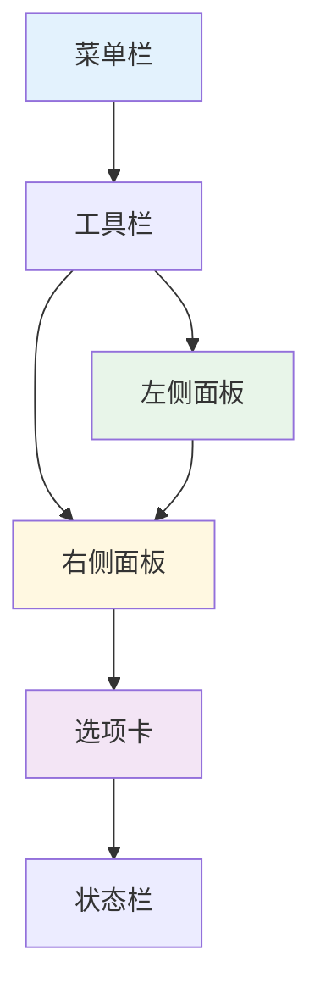
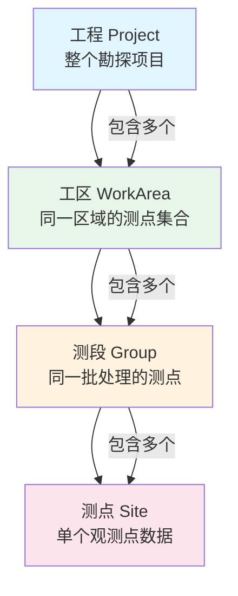
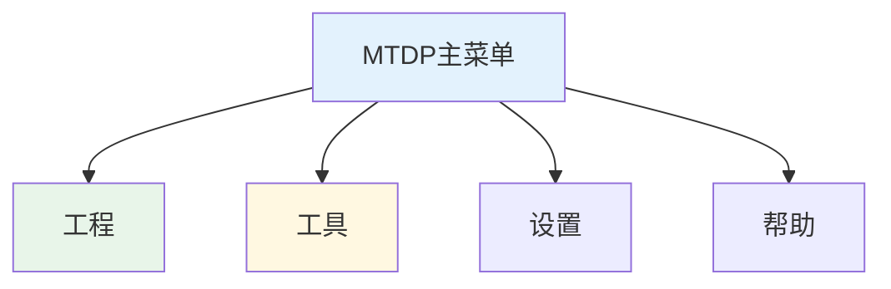
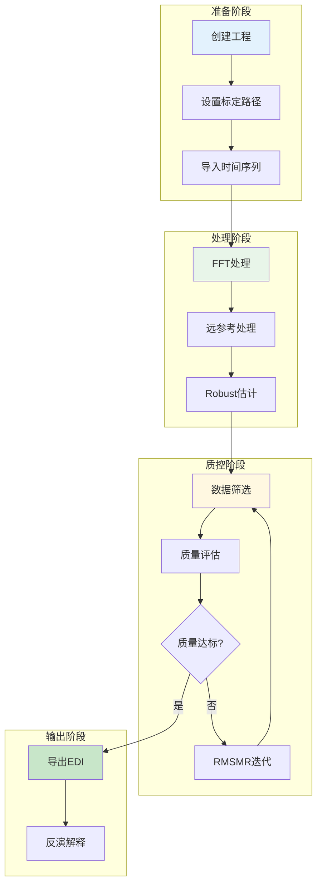
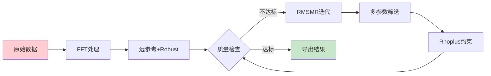
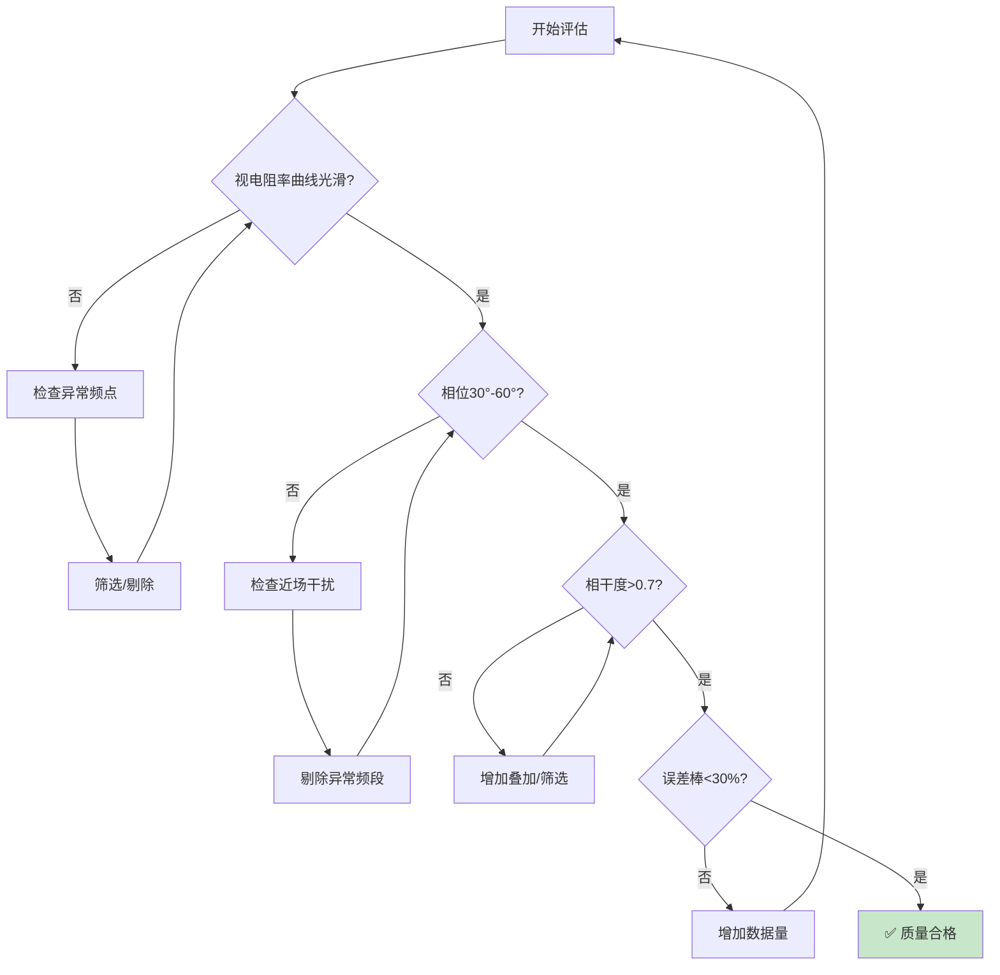

# 软件概述

## MTDP简介

### 软件定位

MTDP（Magnetotelluric Data Processing）是一款专业的MT数据处理软件，用于大地电磁测深数据的处理和分析。

**核心功能：**

- 多仪器数据格式支持
- 时间序列处理与频谱分析
- 智能数据筛选与质量评估
- MT传递函数估计
- 数据导出与可视化

### 版本信息

- **当前版本**: v1.9.5
- **发布日期**: 2026年03月01日
- **发布说明**: 功能优化，bug修复，aether兼容，MTU5兼容，部分重构（可能存在bug）
- **开发环境**: Embarcadero Delphi 10.4 Sydney
- **运行平台**: Windows 64位

### 主要特点

1. **多仪器支持**
   - Phoenix MTU-5/5A/5C/8A
   - Metronix ADU-06/ADU-07/MMS
   - LEMI长周期仪器
   - RMT/CASRMT格式
   - Aether (ATTS) 格式
   - EDI格式导入导出

2. **智能处理**
   - Robust稳健估计
   - 多目标遗传算法筛选
   - 马氏距离异常检测
   - AI参考曲线

3. **专业工具**
   - 完整标定系统
   - 工频滤波
   - 降采样处理
   - 批量处理

4. **辅助工具**
   - 时间序列格式转换
   - 标定文件格式转换

---

## 系统要求与安装

### 硬件要求

| 组件 | 最低配置 | 推荐配置 |
|------|---------|---------|
| CPU | 4核心 | 8核心以上 |
| 内存 | 8GB | 16GB以上 |
| 硬盘 | 10GB可用空间 | SSD, 50GB以上 |
| 显卡 | 支持OpenGL 3.0 | 独立显卡 |

### 软件要求

- 操作系统：Windows 10/11 64位
- 运行时库：随软件安装

### 安装步骤

1. 运行安装程序 `MTDPSetup.exe`
2. 选择安装目录（建议使用默认路径）
3. 完成安装
4. 首次运行时进行授权

### 授权验证

MTDP采用序列号授权机制：

1. 首次启动时，软件会显示硬件码
2. 将硬件码发送给开发者获取授权码
3. 输入授权码完成激活

> **注意**: 授权与计算机硬件绑定，更换计算机需要重新获取授权。

---

## 软件界面导览

### 主窗口布局

MTDP主界面采用树状结构组织数据，配合多选项卡显示不同视图：



**主要界面元素：**

- **菜单栏**：位于窗口顶部，包含工程、工具、设置、帮助等主菜单
- **工程树**：左侧面板，显示当前工程的结构层次
- **数据视图**：右侧主区域，显示选中对象的内容
- **状态栏**：底部显示当前状态信息

### 数据层次结构

MTDP采用四级层次结构组织数据：



```
工程 (Project)
└── 工区 (WorkArea)
    └── 测段 (Group)
        └── 测点 (Site)
```

**各层级功能：**

| 层级 | 说明 | 典型用途 |
|-----|------|---------|
| 工程 | 最顶层容器 | 整个勘探项目 |
| 工区 | 按区域划分 | 同一区域的测点集合 |
| 测段 | 按时间/任务划分 | 同一批处理的测点 |
| 测点 | 最小数据单元 | 单个观测点数据 |

### 菜单结构

MTDP的菜单系统包含主菜单和右键菜单两部分，涵盖了数据处理的所有功能。



#### 主菜单

| 菜单 | 功能项 | 说明 |
|------|--------|------|
| **工程** | 新建工程 | 创建新的MTDP工程 |
| | 打开工程 | 打开已存在的工程文件 |
| | 重新打开 | 打开最近使用的工程 |
| | 保存工程 | 保存当前工程 |
| | 另存为 | 将工程保存为新文件 |
| | 关闭工程 | 关闭当前工程 |
| | 导出版本 | 导出工程版本信息 |
| | 导出选中项 | 导出选中的测点/测段 |
| | 插入工程 | 将其他工程合并到当前工程 |
| | 退出 | 退出程序 |
| **🔧 工具** | 标定查看 | 查看标定文件内容 |
| | Phoenix TS分割 | 分割Phoenix时间序列 |
| | Phoenix TS修复 | 修复损坏的Phoenix时间序列 |
| | Phoenix TS合并 | 合并多个Phoenix时间序列文件 |
| | Phoenix通道重排 | 重新排列Phoenix通道顺序 |
| | TBL坐标修复 | 修复TBL文件中的坐标问题 |
| | TBL参数替换 | 批量替换TBL参数 |
| | TS查看 | 查看时间序列数据 |
| | 时间序列转换 | 时间序列格式转换 |
| | ⊢ TXT→TSN | Phoenix文本格式转TSN |
| | ⊢ TSN→DAT | TSN转DAT格式 |
| | ⊢ DAT→TSN | DAT转TSN格式 |
| | ⊢ TSN→GMT | TSN转GMT格式 |
| | ⊢ 时间序列→GMT | 通用时间序列转GMT |
| | ⊢ 时间序列→ATGMT | 时间序列转ATGMT格式 |
| | Metronix ATS→DAT | Metronix ATS格式转DAT |
| | LEMI测点合并 | 合并LEMI格式测点 |
| | LEMI H自动恢复 | 自动恢复LEMI H通道 |
| | Metronix测点合并 | 合并Metronix格式测点 |
| | WEM数据处理 | WEM格式数据处理 |
| | EDI修复 | 修复损坏的EDI文件 |
| | EDI转换相干度 | EDI格式相干度转换 |
| | 旧版MT→EDI | 旧版MT数据转EDI格式 |
| | Phoenix格式转换 | Phoenix数据格式互转 |
| | ⊢ CLB→JSON | CLB标定转JSON |
| | ⊢ CLC→JSON | CLC标定转JSON |
| | ⊢ JSON→CLB | JSON转CLB标定 |
| | ⊢ JSON→CLC | JSON转CLC标定 |
| | ⊢ TBL→JSON | TBL头文件转JSON |
| | ⊢ JSON→TBL | JSON转TBL头文件 |
| **时间序列处理** | SSA/MSSA | 奇异谱分析多窗口 |
| | ATTS降采样 | ATTS数据降采样 |
| | MTU降采样 | MTU数据降采样 |
| **设置** | FFT参数 | 设置FFT处理参数 |
| | Phoenix FFT设置 | Phoenix专用FFT参数 |
| | 临时文件路径 | 设置临时文件存储位置 |
| | 清理临时文件 | 清理缓存的临时文件 |
| | 最大线程数 | 设置并行处理线程数 |
| | 设置采集盒标定目录 | 配置采集盒标定文件路径 |
| | 设置传感器标定目录 | 配置传感器标定文件路径 |
| | 管理标定路径 | 管理标定文件搜索路径列表 |
| | 设置系统标定文件 | 配置系统级标定文件 |
| | 记录时间可见 | 设置时间标记显示 |
| | 语言切换 | 切换界面语言 |
| | ⊢ 中文 | 简体中文界面 |
| | ⊢ English | 英文界面 |
| | 预测模型 | AI预测模型设置 |
| | 使用FFTW3 | 启用FFTW3加速库 |
| | 坐标轴设置 | 设置图表坐标轴范围 |
| **帮助** | 关于 | 查看软件版本和授权信息 |

---

#### 右键菜单详细说明

右键菜单是MTDP中最常用的操作方式，根据选中的对象类型显示不同的操作选项。MTDP提供了四个层级的右键菜单：**项目**、**工区**、**分组**和**测点**。

##### 项目右键菜单

项目右键菜单用于管理整个工程项目的显示方式。

| 功能 | 说明 | 使用场景 | 操作步骤 |
|:----:|:-----|:--------|:---------|
| 复选框显示 | 切换项目树的复选框显示状态 | 当需要批量选择多个测点进行操作时 | 1. 右键项目名称<br>2. 点击"复选框显示"<br>3. 项目树中会出现复选框 |
| 全部展开 | 展开所有节点，显示完整项目结构 | 当需要查看所有工区、分组和测点时 | 1. 右键项目名称<br>2. 点击"全部展开"<br>3. 所有节点都会展开 |
| 全部折叠 | 折叠所有节点，只显示顶级项目 | 当项目结构复杂，需要简化视图时 | 1. 右键项目名称<br>2. 点击"全部折叠"<br>3. 所有子节点都会隐藏 |

> **提示**：项目树的展开/折叠状态会被保存，下次打开工程时会恢复。

##### 工区右键菜单

工区（WorkArea）是同一区域内测点的集合，工区右键菜单包含以下功能分类：

**1. 测段管理**

| 功能 | 说明 | 使用场景 | 操作步骤 | 注意事项 |
|:----:|:-----|:--------|:---------|:---------|
| 新建测段 | 在工区下创建新的测段 | 当需要按时间、任务或测线组织测点时 | 1. 右键工区名称<br>2. 点击"新建测段"<br>3. 输入测段名称<br>4. 设置测段属性 | 测段名称建议包含日期或测线编号 |
| 加载测段 | 从已有文件加载测段配置 | 当需要复用之前的测段设置时 | 1. 右键工区名称<br>2. 点击"加载测段"<br>3. 选择测段配置文件 | 仅加载配置，不包含测点数据 |
| 粘贴测段 | 粘贴已复制的测段 | 当需要在工区之间复制测段时 | 1. 先在源工区复制测段<br>2. 右键目标工区<br>3. 点击"粘贴测段" | 测点数据会同时复制 |

**2. 工区管理**

| 功能 | 说明 | 使用场景 | 操作步骤 | 注意事项 |
|:----:|:-----|:--------|:---------|:---------|
| 编辑 | 编辑工区属性（名称、描述等） | 当需要修改工区基本信息时 | 1. 右键工区名称<br>2. 点击"编辑"<br>3. 在属性面板中修改信息 | 修改后需要保存工程 |
| 删除 | 删除整个工区及其所有数据 | 当工区不再需要时 | 1. 右键工区名称<br>2. 点击"删除"<br>3. 确认删除操作 | ⚠️ 删除后无法恢复，请谨慎操作 |
| 复制 | 复制工区（包含所有测段和测点） | 当需要创建相似的工区时 | 1. 右键工区名称<br>2. 点击"复制"<br>3. 右键目标位置粘贴 | 复制后建议重命名以区分 |

**3. 批量处理**

| 功能 | 说明 | 使用场景 | 操作步骤 | 注意事项 |
|:----:|:-----|:--------|:---------|:---------|
| 处理 | 批量处理工区内所有测段的数据 | 当需要对整个工区进行统一处理时 | 1. 右键工区名称<br>2. 点击"处理"<br>3. 设置处理参数<br>4. 执行处理 | 处理时间取决于测点数量和计算机性能 |
| Phoenix TS转FT | 将Phoenix时间序列转换为傅里叶系数 | 当使用Phoenix仪器且需要频谱数据时 | 1. 右键工区名称<br>2. 点击"Phoenix TS转FT"<br>3. 设置FFT参数<br>4. 执行转换 | 需要先导入Phoenix时间序列数据 |

**4. 数据导出**

| 功能 | 说明 | 使用场景 | 输出文件 | 注意事项 |
|:----:|:-----|:--------|:---------|:---------|
| 导出参数 | 导出工区内所有测点的处理参数 | 当需要汇总所有测点的MT参数时 | 文本格式的参数文件 | 包含视电阻率、阻抗、相位等 |
| 导出测点坐标 | 导出所有测点的地理坐标 | 当需要制作测点分布图或导入GIS时 | TXT或CSV格式的坐标文件 | 包含经度、纬度、高程 |
| 导出测点信息 | 导出测点的详细信息（含采集参数） | 当需要完整的测点元数据时 | 文本格式的信息文件 | 包含测点名称、坐标、时间、仪器等 |
| 导出到项目 | 将工区导出为独立的MTDP项目 | 当需要将工区独立出来作为新项目时 | 新的.MTDPE工程文件 | 导出后可单独打开和管理 |
| 导出KMZ | 导出Google Earth KMZ格式 | 当需要在Google Earth中查看测点分布时 | .kmz压缩文件 | 包含测点位置、名称和基本信息 |
| 导出OmapKML | 导出Omap专用KML格式 | 当使用Omap软件进行成图时 | .kml文件 | 包含Omap专用的样式和属性 |
| 导出普通KML | 导出标准KML格式 | 当需要与其他GIS软件交换数据时 | .kml文件 | 标准KML格式，兼容性好 |
| 导出EDI | 批量导出所有测点的EDI文件 | 当需要将处理结果提供给反演软件时 | .edi文件（每个测点一个） | 建议先检查数据质量再导出 |

**5. 其他功能**

| 功能 | 说明 | 使用场景 | 操作步骤 |
|:----:|:-----|:--------|:---------|
| 更新TBL | 更新工区内所有测点的TBL文件 | 当TBL文件有更新或需要重新生成时 | 1. 右键工区名称<br>2. 点击"更新TBL"<br>3. 等待更新完成 |

##### 📁 分组（测段）右键菜单

分组（Group/测段）是同一批处理测点的集合，分组右键菜单功能最为丰富，是日常数据处理中最常用的菜单。

**1. 测点管理**

| 功能 | 说明 | 使用场景 | 操作步骤 | 注意事项 |
|:----:|:-----|:--------|:---------|:---------|
| 加载测点 | 从目录批量加载测点数据 | 当需要导入一批新采集的测点时 | 1. 右键分组名称<br>2. 点击"加载测点"<br>3. 选择数据目录<br>4. 选择要加载的测点 | 会清除分组内现有测点 |
| 追加加载 | 追加加载测点（不清除现有测点） | 当需要向分组中添加新测点时 | 1. 右键分组名称<br>2. 点击"追加加载"<br>3. 选择数据目录<br>4. 选择要添加的测点 | 不会影响已存在的测点 |
| 从EDI加载 | 从EDI文件加载测点 | 当需要导入已处理的EDI数据时 | 1. 右键分组名称<br>2. 点击"从EDI加载"<br>3. 选择EDI文件或目录 | 适合导入历史数据或他人数据 |
| 加载源测点 | 加载源场测点（用于远参考处理） | 当需要进行远参考处理时 | 1. 右键分组名称<br>2. 点击"加载源测点"<br>3. 选择源场测点数据 | 源测点需要与测站时间同步 |
| 加载多文件测点 | 从多个不同文件加载测点 | 当测点数据分散在多个文件时 | 1. 右键分组名称<br>2. 点击"加载多文件测点"<br>3. 选择多个文件 | 支持不同格式混合加载 |
| 从目录加载Phoenix | 从目录批量加载Phoenix格式测点 | 当使用Phoenix仪器且数据按目录组织时 | 1. 右键分组名称<br>2. 点击"从目录加载Phoenix"<br>3. 选择Phoenix数据目录 | 自动识别Phoenix数据格式 |
| 加载MTU8 | 加载MTU-8格式数据 | 当使用MTU-8仪器采集数据时 | 1. 右键分组名称<br>2. 点击"加载MTU8"<br>3. 选择MTU-8数据文件 | 需要recmeta.json文件 |
| 加载KML坐标 | 从KML文件导入测点坐标 | 当测点坐标已用KML整理好时 | 1. 右键分组名称<br>2. 点击"加载KML坐标"<br>3. 选择KML文件 | 仅导入坐标，不导入时间序列 |
| 粘贴测点 | 粘贴已复制的单个或多个测点 | 当需要在分组之间移动测点时 | 1. 先在源分组复制测点<br>2. 右键目标分组<br>3. 点击"粘贴测点" | 测点的所有数据都会复制 |
| 粘贴分组测点 | 粘贴整组测点 | 当需要合并两个分组的测点时 | 1. 先复制源分组<br>2. 右键目标分组<br>3. 点击"粘贴分组测点" | 会追加所有测点 |

> **提示**：加载测点时，MTDP会自动识别仪器类型（Phoenix、LEMI、Metronix等），无需手动指定。

**2. 测点批量操作**

| 功能 | 说明 | 使用场景 | 操作步骤 | 注意事项 |
|:----:|:-----|:--------|:---------|:---------|
| 测点重命名 | 批量重命名分组内测点 | 当测点命名需要统一调整时 | 1. 右键分组名称<br>2. 点击"测点重命名"<br>3. 设置重命名规则 | 支持查找替换、添加前后缀等 |
| 添加前缀 | 为所有测点名添加前缀 | 当需要标识测点来源或批次时 | 1. 右键分组名称<br>2. 点击"添加前缀"<br>3. 输入前缀内容 | 例如：添加"Line1_"前缀 |
| 添加后缀 | 为所有测点名添加后缀 | 当需要标识测点处理版本时 | 1. 右键分组名称<br>2. 点击"添加后缀"<br>3. 输入后缀内容 | 例如：添加"_v2"后缀 |
| 测点排序 | 按纬度/经度/名称/时间排序测点 | 当需要按特定顺序组织测点时 | 1. 右键分组名称<br>2. 点击"测点排序"<br>3. 选择排序方式<br>4. 选择升序或降序 | 排序后影响测点在树中的显示顺序 |
| 设置通道为首个 | 将指定通道设置为首个通道 | 当通道顺序需要调整时 | 1. 右键分组名称<br>2. 点击"设置通道为首个"<br>3. 选择通道 | 影响后续处理的通道选择 |
| 设置电极为首个 | 将电极长度设置为首个 | 当需要统一电极长度设置时 | 1. 右键分组名称<br>2. 点击"设置电极为首个" | 以第一个测点的电极长度为准 |
| 设置旋转角为首个 | 将旋转角设置为首个 | 当需要统一旋转角度时 | 1. 右键分组名称<br>2. 点击"设置旋转角为首个" | 以第一个测点的旋转角为准 |

**3. 数据处理**

| 功能 | 说明 | 使用场景 | 操作步骤 | 注意事项 |
|:----:|:-----|:--------|:---------|:---------|
| 处理全部 | 处理分组内所有测点 | 当首次处理或需要重新处理所有测点时 | 1. 右键分组名称<br>2. 点击"处理全部"<br>3. 设置FFT参数<br>4. 执行处理 | 处理时间取决于测点数量 |
| 处理剩余 | 仅处理未处理的测点 | 当部分测点已处理，需要处理剩余测点时 | 1. 右键分组名称<br>2. 点击"处理剩余"<br>3. 确认处理 | 已处理的测点不会被重新处理 |
| 同标定处理 | 使用相同标定文件处理所有测点 | 当所有测点使用同一套标定文件时 | 1. 右键分组名称<br>2. 点击"同标定处理"<br>3. 选择标定文件 | 适用于使用相同仪器的情况 |
| Phoenix Robust处理 | Phoenix Robust稳健估计 | 当需要使用Phoenix专用Robust算法时 | 1. 右键分组名称<br>2. 点击"Phoenix Robust处理"<br>3. 设置参数 | 仅适用于Phoenix数据 |
| Phoenix TS转FT | Phoenix时间序列转傅里叶系数 | 当需要将时域数据转换为频域时 | 1. 右键分组名称<br>2. 点击"Phoenix TS转FT"<br>3. 设置FFT参数 | 生成.FT文件供后续处理使用 |
| 计算标定 | 计算测点的标定系数 | 当需要重新计算或更新标定系数时 | 1. 右键分组名称<br>2. 点击"计算标定"<br>3. 选择标定文件 | 需要先设置标定文件路径 |
| 计算远参考 | 计算远参考传递函数 | 当分组内包含远参考站数据时 | 1. 右键分组名称<br>2. 点击"计算远参考"<br>3. 选择远参考站 | 所有测点之间会互为远参考 |

**4. 数据导出**

| 功能 | 说明 | 使用场景 | 输出文件 | 注意事项 |
|:----:|:-----|:--------|:---------|:---------|
| **📊 导出绘图数据** | 导出参数/相位张量/坐标供第三方软件绘图 | 当需要使用Golden绘图、Surfer等软件成图时 | - {组名}-Paint.dat<br>- {频率}-PhaseTensor.dat<br>- 各测点参数文件 | 推荐用于批量绘图需求 |
| 导出SpeEDI | 批量导出EDI（Spectra数据段） | 当需要与支持SpeEDI的软件交换数据时 | .edi文件（仅含Spectra数据段） | 仅包含频谱数据 |
| 导出ZTEDI | 批量导出EDI（阻抗+倾子数据段） | 当需要包含完整张量信息的EDI时 | .edi文件（含阻抗和倾子） | 标准EDI，含完整张量信息 |
| 导出MTpyEDI | 批量导出EDI（MTpy兼容格式） | 当需要使用Python MTpy库处理时 | .edi文件（MTpy兼容节） | Python MTpy库专用格式 |
| 导出PLT | 批量导出EDI（含视电阻率相位） | 当需要绘图软件直接使用时 | .edi文件（含RhoPhase数据段） | 含视电阻率和相位曲线 |
| 导出数据质量 | 导出测点质量评级 | 当需要汇总数据质量信息时 | .dat文件 | 包含每个测点的质量等级 |
| 导出测点信息 | 导出测点详细信息 | 当需要完整的测点元数据时 | .dat文件 | 包含坐标、时间、仪器等信息 |
| 导出KMZ | 导出Google Earth KMZ | 当需要在Google Earth中查看测点分布时 | .kmz文件 | 压缩格式，包含图标和样式 |
| 导出OmapKML | 导出Omap专用KML | 当使用Omap成图时 | .kml文件 | 包含Omap专用属性 |
| 导出普通KML | 导出标准KML | 当需要与其他GIS软件交换数据时 | .kml文件 | 标准格式，兼容性好 |
| 追加EDI | 将EDI数据追加到测点 | 当需要将处理结果合并到测点时 | 更新测点数据 | 不会覆盖原有数据 |

**5. 数据显示**

| 功能 | 说明 | 使用场景 | 操作步骤 |
|:----:|:-----|:--------|:---------|
| 添加时序显示 | 在时序窗口显示测点时间序列 | 当需要检查原始时间序列数据时 | 1. 右键分组名称<br>2. 点击"添加时序显示"<br>3. 时序窗口显示所有测点时序 |
| 添加标定显示 | 在标定窗口显示标定曲线 | 当需要查看标定文件的频率响应时 | 1. 右键分组名称<br>2. 点击"添加标定显示"<br>3. 标定窗口显示标定曲线 |
| 添加到地图视图 | 将测点添加到地图视图 | 当需要在地图上查看测点位置时 | 1. 右键分组名称<br>2. 点击"添加到地图视图"<br>3. 地图视图显示测点位置 |

**6. 其他功能**

| 功能 | 说明 | 使用场景 | 操作步骤 |
|:----:|:-----|:--------|:---------|
| 编辑 | 编辑分组属性 | 当需要修改分组名称或描述时 | 1. 右键分组名称<br>2. 点击"编辑"<br>3. 修改属性 |
| 删除 | 删除分组及所有测点 | 当分组不再需要时 | 1. 右键分组名称<br>2. 点击"删除"<br>3. 确认删除 |
| 复制 | 复制分组 | 当需要创建相似的分组时 | 1. 右键分组名称<br>2. 点击"复制" |
| 导入绘图用远点 | 导入用于绘图的远点数据 | 当需要绘制带远点的图件时 | 1. 右键分组名称<br>2. 点击"导入绘图用远点"<br>3. 选择远点数据 |

##### 测点右键菜单

测点（Site）是数据处理的最小单元，测点右键菜单用于单点操作。

**1. 测点管理**

| 功能 | 说明 | 使用场景 | 操作步骤 | 注意事项 |
|:----:|:-----|:--------|:---------|:---------|
| 编辑 | 编辑测点属性（名称、坐标、电极等） | 当需要修改测点基本信息时 | 1. 右键测点名称<br>2. 点击"编辑"<br>3. 在属性面板中修改 | 修改后需要保存工程 |
| 重命名 | 重命名测点 | 当测点命名需要调整时 | 1. 右键测点名称<br>2. 点击"重命名"<br>3. 输入新名称 | 名称应唯一且易于识别 |
| 复制 | 复制测点 | 当需要在分组之间移动测点时 | 1. 右键测点名称<br>2. 点击"复制"<br>3. 右键目标分组粘贴 | 复制所有数据 |
| 删除 | 删除测点 | 当测点数据不再需要时 | 1. 右键测点名称<br>2. 点击"删除"<br>3. 确认删除 | ⚠️ 删除后无法恢复 |
| 标记完成 | 标记测点已完成处理 | 当测点处理完成并已检查时 | 1. 右键测点名称<br>2. 点击"标记完成" | 完成的测点会显示特殊标记 |

**2. 测点设置**

| 功能 | 说明 | 使用场景 | 操作步骤 | 注意事项 |
|:----:|:-----|:--------|:---------|:---------|
| EH类型 | 设置电磁场类型（0-3） | 当需要指定电场和磁场的组合方式时 | 1. 右键测点名称<br>2. 选择"EH类型"<br>3. 选择0/1/2/3 | 0=ExEyHxHyHz<br>1=HxHyHz<br>2=ExEy<br>3=ExEyHxHy |
| 设置H测点 | 设置为H测点 | 当此测点作为H测点使用时 | 1. 右键测点名称<br>2. 点击"设置H测点" | 用于特定处理流程 |
| 设置为H组 | 设置为H组 | 当此测点作为H组的参考时 | 1. 右键测点名称<br>2. 点击"设置为H组" | 会影响同组其他测点 |
| 设置为远参考组 | 设置为远参考组 | 当此测点作为远参考站时 | 1. 右键测点名称<br>2. 点击"设置为远参考组" | 远参考站应远离测区 |
| 旋转恢复 | 恢复原始旋转角度 | 当需要取消坐标旋转时 | 1. 右键测点名称<br>2. 点击"旋转恢复" | 恢复到采集时的方向 |

**3. 数据质量**

| 功能 | 说明 | 使用场景 | 质量标准 |
|:----:|:-----|:--------|:---------|
| 数据质量标记 | 设置质量等级 | 当需要标记测点数据质量时 | 见下表 |
| 质量0 | 未评估 | 默认状态 | 数据尚未评估 |
| 质量1 | 优秀 | 相干性>0.8，曲线平滑，无异常点 | 可直接用于反演 |
| 质量2 | 良好 | 相干性0.6-0.8，曲线基本平滑 | 可用于反演，需注意 |
| 质量3 | 一般 | 相干性0.5-0.6，曲线有波动 | 谨慎使用，建议复查 |
| 质量4 | 较差 | 相干性<0.5，曲线畸变明显 | 不建议使用，需重新处理 |

> **建议**：处理完成后立即标记数据质量，方便后续筛选和批量导出。

**4. 数据处理**

| 功能 | 说明 | 使用场景 | 操作步骤 | 注意事项 |
|:----:|:-----|:--------|:---------|:---------|
| 处理 | 单点FFT处理 | 当需要对单个测点进行处理时 | 1. 右键测点名称<br>2. 点击"处理"<br>3. 设置FFT参数<br>4. 执行处理 | 适合测试或特殊处理 |
| 远参考计算 | 设置远参考站 | 当需要指定远参考站时 | 1. 右键测点名称<br>2. 点击"远参考计算"<br>3. 选择远参考站 | 远参考站需时间同步 |
| 频谱组编辑 | 编辑频谱数据 | 当需要手动编辑频谱点时 | 1. 右键测点名称<br>2. 点击"频谱组编辑"<br>3. 在编辑器中修改 | 可删除异常频点 |
| 加载FC | 加载傅里叶系数 | 当需要加载已有的FC文件时 | 1. 右键测点名称<br>2. 点击"加载FC"<br>3. 选择FC文件 | .FC或.FT文件 |

**5. 数据导出**

| 功能 | 说明 | 使用场景 | 输出文件 | 注意事项 |
|:----:|:-----|:--------|:---------|:---------|
| **📊 导出绘图数据** | 导出测点参数数据供第三方软件绘图 | 当需要使用Golden绘图、Surfer等软件成图时 | - {测点名}-{参数名}.dat<br>- {测点名}-lgRP.dat | 推荐用于单点详细绘图 |
| 导出EDI | 导出标准EDI文件 | 当需要将处理结果提供给反演软件时 | .edi文件 | 建议先检查数据质量 |
| 导出SpeEDI | 导出EDI（Spectra数据段） | 当需要与支持SpeEDI的软件交换数据时 | .edi文件（仅含Spectra数据段） | 仅包含频谱数据 |
| 导出ZTEDI | 导出EDI（阻抗+倾子数据段） | 当需要完整张量信息时 | .edi文件（含阻抗和倾子） | 标准EDI，含完整张量信息 |
| 导出MTpyEDI | 导出EDI（MTpy兼容格式） | 当使用Python处理时 | .edi文件（MTpy兼容节） | Python MTpy库专用格式 |
| 导出PLTEDI | 导出EDI（含视电阻率相位） | 当绘图软件需要时 | .edi文件（含RhoPhase数据段） | 含视电阻率和相位曲线 |
| 导出RhoPlus预测 | 导出RhoPlus预测数据 | 当需要验证数据一致性时 | - {测点名}-RhoPlus.dat<br>- {测点名}-Predict.dat | 用于1D模型验证 |
| 导出GMT时序 | 导出GMT格式时间序列 | 当需要使用GMT绘图时 | .dat文件（GMT格式） | 时间序列数据 |
| 导出HTML设置 | 导出HTML配置报告 | 当需要生成测点配置的网页报告时 | .html文件 | 可在浏览器中查看 |

**6. 数据显示**

| 功能 | 说明 | 使用场景 | 操作步骤 |
|:----:|:-----|:--------|:---------|
| 添加时序显示 | 在时序窗口显示 | 当需要查看原始时间序列时 | 1. 右键测点名称<br>2. 点击"添加时序显示" |
| 添加标定显示 | 在标定窗口显示 | 当需要查看标定曲线时 | 1. 右键测点名称<br>2. 点击"添加标定显示" |

##### 右键菜单使用技巧

1. **批量操作优先使用分组级菜单**
   - 在分组级别进行批量处理比单点处理效率高得多
   - 使用"处理全部"或"处理剩余"可自动处理所有测点

2. **合理使用数据导出功能**
   - 需要第三方软件绘图时，使用"导出绘图数据"功能
   - 交付数据给反演团队时，使用"导出EDI"功能
   - 需要GIS成图时，使用"导出KML/KMZ"功能

3. **及时标记数据质量**
   - 处理完成后立即标记数据质量
   - 使用质量标记可快速筛选优质数据
   - 批量导出时可按质量等级筛选

4. **使用复选框进行多选**
   - 在项目菜单中启用"复选框显示"
   - 可多选测点进行批量操作
   - 按住Ctrl键也可多选

5. **利用排序功能组织数据**
   - 按纬度排序可查看测线方向
   - 按时间排序可追踪采集进度
   - 按名称排序可快速定位测点

6. **注意操作顺序**
   - 先加载测点，再设置标定，最后处理
   - 先处理，再筛选，最后导出
   - 先标记质量，再批量导出

---

## 工程文件结构

### 目录组织

```
ProjectName/
├── ProjectName.MTDPE       # 工程主文件（加密）
├── Configurations/         # 配置文件
│   ├── MTDP.SETTING       # 软件设置
│   └── Lang/              # 语言文件
├── CLB/                    # 电场盒标定
├── CLC/                    # 磁传感器标定
└── temp/                   # 临时文件
```

### 自动备份

MTDP自动维护工程备份：

- 每次保存时自动创建备份
- 保留最近10个备份版本
- 备份文件位于工程目录

---

## 快速入门教程

### 5分钟完成数据处理

**流程概览：**


**详细步骤：**

**步骤1：创建工程**

1. 选择 `文件 → 新建工程`
2. 设置工程名称和保存位置
3. 配置工程基本信息

**步骤2：创建工区和测段**

1. 右键工程 → `新建工区`
2. 右键工区 → `新建测段`

**步骤3：导入数据**

1. 右键测段 → `加载测点`
2. 选择数据目录
3. 确认导入

**步骤4：FFT处理**

1. 选择测段
2. 右键 → `FFT处理`
3. 使用默认参数执行

**步骤5：数据筛选**

1. 查看视电阻率/相位曲线
2. 手动剔除异常点
3. 应用Robust估计

**步骤6：导出结果**

1. 右键测点 → `导出EDI`
2. 选择保存位置
3. 选择导出内容（视电阻率/相位/阻抗）

---

## 常见工作流程

### 标准MT数据处理流程



### 远参考处理流程

**适用场景**：有远参考站数据，需要消除本地噪声

**步骤：**

1. **准备远参考数据**
   - 确保远参考站与测站时间同步
   - 检查GPS时钟是否一致

2. **创建远参考测段**
   - 右键工区 → `新建测段`
   - 命名为 `RR_Reference`
   - 导入远参考站数据

3. **关联远参考**
   - 右键本地测段 → `设置远参考`
   - 选择远参考测段

4. **执行处理**
   - FFT处理时自动使用远参考

### RMSMR强干扰处理流程

**适用场景**：强干扰环境，常规方法效果不佳



**RMSMR参数设置：**

| 参数 | 推荐值 | 说明 |
|:----:|:------:|:-----|
| 相干度阈值 | 0.7 | 低于此值的数据被剔除 |
| 残差阈值 | 2.0σ | 残差超过此值降权 |
| 最大迭代次数 | 10 | 根据效果调整 |

### 批量处理流程

**适用场景**：多个测点需要相同处理

**步骤：**

1. **设置处理模板**
   - 对单个测点进行完整处理
   - 保存FFT参数为模板

2. **批量处理**
   - 右键测段 → `处理全部`
   - 选择处理方法
   - 设置输出选项

3. **批量导出**
   - 右键工区 → `导出 → 批量导出EDI`
   - 设置导出目录和命名规则

### 数据质量评估流程

**检查清单：**



### 典型应用场景

| 场景 | 推荐流程 | 注意事项 |
|:-----|:---------|:---------|
| **深部探测** (>10km) | 长时间观测 + 远参考 + 低频筛选 | 确保低频数据充足 |
| **浅部探测** (<1km) | 短时间观测 + 高频处理 | 注意文化噪声 |
| **城市环境** | RMSMR + 严格筛选 | 可能需要夜间观测 |
| **矿区勘探** | 多次观测 + 远参考 | 注意矿山电磁干扰 |
| **地热勘探** | 宽频带处理 | 关注低阻异常 |

---

## 软件配置建议

### 推荐设置

| 设置项 | 推荐值 | 说明 |
|:------:|:------:|:-----|
| **最大线程数** | CPU核心数 | 充分利用多核性能 |
| **FFT窗长度** | 4096点 | 平衡频率分辨率和时间分辨率 |
| **标定路径** | 工程目录下的CLB/CLC文件夹 | 便于管理 |
| **自动保存间隔** | 10分钟 | 防止数据丢失 |

### 性能优化

**处理大量数据时：**

1. 关闭不必要的图表窗口
2. 减少实时预览
3. 使用批量处理代替单点处理
4. 确保足够的磁盘空间

---

## 获取帮助

- 菜单 `帮助 → 关于` 查看版本信息
- 遇到问题请查看 [常见问题FAQ](../appendices/appendixD)
- 联系技术支持获取帮助
