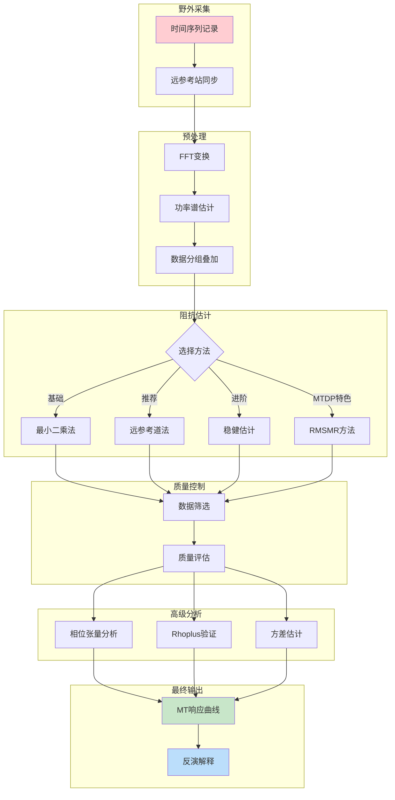
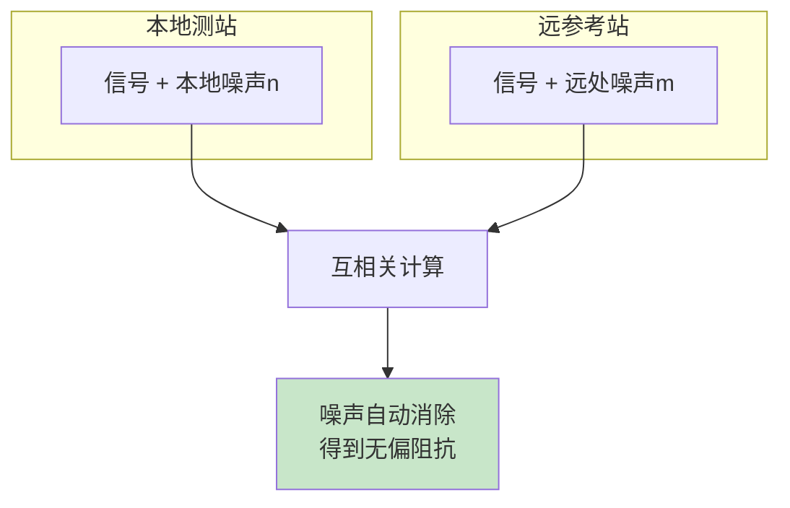
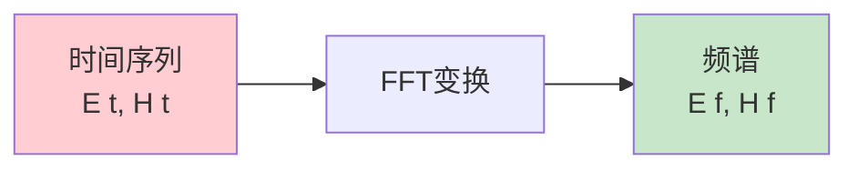
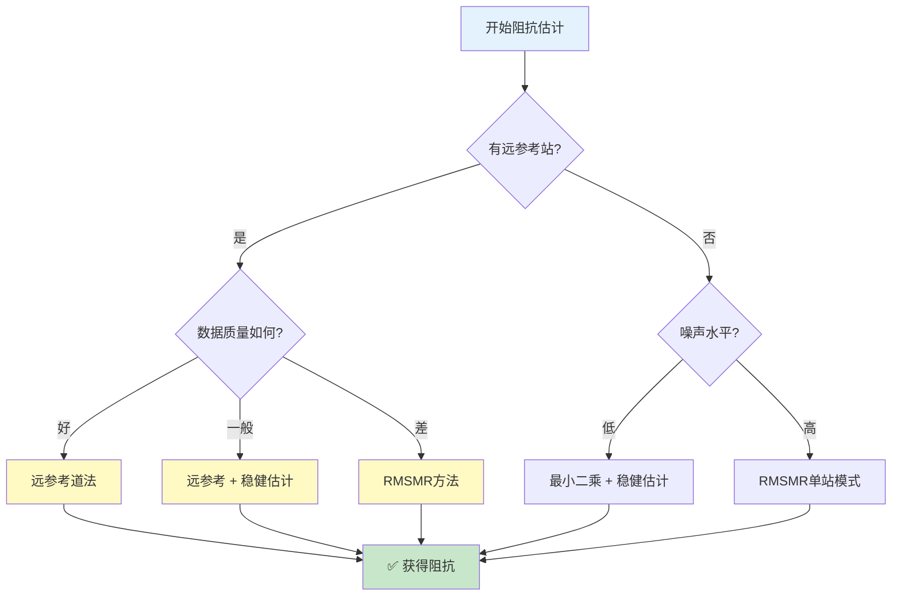
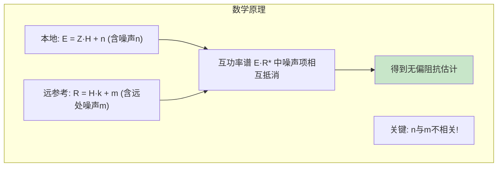
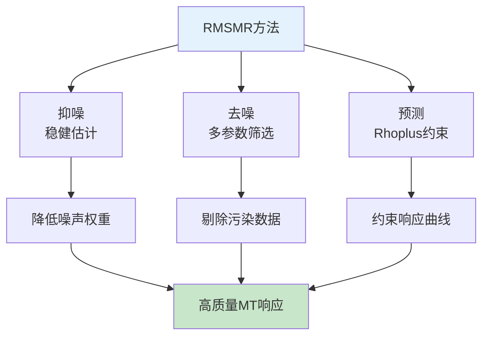
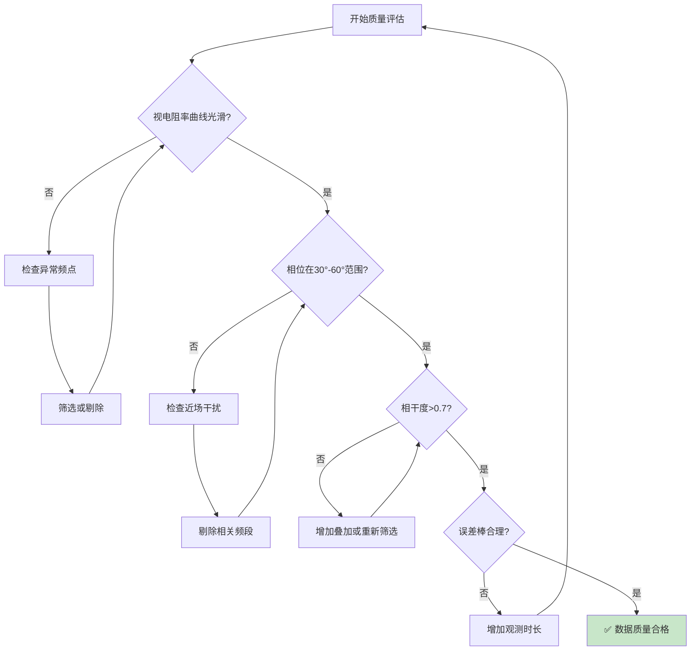
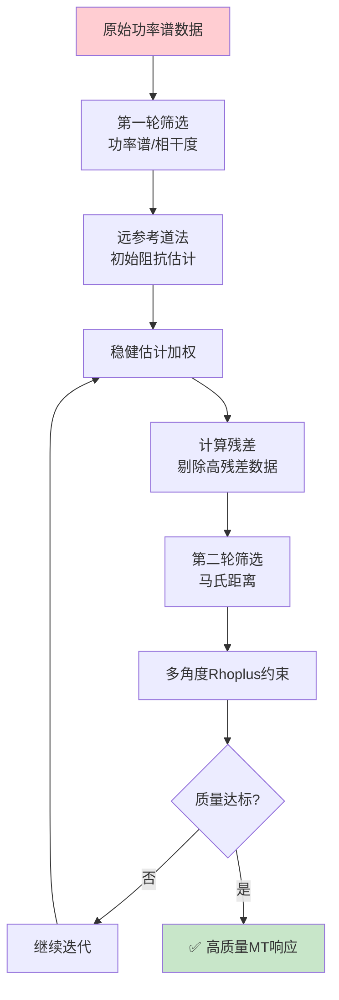
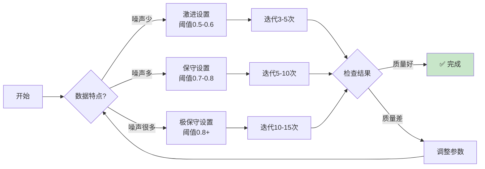

# MT原理

> **本章目标**：带你从零开始，一步步掌握MT数据处理的完整流程，理解每个步骤背后的原理，学会使用MTDataPro软件获得高质量的处理结果。

---

(21-教程概述与学习路径)=
## 教程概述与学习路径

### MT数据处理全景图

大地电磁数据处理是一个从原始时间序列到最终电阻率模型的完整流程。下图展示了整个处理流程：



### 本章学习路径

| 学习阶段 | 章节 | 内容 | 预计时间 |
|:--------:|:----:|------|:--------:|
| 🎯 **入门** | 2.2 | MT基本原理：为什么电磁场能探测地下？ | 20分钟 |
| 📋 **准备** | 2.3 | 数据采集：野外工作需要注意什么？ | 15分钟 |
| 🔧 **基础** | 2.4-2.5 | 频谱分析与阻抗估计：核心处理步骤 | 30分钟 |
| ✅ **质控** | 2.6 | 数据质量评估：如何判断结果可靠？ | 20分钟 |
| 🚀 **进阶** | 2.7-2.8 | 高级工具与RMSMR：提升处理效果 | 25分钟 |

### 学习建议

::: tip 💡 给初学者的建议
1. **先理解原理**：不要急于操作软件，先搞清楚"为什么"
2. **动手实践**：用软件自带示例数据跟着教程操作
3. **对比学习**：处理同一数据，尝试不同方法，对比结果差异
4. **记录问题**：遇到不理解的地方记下来，后续章节可能有答案
:::

### 术语中英对照表

| 中文术语 | 英文术语 | 缩写/符号 |
|:--------:|:--------:|:---------:|
| 大地电磁 | Magnetotelluric | MT |
| 阻抗张量 | Impedance Tensor | **Z** |
| 视电阻率 | Apparent Resistivity | ρₐ |
| 相位 | Phase | φ |
| 倾子 | Tipper | **T** |
| 趋肤深度 | Skin Depth | δ |
| 功率谱密度 | Power Spectral Density | PSD |
| 常相干度 | Ordinary Coherence | Coh² |
| 重相干度 | Multiple Coherence | Cohₘ² |
| 偏相干度 | Partial Coherence | Cohₚ² |
| 远参考道 | Remote Reference | RR |
| 稳健估计 | Robust Estimation | - |
| 相位张量 | Phase Tensor | **Φ** |

---

(22-第一步理解mt基本原理)=
## 第一步：理解MT基本原理

### 天然电磁场从哪里来？

**想象一下**：你站在野外，周围看不见任何电磁设备，但实际上空气中充满了看不见的电磁波——这就是MT探测的"光源"。

#### 两种天然场源

| 场源类型 | 频率范围 | 来源 | 特点 |
|:--------:|:--------:|------|------|
| **电离层辐射** | < 1 Hz | 太阳风与地球磁场相互作用 | 能量稳定，适合深部探测 |
| **雷电天电波** | > 1 Hz | 全球雷电活动 | 能量较强，适合浅部探测 |

> 🌍 **有趣的事实**：地球上每秒钟有约100次雷电，它们激发的电磁波在地表和电离层之间来回反射，形成了我们使用的"免费光源"。

#### 昼夜变化的影响

由于地球自转，天然场有明显的昼夜变化：

```
白天：大气电离度高 → 高频信号衰减快 → 信号较弱
夜间：大气电离度低 → 高频信号传播好 → 信号较强
```

::: warning 📝 实践提示
对于音频MT（AMT，1Hz-10kHz），**夜间观测**效果通常更好，特别是在"死频带"（1-5kHz）区域。
:::

### 电磁波如何"看见"地下？

#### 核心概念：趋肤深度

**想象海浪**：
- 长波海浪可以传播到很远的深海
- 短波涟漪只在水面上传播，很快消失

电磁波在地下也是如此！**频率越低，穿透越深**。

趋肤深度（电磁场衰减到1/e的深度）计算公式：

$$\delta = 503\sqrt{\frac{\rho}{f}}$$

*(2.1)*

其中：
- $\delta$ = 趋肤深度（米）
- $\rho$ = 地下电阻率（Ω·m）
- $f$ = 频率（Hz）

#### 实际探测深度速查表

| 地下电阻率 | 0.01 Hz | 0.1 Hz | 1 Hz | 10 Hz | 100 Hz |
|:----------:|:-------:|:------:|:----:|:-----:|:------:|
| **10 Ω·m** (沉积岩) | 50 km | 16 km | 5 km | 1.6 km | 500 m |
| **100 Ω·m** (中等) | 160 km | 50 km | 16 km | 5 km | 1.6 km |
| **1000 Ω·m** (基岩) | 500 km | 160 km | 50 km | 16 km | 5 km |

::: tip 💡 关键理解
- **低频 = 深部信息**：想探测更深，需要更低频率的信号
- **高频 = 浅部信息**：浅部结构由高频信号反映
- **电阻率影响**：同样频率，在高阻地区探测更深
:::

### 我们测量的是什么？

#### 阻抗：地下的"电阻"

**简单类比**：用万用表测电阻，我们测量电压和电流的比值。MT方法测量电场和磁场的比值，得到地下的"等效电阻"——这就是**阻抗**。

$$\mathbf{E} = \mathbf{Z} \cdot \mathbf{H}$$

*(2.2)*

因为地下结构可能沿不同方向有不同电阻率（各向异性），所以阻抗是一个**2×2张量**：

$$\begin{pmatrix} E_x \\ E_y \end{pmatrix} = \begin{pmatrix} Z_{xx} & Z_{xy} \\ Z_{yx} & Z_{yy} \end{pmatrix} \begin{pmatrix} H_x \\ H_y \end{pmatrix}$$

*(2.3)*

#### 视电阻率与相位

从阻抗可以计算**视电阻率**和**相位**：

$$\rho_a = \frac{|Z|^2}{\omega \mu_0}$$

*(2.4)*

$$\varphi = \arg(Z)$$

*(2.5)*

**相位的物理意义**：电场和磁场之间的时间延迟。
- 均匀半空间：相位 = 45°
- 电阻率随深度增加：相位 > 45°
- 电阻率随深度减小：相位 < 45°

#### 倾子：寻找侧向异常

如果地下是理想的水平层状结构，磁场只有水平分量。但如果旁边有电性异常体（如矿体、断裂带），磁场会"弯曲"，产生垂直分量$H_z$。

**倾子**描述这种关系：

$$H_z = T_{zx}H_x + T_{zy}H_y$$

*(2.6)*

> 🎯 **实际应用**：感应矢量（由倾子计算）会指向低阻体，是寻找矿体或断裂带的重要工具。

---
⬅️ [上一节：教程概述](#21-教程概述与学习路径) | ➡️ [下一节：数据采集准备](#23-第二步数据采集准备)

---

(23-第二步数据采集准备)=
## 第二步：数据采集准备

### 野外布置要点

#### 测站组成

一个完整的MT测站需要记录5个分量：

| 分量 | 传感器 | 测量方向 |
|:----:|:------:|:--------:|
| $E_x$ | 电极 | 南北方向 |
| $E_y$ | 电极 | 东西方向 |
| $H_x$ | 磁探头 | 南北方向 |
| $H_y$ | 磁探头 | 东西方向 |
| $H_z$ | 磁探头 | 垂直方向 |

#### 布置建议


| 注意事项 | 具体要求 |
|:--------:|:---------|
| **避开干扰** | 距离高压线>500m，工厂>1km，公路>200m |
| **电极接触** | 埋深>20cm，浇盐水降低接地电阻 |
| **磁探头** | 水平放置，远离金属物体 |
| **电缆** | 埋入土中或防水布覆盖，避免晃动 |

::: danger ⚠️ 常见错误
1. **电极极化**：长时间观测后电极接触变差，需定期检查接地电阻（建议 < 1kΩ）
2. **磁探头倾斜**：水平磁探头倾斜会导致信号失真，使用水平仪校准
3. **电缆松动**：风吹动电缆会产生电磁干扰，务必固定好
:::

### 远参考站设置

#### 为什么需要远参考站？

**问题**：本地测站可能受到附近噪声干扰（如工厂、电线），导致阻抗估计偏差。

**解决方案**：在远处设置参考站，利用"噪声不相关、信号相关"的特性消除偏差。



#### 远参考站设置要求

| 参数 | 建议值 | 原因 |
|:----:|:------:|:-----|
| **距离** | 几公里到几十公里 | 保证噪声不相关，信号仍相关 |
| **同步** | GPS时间同步 | 必须精确同步 |
| **环境** | 低噪声区域 | 参考站质量影响处理效果 |

::: danger ⚠️ 常见错误
远参考站与本地测站**不能**受同一噪声源影响。例如，两个站都靠近同一工厂就失去了远参考的意义。
:::

### 观测时长建议

#### 根据探测深度确定时长

| 目标深度 | 建议观测时长 | 原因 |
|:--------:|:------------:|:-----|
| < 1 km（浅部） | 2-4 小时 | 高频信号充足 |
| 1-10 km（中深部） | 8-12 小时 | 需要足够的低频叠加 |
| > 10 km（深部） | 24+ 小时 | 低频信号需要长时间积累 |

#### 提高数据质量的技巧

1. **跨越昼夜**：包含白天和夜间的数据，覆盖不同噪声环境
2. **多次叠加**：长时间观测可以增加叠加次数，提高信噪比
3. **避开干扰时段**：如附近的工厂工作时间

### MTDP数据导入操作

::: details 🖥️ MTDP操作路径
**导入时间序列数据：**
1. 菜单：**文件 → 导入 → 时间序列**（或快捷键 `Ctrl+I`）
2. 选择数据格式（Phoenix/Metronix/LEMI等）
3. 选择数据文件夹
4. 确认时间范围和采样率

**导入远参考数据：**
1. 菜单：**文件 → 导入 → 远参考数据**
2. 选择参考站数据文件
3. 系统自动检测时间同步状态
:::

### 测点设置表单详解

在MTDP中，每个测点的详细参数通过测点设置表单进行管理。双击测点即可打开该表单。

#### 基本信息

| 字段 | 控件名称 | 说明 | 数据类型 |
|:----:|:--------:|:----:|:--------:|
| 测点名称 | EditName | 测点标识名称 | 字符串 |
| 所有者 | EditOwner | 测点所有者/负责人 | 字符串 |
| 描述 | MemoDescription | 测点详细描述信息 | 多行文本 |
| 测量员 | EditSurveyor | 实施测量的技术人员 | 字符串 |
| 数据采集者 | EditDataCollector | 采集设备操作人员 | 字符串 |
| 数据处理者 | EditDataProcessor | 数据处理操作人员 | 字符串 |
| 创建时间 | EditCreationTime | 测点创建时间戳 | 日期时间 |
| 数据质量 | ComboBoxDataQuality | 数据质量评级(0-4级) | 下拉选择 |

**数据质量等级定义：**

| 等级 | 名称 | 说明 |
|:----:|:----:|:-----|
| 0 | 未评估 | 尚未进行质量评估 |
| 1 | 优秀 | 数据质量极佳可直接使用 |
| 2 | 良好 | 数据质量正常可用 |
| 3 | 一般 | 数据存在轻微问题需注意 |
| 4 | 较差 | 数据质量问题较多 |

#### 坐标信息

| 字段 | 控件名称 | 说明 | 单位 |
|:----:|:--------:|:----:|:----:|
| 经度 | EditLongitude | 测点东向地理坐标 | 度 |
| 纬度 | EditLatitude | 测点北向地理坐标 | 度 |
| 高程 | EditAltitude | 测点海拔高度 | 米 |

#### 通道配置参数

每个测点包含5个电磁分量通道，各通道参数如下：

| 通道 | 索引控件 | 反向控件 | 长度控件 | 传感器ID | 旋转角控件 |
|:----:|:--------:|:--------:|:--------:|:--------:|:--------:|
| **Ex** (电场X) | NumberBoxExIndex | CheckBoxExReverse | NumberBoxExLength | - | NumberBoxExRotate |
| **Ey** (电场Y) | NumberBoxEyIndex | CheckBoxEyReverse | NumberBoxEyLength | - | NumberBoxEyRotate |
| **Hx** (磁场X) | NumberBoxHxIndex | CheckBoxHxReverse | NumberBoxHxLength | EditHxSensor | NumberBoxHxRotate |
| **Hy** (磁场Y) | NumberBoxHyIndex | CheckBoxHyReverse | NumberBoxHyLength | EditHySensor | NumberBoxHyRotate |
| **Hz** (磁场Z) | NumberBoxHzIndex | CheckBoxHzReverse | NumberBoxHzLength | EditHzSensor | NumberBoxHzRotate |

**通道参数说明：**

| 参数 | 说明 | 注意事项 |
|:----:|:-----|:---------|
| **索引** | 通道在数据文件中的位置编号 | 通常自动识别 |
| **反向** | 是否反转通道极性 | 用于修正电极接线错误 |
| **长度** | 电极间距或传感器序列号 | 电场为电极距，磁场为传感器编号 |
| **传感器ID** | 磁传感器的唯一标识 | 仅磁场通道有此参数 |
| **旋转角** | 通道相对于真北的旋转角度 | 用于坐标旋转校正 |

#### 采集盒信息

| 字段 | 控件名称 | 说明 | 单位 |
|:----:|:--------:|:----:|:----:|
| 采集盒ID | EditBox | MT采集仪器的唯一序列号 | - |
| 电场前置放大器 | EditEPreamplifier | 前置放大器型号/编号 | - |
| Ex接地电阻 | NumberBoxGroundResEx | Ex通道电极接地电阻 | Ω |
| Ey接地电阻 | NumberBoxGroundResEy | Ey通道电极接地电阻 | Ω |

**接地电阻说明：**
- 理想值：< 1kΩ
- 可接受：< 5kΩ
- 需改善：> 5kΩ（可能影响数据质量）

#### 时间信息

| 字段 | 控件名称 | 说明 |
|:----:|:--------:|:----|
| 采集开始时间 | SiteBeginEnd.BeginDateTime | 时间序列数据起始时刻 |
| 采集结束时间 | SiteBeginEnd.EndDateTime | 时间序列数据结束时刻 |
| 处理开始时间 | ProcessBeginEnd.BeginDateTime | 用于处理的时间窗口起始 |
| 处理结束时间 | ProcessBeginEnd.EndDateTime | 用于处理的时间窗口结束 |
| 采集时长 | LabelTimeLengthH | 自动计算的采集持续时间 |

#### 频率信息

| 字段 | 控件名称 | 说明 | 单位 |
|:----:|:--------:|:----:|:----:|
| 最大可用频率 | EditMaxAvailableFrequency | 数据中包含的最高频率 | Hz |
| 最小可用频率 | EditMinAvailableFrequency | 数据中包含的最低频率 | Hz |

#### 特殊功能

**从TBL文件加载：**
- 支持拖放 `.tbl` 文件更新Phoenix测点信息
- 自动读取：坐标、时间、采集盒ID、传感器ID、电极长度、旋转角

**从LEMI文件加载：**
- 支持拖放 `.lemi` 文件
- 更新LEMI通道索引

**加载傅里叶系数：**
- 支持拖放 `.stfc` 文件

**更新Phoenix TBL：**
- 修改坐标、采集盒、传感器信息后自动备份原TBL到 `.tbl.backup`

**更新RMT JSON：**
- 修改坐标、设备信息后更新JSON文件，自动备份原文件

---
⬅️ [上一节：MT基本原理](#22-第一步理解mt基本原理) | ➡️ [下一节：从时间序列到频谱](#24-第三步从时间序列到频谱)

---

(24-第三步从时间序列到频谱)=
## 第三步：从时间序列到频谱

### 傅里叶变换基础

#### 为什么需要FFT？

**原始数据**是时间域的电场和磁场信号，但MT分析需要在**频率域**进行——我们需要知道不同频率成分的振幅和相位。

**形象理解**：就像把一首音乐分解成不同音调（频率）的音符。



#### MTDP中的FFT参数

| 参数 | 推荐值 | 说明 |
|:----:|:------:|:-----|
| **窗长度** | N倍周期 | 窗口覆盖 N 个工频周期 |
| **窗函数** | 汉宁窗 | 减少频谱泄漏 |
| **重叠率** | 50% | 提高数据利用率 |

::: danger ⚠️ 常见错误
1. **窗长度选择不当**：
   - 窗太短 → 频率分辨率低，低频精度差
   - 窗太长 → 时间分辨率低，难以剔除短时噪声
2. **忽略去均值**：FFT前未去除直流分量会导致零频附近失真
:::

### 功率谱估计

#### 自功率谱与互功率谱

- **自功率谱**：$[XX^*]$ — 单个信号的能量
- **互功率谱**：$[XY^*]$ — 两个信号的相关能量

$$[XY^*] = \frac{1}{N}\sum_{i=1}^{N} X_i(f) \cdot Y_i^*(f)$$

*(2.7)*

#### 叠加的作用

将时间序列分成多段，分别FFT后叠加平均：

$$[XY^*]_{avg} = \frac{1}{N}\sum_{i=1}^{N} X_i Y_i^*$$

*(2.8)*

**叠加的好处**：
- 随机噪声在平均中相互抵消
- 信号在平均中增强
- 信噪比提升 $\sqrt{N}$ 倍

::: tip 💡 经验法则
叠加次数 N = 100 时，信噪比可提升约 10 倍（$\sqrt{100} = 10$）。
:::

### 数据分组与叠加

#### 分组策略

MTDP支持将长时间序列分成多个**时间段（分组）**进行处理：

| 分组方式 | 适用场景 |
|:--------:|:---------|
| **等长分组** | 信号稳定的环境 |
| **按时间分段** | 需要剔除特定时段（如白天干扰） |
| **按质量筛选** | 自动剔除低质量分组 |

### MTDP的FFT操作

::: details 🖥️ MTDP操作路径
**执行FFT处理：**
1. 菜单：**处理 → FFT设置**（或快捷键 `Ctrl+Shift+F`）
2. 设置参数：
   - 窗长度：4096点（推荐）
   - 窗函数：Hann窗
   - 重叠率：50%
3. 点击 **执行FFT**

**查看功率谱：**
1. 切换到 **功率谱** 选项卡
2. 选择要查看的通道（Ex, Ey, Hx, Hy, Hz）
3. 可切换时间/频率视图
:::

---
⬅️ [上一节：数据采集准备](#23-第二步数据采集准备) | ➡️ [下一节：阻抗估计](#25-第四步阻抗估计)

---

(25-第四步阻抗估计)=
## 第四步：阻抗估计

### 方法对比总览

| 方法 | 优点 | 缺点 | 适用场景 |
|:----:|:----:|:----:|:--------:|
| **最小二乘法** | 简单快速 | 对噪声敏感 | 理想低噪声环境 |
| **远参考道法** | 消除输入端偏差 | 需要参考站 | **推荐首选** |
| **稳健估计** | 抗异常值 | 计算复杂 | 有少量强干扰 |
| **RMSMR** | 综合处理能力强 | 需要迭代 | **强干扰环境** |

### 方法选择决策树



### 最小二乘法（入门理解）

#### 基本思想

找到阻抗 Z，使得预测误差最小：

$$\min_Z \sum |E - ZH|^2$$

*(2.9)*

解为：

$$\mathbf{Z} = [\mathbf{E}\mathbf{H}^*][\mathbf{H}\mathbf{H}^*]^{-1}$$

*(2.10)*

#### 为什么不推荐？

**致命弱点**：假设磁场 H 无噪声。但实际中：
- 磁场同样受噪声污染
- 噪声会导致阻抗**系统偏差**
- 一个异常数据点就能破坏估计

::: warning ⚠️ 不推荐单独使用
最小二乘法主要用于理解原理，实际处理应使用远参考道法或稳健方法。
:::

### 远参考道法（推荐）

#### 核心思想

使用远参考站的磁场 R 替代本地磁场 H：

$$\mathbf{Z} = [\mathbf{E}\mathbf{R}^*][\mathbf{H}\mathbf{R}^*]^{-1}$$

*(2.11)*

#### 为什么有效？



#### 使用条件

1. ✅ 远参考站与测站**时间同步**
2. ✅ 两站**噪声不相关**
3. ✅ 两站距离适中（几公里到几十公里）

### 稳健估计（进阶）

#### 回归M估计

**核心思想**：给异常数据**降低权重**

$$w_i = \begin{cases} 1, & |r_i| \leq r_0 \\ \frac{r_0}{|r_i|}, & |r_i| > r_0 \end{cases}$$

*(2.12)*

**形象理解**：
- 正常数据：权重 = 1.0（完全参与）
- 轻微偏离：权重 = 0.8
- 严重偏离：权重 = 0.1（几乎忽略）

#### 有界影响估计

在M估计基础上，进一步处理**输入端异常**（杠杆点）。这是BIRRP软件的核心算法。

### RMSMR方法（MTDP特色）

#### 三维度处理策略

RMSMR = **R**obust + **M**ulti-parameter Screening + **M**ulti-angle **R**hoplus



| 维度 | 技术 | 作用 |
|:----:|:----:|:----:|
| **抑噪** | 稳健估计 | 降低噪声数据的权重 |
| **去噪** | 多参数筛选 | 剔除受污染的数据段 |
| **预测** | Rhoplus约束 | 用1D模型约束响应质量 |

> 📖 **参考文献**：王培杰等. 基于稳健估计、数据筛选和Rhoplus约束的大地电磁数据处理方法. 地球物理学报, 2024.

### MTDP阻抗估计操作

::: details 🖥️ MTDP操作路径
**执行阻抗估计：**
1. 菜单：**处理 → 阻抗估计**（或快捷键 `Ctrl+Shift+Z`）
2. 选择处理方法：
   - [ ] 最小二乘法
   - [x] 远参考道法（推荐）
   - [x] 稳健估计
   - [ ] RMSMR迭代
3. 点击 **执行**

**查看结果：**
1. 切换到 **MT响应** 选项卡
2. 选择查看：视电阻率 / 相位 / 阻抗张量
3. 可切换 XY/YX 模式
:::

::: danger ⚠️ 常见错误
1. **忘记设置远参考**：有参考数据但未在软件中关联
2. **方法不匹配**：高噪声数据却用最小二乘法
3. **忽略参数检查**：直接使用默认参数，不适配实际数据特点
:::

---
⬅️ [上一节：从时间序列到频谱](#24-第三步从时间序列到频谱) | ➡️ [下一节：数据质量评估](#26-第五步数据质量评估)

---

(26-第五步数据质量评估)=
## 第五步：数据质量评估

### 质量评估指标总览

| 指标 | 英文名称 | 物理意义 | 理想值 |
|:----:|:--------:|:--------:|:------:|
| **常相干度** | Ordinary Coherence | 两信号直接相关性 | 接近1 |
| **重相干度** | Multiple Coherence | 输出与所有输入的综合相关性 | 接近1 |
| **偏相干度** | Partial Coherence | 排除其他输入后某输入的独立贡献 | >0.5 |
| **误差棒** | Error Bar | 估计的不确定性 | 越小越好 |

### 三种相干度详解

#### 常相干度 (Ordinary Coherence)

**定义**：描述两个信号之间的直接相关性（0-1）

$$Coh^2(XY) = \frac{|[XY^*]|^2}{[XX^*][YY^*]}$$

*(2.13)*

| 常相干度值 | 数据质量 | 建议 |
|:----------:|:--------:|:----:|
| > 0.9 | 优秀 | 可直接使用 |
| 0.7-0.9 | 良好 | 正常使用 |
| 0.5-0.7 | 一般 | 考虑筛选 |
| < 0.5 | 较差 | 需要剔除或重新采集 |

#### 重相干度 (Multiple Coherence)

**定义**：输出信号与所有输入信号的综合相关性

$$Coh_m^2(E_x) = \frac{Z_{xy}[H_yE_x^*] + Z_{xx}[H_xE_x^*]}{[E_xE_x^*]}$$

*(2.14)*

**物理意义**：衡量两个水平磁场对电场的**综合解释能力**

- 无噪声条件下，重相干度 = 1
- 噪声越强，重相干度越低
- **同源噪声**也会导致高重相干度（需结合其他指标判断）

#### 偏相干度 (Partial Coherence)

**定义**：排除其他输入影响后，某输入对输出的**独立贡献**

$$Coh_p^2(E_xH_y) = \frac{Coh_m^2(E_x) - Coh^2(E_xH_x)}{1 - Coh^2(E_xH_x)}$$

*(2.15)*

**应用场景**：
- 判断哪个磁场分量贡献更大
- 识别某个方向的信号是否被噪声污染
- 多输入系统中定位问题通道

::: tip 💡 相干度评估要点
1. **三种相干度结合看**：不能只看一个指标
2. **注意同源噪声**：高相干度 ≠ 数据好（可能是噪声相关）
3. **分段检查**：不同时段/频段的相干度可能差异很大
:::

### 其他质量指标

#### 功率谱密度 (PSD)

**识别噪声**：功率谱密度异常高的时段可能包含噪声

$$PSD = \frac{\sqrt{[AA^*]^2}}{\Delta T}$$

*(2.16)*

**判断标准**：
- 正常天然场：PSD随频率缓慢变化
- 噪声干扰：PSD突然升高一个数量级

#### 误差棒（方差估计）

**Gamble方差估计**：

$$(\Delta Z_{ij})^2 = \frac{[|\eta_i|^2][|R_j|^2]}{N|D^R|^2}$$

*(2.17)*

**误差棒的意义**：
- 误差小 → 数据可信度高
- 误差大 → 数据不确定性大
- 反演时：误差大的点权重小

### 数据筛选方法

#### 筛选参数一览

| 参数 | 物理意义 | 筛选标准 |
|:----:|:--------:|:--------:|
| **常相干度** | 信号相关性 | > 0.7 |
| **重相干度** | 综合解释能力 | > 0.7 |
| **功率谱密度** | 信号能量 | 无异常峰值 |
| **极化方向** | 信号方向 | 分布随机 |
| **残差** | 拟合误差 | < 2σ |

#### 马氏距离筛选

**为什么用马氏距离**：综合考虑多个参数的相关性

$$D_M = \sqrt{(\mathbf{x} - \boldsymbol{\mu})^T \mathbf{\Sigma}^{-1} (\mathbf{x} - \boldsymbol{\mu})}$$

*(2.18)*

**类比**：
- 欧氏距离：只看"价格"一个维度
- 马氏距离：综合考虑"价格、品牌、重量"等多个维度的相关性

### 好/坏数据对比示例

#### ✅ 高质量数据特征

```
┌─────────────────────────────────────────────────────────┐
│                    高质量MT响应曲线                       │
├─────────────────────────────────────────────────────────┤
│                                                         │
│  视电阻率 (log scale)                                    │
│  ┌────────────────────────────────────────────────┐    │
│  │     ○ ○                                        │    │
│  │   ○     ○ ○                                    │    │
│  │  ○         ○ ○                                 │    │
│  │ ○             ○ ○ ○                            │    │
│  │○                  ○ ○ ○                        │    │
│  │                        ○ ○ ○                    │    │
│  └────────────────────────────────────────────────┘    │
│  特征：曲线光滑连续，误差棒小，相干度>0.8                  │
│                                                         │
│  相位 (度)                                              │
│  ┌────────────────────────────────────────────────┐    │
│  │            ○ ○ ○ ○ ○ ○ ○                       │    │
│  │         ○              ○                       │    │
│  │       ○                  ○                     │    │
│  │     ○                     ○                    │    │
│  │   ○                        ○                   │    │
│  └────────────────────────────────────────────────┘    │
│  特征：相位在30°-60°范围，曲线平滑                        │
└─────────────────────────────────────────────────────────┘
```

#### ❌ 低质量数据特征

```
┌─────────────────────────────────────────────────────────┐
│                    低质量MT响应曲线                       │
├─────────────────────────────────────────────────────────┤
│                                                         │
│  视电阻率 (log scale)                                    │
│  ┌────────────────────────────────────────────────┐    │
│  │       ○                                        │    │
│  │     ○   ○     ○                                │    │
│  │   ○       ○     ○                              │    │
│  │ ○           ○ ○   ○  ○                         │    │
│  │                ○    ○                          │    │
│  │                     ○ ○                        │    │
│  └────────────────────────────────────────────────┘    │
│  问题：曲线脱节、跳动，误差棒大，相干度<0.5                 │
│        ↓ 死频带区域数据质量差                             │
│                                                         │
│  相位 (度)                                              │
│  ┌────────────────────────────────────────────────┐    │
│  │     ○           ○                              │    │
│  │   ○   ○       ○   ○                            │    │
│  │          ○ ○        ○                          │    │
│  │ ○                    ○                         │    │
│  │                        ○                       │    │
│  └────────────────────────────────────────────────┘    │
│  问题：相位异常（>90°或<0°），数据跳动                     │
└─────────────────────────────────────────────────────────┘
```

#### 质量问题诊断表

| 问题现象 | 可能原因 | 诊断指标 | 解决方案 |
|:--------:|:--------:|:--------:|:--------:|
| **曲线脱节** | 死频带噪声 | 相干度<0.5 | Rhoplus校正 |
| **相位异常** | 近场干扰 | 相位>90° | 剔除相关频点 |
| **误差棒大** | 叠加不足 | 误差>30% | 增加数据量 |
| **低相干度** | 人文噪声 | Coh<0.5 | 人工筛选/增加时长 |
| **曲线跳动** | 强干扰 | PSD异常 | RMSMR处理 |

### 质量评估清单



### MTDP质量评估操作

::: details 🖥️ MTDP操作路径
**查看相干度：**
1. 切换到 **数据筛选** 选项卡
2. 勾选要显示的相干度类型：
   - [x] 常相干度 (Coh²)
   - [x] 重相干度 (Cohₘ²)
   - [ ] 偏相干度 (Cohₚ²)
3. 设置阈值线（推荐 0.7）

**手动筛选数据：**
1. 在功率谱窗口框选异常区域
2. 右键 → **剔除选中数据**
3. 重新计算阻抗

**自动筛选：**
1. 菜单：**处理 → 自动筛选**
2. 设置筛选参数阈值
3. 点击 **执行**
:::

---
⬅️ [上一节：阻抗估计](#25-第四步阻抗估计) | ➡️ [下一节：高级分析工具](#27-第六步高级分析工具)

---

(27-第六步高级分析工具)=
## 第六步：高级分析工具

### 相位张量分析

#### 为什么用相位张量？

**传统方法的局限**：需要先假设地下是一维、二维还是三维。

**相位张量的优势**：**不需要任何维性假设**！

#### 相位张量定义

将阻抗分解为实部和虚部：$\mathbf{Z} = \mathbf{X} + i\mathbf{Y}$

相位张量：

$$\mathbf{\Phi} = \mathbf{X}^{-1}\mathbf{Y}$$

*(2.19)*

#### 椭圆表示

相位张量可以用椭圆可视化：

| 结构类型 | 椭圆形状 | 特征 |
|:--------:|:--------:|:-----|
| **一维** | 圆形 | $\Phi_{max} = \Phi_{min}$ |
| **二维** | 椭圆 | 扁平程度反映各向异性 |
| **三维** | 不规则椭圆 | 椭圆倾斜 |

#### 关键参数

| 参数 | 定义 | 判断标准 |
|:----:|:----:|:--------:|
| **主方向角 α** | 电性主轴方向 | 椭圆长轴方向 |
| **二维偏离度 β** | 偏离二维程度 | $|\beta| < 3°$ 可近似为二维 |
| **椭圆率 λ** | 各向异性程度 | λ=0为圆形 |
| **一维偏离度 κ** | 偏离一维程度 | κ=0为一维 |

### Rhoplus分析

#### 核心思想

**奥卡姆剃刀原则**：寻找能解释观测数据的**最简单模型**

Rhoplus寻找与观测数据相容的**最少层数**一维模型。

#### 目标函数

$$\min \sum_{i=1}^{N} \left[\frac{\rho_a^{obs}(\omega_i) - \rho_a^{cal}(\omega_i)}{\delta\rho_a(\omega_i)}\right]^2$$

*(2.20)*

#### 应用场景

| 应用 | 说明 |
|:----:|:-----|
| **数据质量检验** | 数据能被简单模型拟合 → 数据可靠 |
| **维性分析** | 不同方向拟合结果不同 → 结构复杂 |
| **静态位移检测** | 模型预测与实测偏差 |
| **初始模型** | 为复杂反演提供起点 |

#### 多角度Rhoplus

对于二维/三维结构，不同方向的视电阻率曲线不同。通过旋转计算不同角度的Rhoplus响应，可以判断维性特征。

### MTDP高级分析操作

::: details 🖥️ MTDP操作路径
**相位张量分析：**
1. 切换到 **高级分析** 选项卡
2. 选择 **相位张量** 子选项卡
3. 查看椭圆图和参数曲线
4. 可导出相位张量数据

**Rhoplus分析：**
1. 切换到 **Rhoplus** 子选项卡
2. 设置角度范围（默认 0°-180°，步长 10°）
3. 点击 **计算**
4. 查看不同角度的拟合结果
:::

---
⬅️ [上一节：数据质量评估](#26-第五步数据质量评估) | ➡️ [下一节：RMSMR完整流程](#28-第七步rmsmr完整流程)

---

(28-第七步rmsmr完整流程)=
## 第七步：RMSMR完整流程

### RMSMR处理流程图



### 参数设置指南

#### 核心参数详解

| 参数 | 含义 | 保守设置 | 激进设置 | 影响 |
|:----:|:----:|:--------:|:--------:|:-----|
| **常相干度阈值** | 相干度低于此值的数据被剔除 | 0.8 | 0.5 | 保守→数据少但质量高 |
| **重相干度阈值** | 重相干度低于此值的数据被剔除 | 0.8 | 0.6 | 保守→更严格筛选 |
| **残差阈值** | 残差超过此值的数据被降权/剔除 | 1.5σ | 3.0σ | 保守→剔除更多数据 |
| **马氏距离阈值** | 马氏距离超过此值视为异常 | χ²(0.90) | χ²(0.99) | 保守→更严格异常检测 |
| **最大迭代次数** | 迭代处理的最大次数 | 5 | 15 | 激进→可能过度筛选 |

#### 参数调优建议



#### 不同场景的推荐参数

| 场景 | 常相干度 | 重相干度 | 残差阈值 | 迭代次数 |
|:----:|:--------:|:--------:|:--------:|:--------:|
| **城市郊区** | 0.8 | 0.8 | 1.5σ | 10 |
| **农村地区** | 0.7 | 0.7 | 2.0σ | 5 |
| **矿区附近** | 0.8 | 0.8 | 1.5σ | 15 |
| **远参考质量好** | 0.6 | 0.6 | 2.5σ | 5 |

### 在MTDP中执行RMSMR

#### 步骤1：数据导入

1. 导入本地测站时间序列
2. 导入远参考站数据
3. 确认时间同步

#### 步骤2：FFT设置

| 参数 | 推荐设置 |
|:----:|:--------:|
| 窗长度 | 4096点 |
| 窗函数 | Hann窗 |
| 重叠率 | 50% |

#### 步骤3：选择处理方法

在MTDP中选择：
- ✅ 远参考道处理
- ✅ 稳健估计
- ✅ RMSMR迭代

::: details 🖥️ MTDP操作路径
**执行RMSMR处理：**
1. 菜单：**处理 → RMSMR处理**（或快捷键 `Ctrl+Shift+R`）
2. 在参数设置面板设置：
   ```
   [x] 启用远参考道
   [x] 启用稳健估计
   [x] 启用多参数筛选
   [x] 启用Rhoplus约束
   
   相干度阈值: 0.7
   残差阈值: 2.0
   最大迭代次数: 10
   ```
3. 点击 **执行**
4. 实时查看处理进度和中间结果
:::

### 常见问题处理（详细版）

#### 问题诊断与解决步骤

| 问题现象 | 可能原因 | 诊断方法 | 详细解决步骤 |
|:--------:|:--------:|:--------:|:---------|
| **曲线脱节** | 死频带噪声(1-5kHz) | 1. 检查1-5kHz频段相干度是否<0.5<br>2. 确认脱节是否发生在日间 | **Step 1**: 切换到 **Rhoplus** 选项卡<br>**Step 2**: 点击 **死频带校正** 按钮<br>**Step 3**: 选择校正模式（自动/手动）<br>**Step 4**: 预览校正效果<br>**Step 5**: 点击 **应用校正**<br>**Step 6**: 重新计算阻抗 |
| **相位异常** | 近场干扰 | 1. 检查相位是否>90°或<0°<br>2. 检查异常频点周围是否有强干扰源 | **Step 1**: 在功率谱图中标记异常频点<br>**Step 2**: 查看该频点的极化方向是否集中<br>**Step 3**: 右键 → **剔除选中频点**<br>**Step 4**: 重新计算阻抗<br>**Step 5**: 验证相位是否恢复正常<br>**Step 6**: 如果多个频点异常，考虑重新选址 |
| **误差棒大** | 叠加次数不足 | 1. 检查相对误差是否>30%<br>2. 查看叠加次数是否<50次 | **Step 1**: 检查当前叠加次数（建议>50次）<br>**Step 2**: 如果叠加次数<50，尝试增加数据时长或合并相邻日期的数据<br>**Step 3**: 在RMSMR参数中增加最大迭代次数<br>**Step 4**: 重新执行处理<br>**Step 5**: 如果误差棒仍大，检查是否有远参考数据缺失 |
| **低相干度** | 人文噪声 | 1. 检查相干度曲线，找出Coh<0.5的频段/时段<br>2. 检查对应时段的功率谱密度是否异常高 | **Step 1**: 在功率谱窗口框选低相干度时段<br>**Step 2**: 右键 → **剔除选中数据**<br>**Step 3**: 重新计算阻抗<br>**Step 4**: 如果相干度仍低，使用RMSMR方法迭代处理<br>**Step 5**: 如果是系统性噪声，考虑增加观测时长或重新选址 |
| **曲线跳动** | 强干扰 | 1. 检查功率谱密度是否有突然升高的时段<br>2. 检查视电阻率曲线上是否有明显跳动的频点 | **Step 1**: 在功率谱窗口框选异常高能量时段<br>**Step 2**: 右键 → **剔除选中数据**<br>**Step 3**: 重新计算阻抗<br>**Step 4**: 如果仍跳动，使用RMSMR方法并适当提高残差阈值<br>**Step 5**: 增加迭代次数至10-15次 |
| **静态位移** | 近地表不均匀体 | 1. 对比同一测站不同方向的视电阻率曲线<br>2. 检查是否存在整体平移（曲线形状相同但数值平移） | **Step 1**: 如果是单测站，使用Rhoplus约束校正<br>**Step 2**: 如果是多测站，使用空间中值滤波校正<br>**Step 3**: 检查近地表地质条件<br>**Step 4**: 校正后重新评估数据质量 |
| **迭代不收敛** | 参数过严或数据质量差 | 1. 检查每次迭代后数据量是否急剧减少<br>2. 检查最终数据点是否<30%原始量 | **Step 1**: 放宽筛选参数（相干度0.7→0.6，残差2.0σ→3.0σ）<br>**Step 2**: 增加最大迭代次数（10→20）<br>**Step 3**: 重新执行RMSMR<br>**Step 4**: 如果仍不收敛，检查原始数据质量<br>**Step 5**: 如果数据本身质量差，可能需要重新采集 |
| **过度筛选** | 数据量太少或阈值过严 | 1. 检查最终数据点数量是否<原始量的30%<br>2. 检查筛选参数设置是否过于严格 | **Step 1**: 放宽筛选阈值（相干度0.8→0.6，残差1.5σ→2.5σ）<br>**Step 2**: 减少迭代次数（10→5）<br>**Step 3**: 检查远参考数据质量<br>**Step 4**: 合并多天数据处理<br>**Step 5**: 如果仍不够，需要增加观测时间重新采集 |

### 处理时间预估

| 数据量 | 采样率 | FFT | 阻抗估计 | RMSMR(10次迭代) | 总计 |
|:------:|:------:|:---:|:--------:|:----------------:|:----:|
| **1小时** | 512 Hz | ~10秒 | ~5秒 | ~30秒 | ~1分钟 |
| **4小时** | 512 Hz | ~40秒 | ~15秒 | ~2分钟 | ~3分钟 |
| **12小时** | 512 Hz | ~2分钟 | ~30秒 | ~5分钟 | ~8分钟 |
| **24小时** | 512 Hz | ~4分钟 | ~1分钟 | ~10分钟 | ~15分钟 |
| **48小时** | 512 Hz | ~8分钟 | ~2分钟 | ~20分钟 | ~30分钟 |

> 💡 **提示**：以上时间仅供参考，实际时间取决于计算机性能和数据复杂度。
### 处理结果验证

#### 验证清单

- [ ] 视电阻率曲线光滑连续
- [ ] 相位在合理范围（30°-60°）
- [ ] 相干度 > 0.7
- [ ] 误差棒合理（<30%）
- [ ] 相位张量二维偏离度 |β| < 3°
- [ ] Rhoplus拟合残差小

---
⬅️ [上一节：高级分析工具](#27-第六步高级分析工具) | ➡️ [下一节：小结](#29-小结)

---

(29-小结)=
## 小结

### 处理流程速查


### 方法选择指南

| 数据条件 | 推荐方法 |
|:--------:|:--------:|
| 优质数据 + 有远参考 | 远参考道法 |
| 一般数据 + 有远参考 | 远参考 + 稳健估计 |
| 强干扰环境 | RMSMR迭代处理 |
| 无远参考 | 稳健估计 + 严格筛选 |

### 质量标准

| 指标 | 合格标准 |
|:----:|:--------:|
| 常相干度 | > 0.7 |
| 重相干度 | > 0.7 |
| 相位范围 | 30° - 60°（TE模式） |
| **二维偏离度** | |β| < 3° |
| **曲线形态** | 光滑连续 |

### 相关章节快速导航

> 📖 **深入学习的章节关联**：
>
> | 想要深入学习... | 请参考章节 | 位置 |
> |:---------------|:----------|:-----|
> | **FFT参数详细设置** | 第4章 时间序列处理 | 4.2 FFT参数设置 |
> | **RMSMR高级参数** | 第5章 RMSMR处理 | 5.1-5.4 |
> | **数据导入导出** | 第3章 数据工程管理 | 3.2-3.4 |
> | **远参考站设置** | 第3章 数据工程管理 | 3.5 远参考管理 |
> | **反演处理** | 第6章 反演 | 6.1-6.5 |
> | **结果可视化** | 第7章 可视化 | 7.1-7.4 |
---
⬅️ [上一节：RMSMR完整流程](#28-第七步rmsmr完整流程) | ➡️ [附录](#附录a权威参考文献)

---

(附录a权威参考文献)=
## 附录A：权威参考文献

### 经典教材

| 文献 | 年份 | 说明 |
|:-----|:----:|:-----|
| Chave & Jones. **The Magnetotelluric Method: Theory and Practice** | 2012 | MT领域最权威教材 |
| Simpson & Bahr. **Practical Magnetotellurics** | 2005 | 实用指南 |
| Kaufman & Keller. **The Magnetotelluric Sounding Method** | 1981 | 经典理论 |

### 关键论文

| 主题 | 文献 | 贡献 |
|:-----|:-----|:-----|
| **远参考道法** | Gamble et al. (1979) | 奠基性论文 |
| **稳健估计** | Chave et al. (1987, 2004) | BIRRP核心算法 |
| **相位张量** | Caldwell et al. (2004) | 原创理论 |
| **Rhoplus** | Parker & Booker (1996) | 原创方法 |
| **RMSMR** | 王培杰等 (2024) | MTDP采用的方法 |

### 开源工具

| 项目 | 网址 | 说明 |
|:-----|:-----|:-----|
| **MTpy** | github.com/MTgeophysics/mtpy | Python MT库 |
| **BIRRP** | dias.ie | 稳健处理 |
| **EMTF** | iris.edu | USGS工具 |

---

## 附录B：公式速查表

### 基本公式

| 名称 | 公式 | 编号 |
|:----:|:-----|:----:|
| **趋肤深度** | $\delta = 503\sqrt{\rho/f}$ | (2.1) |
| **阻抗关系** | $\mathbf{E} = \mathbf{Z}\mathbf{H}$ | (2.2) |
| **视电阻率** | $\rho_a = \|Z\|^2/(\omega\mu_0)$ | (2.4) |
| **相位** | $\varphi = \arg(Z)$ | (2.5) |
| **倾子关系** | $H_z = T_{zx}H_x + T_{zy}H_y$ | (2.6) |

### 估计方法

| 方法 | 公式 | 编号 |
|:----:|:-----|:----:|
| **最小二乘** | $\mathbf{Z} = [\mathbf{E}\mathbf{H}^*][\mathbf{H}\mathbf{H}^*]^{-1}$ | (2.10) |
| **远参考道** | $\mathbf{Z} = [\mathbf{E}\mathbf{R}^*][\mathbf{H}\mathbf{R}^*]^{-1}$ | (2.11) |

### 相干度

| 类型 | 公式 | 编号 |
|:----:|:-----|:----:|
| **常相干度** | $Coh^2(XY) = \|[XY^*]\|^2/([XX^*][YY^*])$ | (2.13) |
| **重相干度** | $Coh_m^2 = (Z_{xy}[H_yE_x^*] + Z_{xx}[H_xE_x^*])/[E_xE_x^*]$ | (2.14) |
| **偏相干度** | $Coh_p^2 = (Coh_m^2 - Coh^2)/(1 - Coh^2)$ | (2.15) |

### 相位张量

| 名称 | 公式 | 编号 |
|:----:|:-----|:----:|
| **相位张量** | $\mathbf{\Phi} = \mathbf{X}^{-1}\mathbf{Y}$ | (2.19) |
| **主方向角** | $\alpha = \frac{1}{2}\arctan(\frac{\Phi_{xy}+\Phi_{yx}}{\Phi_{xx}-\Phi_{yy}})$ | (2.21) |
| **二维偏离度** | $\beta = \frac{1}{2}\arctan(\frac{\Phi_{xy}-\Phi_{yx}}{\Phi_{xx}+\Phi_{yy}})$ | (2.22) |
| **椭圆率** | $\lambda = \frac{\Phi_{max} - \Phi_{min}}{\Phi_{max} + \Phi_{min}}$ | (2.23) |
| **一维偏离度** | $\kappa = \sqrt{\frac{(\Phi_{xx}-\Phi_{yy})^2 + 4\Phi_{xy}^2}{(\Phi_{xx}+\Phi_{yy})^2}}$ | (2.24) |

### 其他公式

| 名称 | 公式 | 编号 |
|:----:|:-----|:----:|
| **马氏距离** | $D_M = \sqrt{(\mathbf{x}-\boldsymbol{\mu})^T\mathbf{\Sigma}^{-1}(\mathbf{x}-\boldsymbol{\mu})}$ | (2.18) |
| **Gamble方差** | $(\Delta Z_{ij})^2 = \frac{[|\eta_i|^2][|R_j|^2]}{N|D^R|^2}$ | (2.17) |
---

## 附录C：学习路径建议

### 初学者路径

```
1. 阅读 2.2 理解基本原理（20分钟）
2. 阅读 2.5 掌握阻抗估计方法（20分钟）
3. 用示例数据练习基本处理
4. 阅读 2.6 学习质量评估
```

### 进阶用户路径

```
1. 复习 2.5 深入理解各种方法
2. 阅读 2.7 掌握高级分析工具
3. 阅读 2.8 学习RMSMR完整流程
4. 用实际数据练习高级处理
```

### 问题排查路径

```
遇到数据质量问题 → 
  查看 2.6 质量评估指标 → 
    查看 2.8.4 常见问题处理 → 
      调整参数重新处理
```

---

> **下一章预告**：第3章将介绍MTDP的数据工程管理功能，包括项目组织、数据导入导出等实用操作。

---

## 附录D：术语索引

### B
- **BIRRP** .................... 2.5.5, 附录A
- **半空间** .................... 2.2.3
- **被影响估计** ................ 2.5.5

### C
- **常相干度** .................. 2.6.2
- **重相干度** .................. 2.6.2
- **传感器** .................... 2.3.1
- **传输函数** .................. 2.2

### D
- **电极** ...................... 2.3.1
- **电磁场** .................... 2.2.1
- **叠加** ...................... 2.4.2
- **对流层** .................... 2.2.1

### E
- **FFT** ....................... 2.4.1
- **EMTF** ...................... 附录A

### F
- **方差估计** .................. 2.5
- **傅里叶变换** ................ 2.4.1

### G
- **Gamble方差** ................ 2.5.1
- **功率谱密度** ................ 2.4.2, 2.6.3

### H
- **Hann窗** .................... 2.4.1

### I
- **Impedance** ................. 见：阻抗

### J
- **极化方向** .................. 2.4.3
- **静态位移** .................. 2.7.2, 2.8.4

### K
- **抗干扰** .................... 2.5.5

### L
- **离散傅里叶变换** ............ 2.4.1

### M
- **MTpy** ...................... 附录A
- **马氏距离** .................. 2.6.4, 2.8.2
- **敏感度分析** ................ 2.8.5

### N
- **拟合** ...................... 2.7.2

### O
- **耦合** ...................... 2.2.3

### P
- **偏相干度** .................. 2.6.2
- **频率** ...................... 2.2.2
- **频谱** ...................... 2.4

### Q
- **倾子** ...................... 2.2.3
- **趋肤深度** .................. 2.2.2

### R
- **Rhoplus** ................... 2.7.2
- **RMSMR** ..................... 2.8
- **人工筛选** .................. 2.6.7

### S
- **死频带** .................... 2.2.1, 2.8.4
- **时间序列** .................. 2.4
- **视电阻率** .................. 2.2.3
- **相位** ...................... 2.2.3
- **相位张量** .................. 2.7.1
- **稳健估计** .................. 2.5.5

### T
- **Tipper** .................... 见：倾子
- **探测深度** .................. 2.2.2

### W
- **误差棒** .................... 2.6.3

### Y
- **远参考道** .................. 2.3.2, 2.5.4
- **阈值** ...................... 2.8.2

### Z
- **噪声** ...................... 2.3, 2.6
- **张量** ...................... 2.2.1
- **阻抗** ...................... 2.2.3, 2.5
- **阻抗估计** .................. 2.5

---

## 附录E：常见问题 FAQ

### Q1: 为什么我的视电阻率曲线在某个频段突然跳动？

**A**: 可能是死频带(1-5kHz)噪声干扰。建议按以下步骤处理：

1. 检查该频段相干度是否<0.5
2. 如果是日间数据，死频带问题更常见
3. 使用 **Rhoplus死频带校正**功能
4. 如果校正效果不好，考虑夜间重新采集

---

### Q2: 远参考站距离多远合适？

**A**: 一般建议 **5-50km**。具体参考：

| 距离 | 优点 | 缺点 |
|:----:|:-----|:-----|
| < 3km | 信号相关性强 | 噪声可能相关 |
| 3-10km | 平衡 | 一般推荐 |
| 10-50km | 噪声不相关 | **最佳范围** |
| > 100km | 噪声完全不相关 | 信号相关性降低 |

---

### Q3: RMSMR迭代多少次合适？

**A**: 通常 **5-10次**。判断标准：

- **5次后质量达标** → 数据质量好，处理完成
- **10次后仍不达标** → 检查原始数据质量
- **每次迭代数据量减少>20%** → 参数过严，需要放宽阈值

---

### Q4: 相干度一直很低怎么办？

**A**: 按以下优先级排查：

1. **检查原始数据**：是否有明显的干扰时段？
2. **检查远参考**：远参考数据是否正常？
3. **调整阈值**：尝试降低相干度阈值（0.7→0.6）
4. **增加时长**：是否观测时间太短？
5. **重新选址**：如果周围有持续性干扰源，可能需要更换测站位置

---

### Q5: 如何判断数据是否可以用于反演？

**A**: 使用以下检查清单：

- [ ] 视电阻率曲线光滑连续，无脱节
- [ ] 相位在30°-60°范围（TE模式）
- [ ] 常相干度 > 0.7（大部分频点）
- [ ] 误差棒 < 30%（大部分频点）
- [ ] 相位张量二维偏离度 |β| < 5°
- [ ] 没有明显的静态位移

如果以上6项中5项以上满足，数据通常可以用于反演。

---

### Q6: 不同仪器格式的数据如何导入？

**A**: MTDP支持多种仪器格式：

| 仪器品牌 | 导入方式 | 注意事项 |
|:--------:|:--------:|:--------:|
| **Phoenix** | 自动识别 | 需要完整的标定文件 |
| **Metronix** | 自动识别 | 检查采样率设置 |
| **LEMI** | 自动识别 | 注意时间格式 |
| **其他** | 通用格式导入 | 需要ASCII/CSV格式 |

---

### Q7: 处理结果导出什么格式？

**A**: MTDP支持多种导出格式：

| 格式 | 用途 | 说明 |
|:----:|:-----|:-----:|
| **EDI** | 标准交换格式 | 推荐用于反演软件 |
| **J-file** | BIRRP格式 | 用于进一步处理 |
| **CSV** | 通用格式 | 用于自定义分析 |
| **PNG/PDF** | 图形导出 | 用于报告 |

---

> **下一章预告**：第3章将介绍MTDP的数据工程管理功能，包括项目组织、数据导入导出等实用操作。
