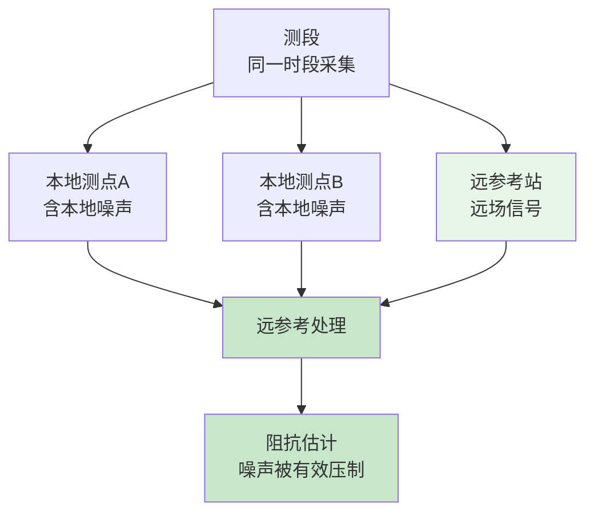
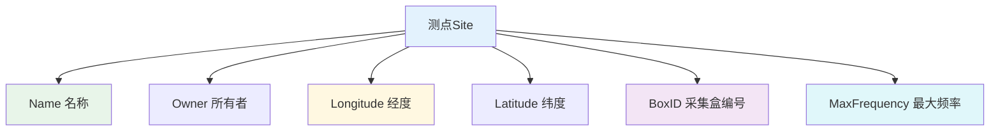
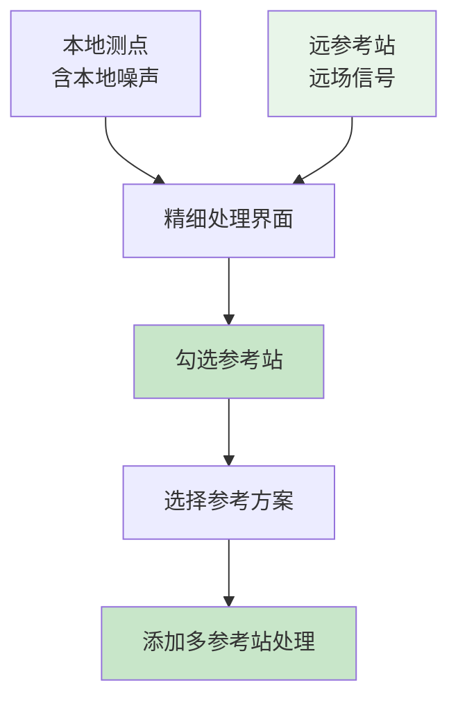

# 数据工程管理

## 工程结构概述

MTDP采用四级层次结构管理数据：

```
📦 工程 (Project) → 🗺️ 工区 (WorkArea) → 📋 测段 (Group) → 📍 测点 (Site)
```

### 各层级说明

| 层级 | 说明 | 典型用途 |
|-----|------|---------|
| 工程 | 最顶层容器 | 整个勘探项目 |
| 工区 | 按区域划分 | 同一区域的测点集合 |
| 测段 | 同时段采集/远参考 | 同一时段测点集合（支持远参考计算） |
| 测点 | 最小数据单元 | 单个观测点数据 |

### 测点类型

MTDP支持多种测点类型：

| 类型 | 📻 仪器 | 📄 格式 |
|-----|------|-----|
| PhoenixSite | Phoenix MTU-5/5A | TBL格式数据 |
| MTUSite | Phoenix MTU-5C/8A | JSON格式数据 |
| MetronixSite | Metronix仪器 | ATM格式数据 |
| LEMISite | LEMI长周期 | LEMI长周期格式 (.bin/.msr文件) |
| UltraEMSite | 国科 UltraEM Z5/Z5L/Z5-8C | Z5L: 5通道(MT/LMT); Z5-8C: 8通道(MT+LMT) |

| RMTSite | RMT格式 | 无线电MT |
| SBFSite | SBF格式 | RMT数据 |
| CASRMTSite | CASRMT格式 | 可控源AMT |
| ATTSSite | Aether仪器 | ATTS格式 |
| SyntheticSite | 合成数据 | 正演模拟 |
| EDISite | EDI格式 | 已处理数据 |

---

## 创建与管理工程

### 新建工程

1️⃣ 选择菜单 `文件 → 新建工程`
2️⃣ 在弹出的对话框中设置：
   - 📝 工程名称
   - 📁 保存位置
   - 📖 工程描述（可选）
3️⃣ 点击"确定"创建

### 打开已有工程

**📄 方式1：直接打开**
- 选择 `文件 → 打开工程`
- 选择 .MTDPE 文件

**🕐 方式2：最近文件**
- 选择 `文件 → 重新打开`
- 从列表中选择

### 工程属性设置 (ProjectSetForm)

打开工程设置窗口可以配置以下属性：

**📋 基本信息：**

| 字段 | 说明 |
|-----|------|
| Name | 工程名称 |
| Owner | 所有者 |
| Creator | 创建者 |
| Editor | 编辑者 |
| Purpose | 工程目的 |
| Description | 描述信息 |
| Version | 版本号 |

**📁 目录配置：**

| 字段 | 说明 |
|-----|------|
| Project Directory | 工程目录 |
| Data Directory | 数据目录 |

**⏰ 时间信息（自动记录）：**

- 创建时间
- 最后编辑时间

> 💡 **操作方法**：右键工程 → `工程设置`

### 人员信息管理 (PersonSetForm)

管理项目中参与人员的信息，便于数据溯源和协作。

**👤 人员字段：**

| 字段 | 说明 |
|-----|------|
| Name | 姓名 |
| Phone | 联系电话 |
| Email | 电子邮箱 |
| Institution | 所属机构 |
| Position | 职位 |
| Description | 备注 |

> **操作方法**：在工程设置或工区设置中点击人员字段进行编辑

---

## 工区管理

### 新建工区

1. 右键工程 → `新建工区`
2. 设置工区属性：
   - 名称
   - 描述
   - 坐标范围（可选）

### 工区属性设置 (WorkAreaSetForm)

打开工区设置窗口可以配置以下属性：

**📋 基本信息：**

| 字段 | 说明 |
|-----|------|
| Name | 工区名称 |
| Description | 描述信息 |
| Owner | 所有者 |
| Surveyor | 测量员 |
| DataCollector | 数据采集者 |
| DataProcessor | 数据处理者 |

**🌍 坐标范围（可选）：**

| 字段 | 说明 |
|-----|------|
| MinLongitude | 最小经度 |
| MaxLongitude | 最大经度 |
| MinLatitude | 最小纬度 |
| MaxLatitude | 最大纬度 |

> 💡 **提示**：坐标范围可用于在地图上显示工区边界，方便数据管理和可视化。

**📊 工区统计信息：**

| 属性 | 说明 |
|-----|------|
| CreateTime | 创建时间 |
| Groups | 测段列表 |
| SiteCount | 测点总数（自动计算） |
### 工区操作

- **编辑**：右键 → 工区设置
- **复制**：右键 → 复制工区
- **删除**：右键 → 删除工区
- **导出坐标**：导出工区内所有测点坐标

---

## 测段管理

### 新建测段

1. 右键工区 → `新建测段`
2. 设置测段属性

### 测段属性设置 (GroupSetForm)

打开测段设置窗口可以配置以下属性：

**📋 基本信息：**

| 字段 | 说明 |
|-----|------|
| Name | 测段名称 |
| Description | 描述信息 |

**⚙️ 处理方案：**

测段可以关联FFT处理方案，用于后续数据处理：

| 选项 | 说明 |
|-----|------|
| 选择已有方案 | 从下拉列表中选择已创建的FFT处理方案 |
| 使用默认方案 | 不指定方案时使用系统默认参数 |

> 💡 **提示**：处理方案可在后续处理阶段修改，不影响数据导入。

### 测段的远参考意义

测段的核心作用是**将同时段采集的测点集合在一起**，以便进行远参考站处理。



**远参考处理的关键要求：**
- 同一测段内的所有测点必须在**时间上有重叠**
- 远参考站与本地测点之间噪声应**不相关**
- 建议每个测段包含至少1个远参考站

> 💡 **提示**：只有同属一个测段的测点之间才能进行远参考处理。不同测段的测点无法互相作为远参考站。

**测段设置建议：**
- 将同一时间段采集的测点放在同一测段
- 将远参考站单独建为一个测段
- 远参考站测段应与目标工区的测段时间段重叠

**📊 测段统计信息：**

| 属性 | 说明 |
|-----|------|
| Sites | 测点列表 |
| SiteCount | 测点数量（自动计算） |
| ProcessSchema | 关联的处理方案 |

### 批量加载测点

**从目录加载：**
1. 右键测段 → `加载测点 → 从目录`
2. 选择数据目录
3. 系统自动识别数据类型

**从EDI文件加载：**
1. 右键测段 → `加载测点 → 从EDI文件`
2. 选择EDI文件（支持多选）

---

## 测点管理

### 测点属性



| 属性 | 说明 |
|-----|------|
| **📋 基本信息** | |
| Name | 测点名称 |
| Owner | 所有者 |
| Description | 描述 |
| Surveyor | 测量员 |
| DataCollector | 数据采集者 |
| DataProcessor | 数据处理者 |
| CreationTime | 创建时间 |
| DataQuality | 数据质量（0-4级） |
| **🌍 坐标信息** | |
| Longitude | 经度 |
| Latitude | 纬度 |
| Altitude | 高程 |
| **📦 采集盒信息** | |
| BoxID | 采集盒编号 |
| EPreamplifier | 电场前置放大器 |
| ExGroundRes | Ex接地电阻 |
| EyGroundRes | Ey接地电阻 |
| **📊 频率信息** | |
| MaxAvailableFrequency | 最大可用频率 |
| MinAvailableFrequency | 最小可用频率 |

### 测点操作

- **编辑属性**：右键 → 测点设置
- **设置电场类型**：右键 → 电场类型
- **设置数据质量**：右键 → 数据质量
- **导出EDI**：右键 → 导出EDI

### 数据质量等级

| 等级 | 说明 |
|-----|------|
| 0 | 未评估 |
| 1 | 优秀 |
| 2 | 良好 |
| 3 | 一般 |
| 4 | 较差 |

### 测点排序

可按以下方式对测点排序：

| 排序方式 | 说明 |
|---------|------|
| 按纬度 | 从南到北或从北到南 |
| 按经度 | 从西到东或从东到西 |
| 按名称 | 按字母顺序 |
| 按开始时间 | 按采集开始时间 |
| 按结束时间 | 按采集结束时间 |

操作方法：右键测段 → 排序测点 → 选择排序方式

### 通道配置

每个测点包含5个电磁场通道，可独立配置：


| 通道 | 索引 | 反向 | 长度(m) | 传感器 | 旋转角(°) |
|-----|------|------|--------|--------|----------|
| Ex | ✓ | ✓ | ✓ | - | ✓ |
| Ey | ✓ | ✓ | ✓ | - | ✓ |
| Hx | ✓ | ✓ | ✓ | ✓ | ✓ |
| Hy | ✓ | ✓ | ✓ | ✓ | ✓ |
| Hz | ✓ | ✓ | ✓ | ✓ | ✓ |

**配置项说明：**

| 配置项 | 说明 |
|-------|------|
| 索引 | 通道在数据文件中的顺序号 |
| 反向 | 是否翻转信号方向 |
| 长度 | 电场电极距离（仅Ex、Ey） |
| 传感器 | 磁传感器编号（仅Hx、Hy、Hz） |
| 旋转角 | 通道相对于地理北的旋转角度 |

### 时间信息

| 属性 | 说明 |
|-----|------|
| BeginTime | 采集开始时间 |
| EndTime | 采集结束时间 |
| ProcessBeginTime | 处理开始时间（可选） |
| ProcessEndTime | 处理结束时间（可选） |
| TimeLength | 采集时长（小时，自动计算） |

### 特殊功能

**🔄 拖放文件更新**

支持通过拖放文件自动更新测点信息：

| 文件类型 | 更新内容 |
|---------|---------|
| .tbl | 自动更新Phoenix测点坐标、时间、采集盒ID、传感器ID、电极长度、旋转角 |
| .lemi | 更新LEMI通道索引 |
| .stfc | 加载傅里叶系数 |

**💾 自动备份**

| 操作 | 备份行为 |
|-----|---------|
| 修改Phoenix TBL | 自动备份为 .tbl.backup |
| 修改RMT JSON | 自动备份原文件 |
---

## 远参考站管理

### 远参考处理说明



远参考处理用于消除本地噪声的影响，提高阻抗估计的准确性。**远参考处理在精细处理界面（频谱编辑窗口）中完成**，而非在测段层面计算。

> 💡 **提示**：远参考处理需要测点间有时间重叠的采集数据，且参考站应位于远场区域（噪声与本地测点不相关）。

> ⚠️ **前提条件**：远参考站和本地测点必须位于**同一测段**中，才能在精细处理界面中互相作为参考站使用。建议在新建测段时，将同时段采集的本地测点和远参考站一起加载到同一测段。

### 精细处理界面中的远参考操作

远参考站的设置和切换在**精细处理界面**中进行：

1️⃣ 右键测点 → `频谱编辑`，打开精细处理界面
2️⃣ 在左侧面板的**远参考站列表**中查看可用的远参考站
3️⃣ **勾选**要使用的远参考站
4️⃣ 在下拉框中选择参考方案（RE/RH/REH/RELH）
5️⃣ 点击**添加多参考站处理**按钮，生成新的处理版本
6️⃣ 在视电阻率/相位选项卡中查看处理效果

### 远参考方案

| 方案 | 代码 | 说明 |
|------|------|------|
| 本地电场参考 | LE | 使用本地电场 Ex/Ey 作为参考 |
| 本地磁场参考 | LH | 使用本地磁场 Hx/Hy 作为参考 |
| 本地电磁场参考 | LEH | 本地电场+磁场组合，按相干性加权 |
| **远参考电场** | RE | 使用远参考站电场 Ex/Ey ⭐推荐 |
| **远参考磁场** | RH | 使用远参考站磁场 Hx/Hy ⭐推荐 |
| **远参考电磁场** | REH | 频率自适应切换：≥50Hz用远参考电场，<50Hz用远参考磁场 |
| 远E/本地H | RELH | 频率自适应切换：≥50Hz用远参考电场，<50Hz用本地磁场 |

> 💡 **推荐**：使用 RE（远参考电场）或 RH（远参考磁场）可获得最佳远参考效果。

### 远参考站列表操作

| 操作 | 功能 |
|------|------|
| **勾选** | 选择参与处理的参考站 |
| **删除选中** | 删除已勾选的参考站 |

### 多参考站处理

MTDP支持使用多个远参考站同时处理：

1. 在远参考站列表中勾选多个参考站
2. 选择远参考方案（推荐 REH）
3. 点击"添加多参考站处理"按钮
4. 系统自动创建新的编辑FC版本

### 反向参考站配置

反向参考用于特殊处理场景，可将本地测站作为参考站使用。

| 方案 | 说明 |
|------|------|
| **None** | 不使用反向参考 |
| LE/LH/LEH | 本地参考方案 |
| RE/RH/REH | 远参考方案 |

### 旋转角度设置

| 参数 | 说明 |
|------|------|
| **测站旋转角** | 本地测站的旋转角度（度） |
| **参考站旋转角** | 远参考站的旋转角度（度） |

> 📖 **详细操作步骤请参阅"时间序列处理"章节中的"测点精细处理界面"部分。

---

## 坐标管理

### 从KML导入坐标

从KML文件批量更新测点坐标：

1. 准备包含测点位置信息的KML文件
2. 右键测段 → `从KML读取坐标`
3. 选择KML文件
4. 系统自动匹配测点名称并更新坐标

### 导出测点坐标

1. 右键测段 → `导出坐标`
2. 选择保存位置
3. 生成坐标文件（包含名称、经度、纬度、高程）

### 坐标格式

MTDP支持以下坐标格式：
- 十进制度（推荐）
- 度分秒（自动转换）

---

## 工程文件管理

### 保存与备份

**手动保存：**
- `文件 → 保存` (Ctrl+S)
- `文件 → 另存为`

**自动备份：**
- 每次保存时自动创建备份
- 保留最近10个版本
- 备份文件在工程目录下

### 工程信息存储

工程信息保存在以下位置：

- **工程文件列表**: `Configurations/ProjectInfos.XML`
- **语言文件**: `Configurations/Lang/` 目录

### 导入导出

**导出版本：**
- `文件 → 导出版本`
- 创建完整工程副本

**导出选中项：**
- `文件 → 导出选中项`
- 仅导出选中的数据

---

## 多语言支持

MTDP支持多语言界面：

1. 选择 `设置 → 语言`
2. 选择语言：
   - 中文
   - English
3. 重启软件生效

语言文件存储在 `Configurations/Lang/` 目录。

---

## 常用操作快捷方式

| 操作 | 方法 |
|-----|------|
| 复制测点 | 右键 → 复制 / Ctrl+C |
| 粘贴测点 | 右键 → 粘贴 / Ctrl+V |
| 删除 | 右键 → 删除 / Delete |
| 重命名 | 右键 → 重命名 / F2 |
| 批量选择 | 按住Ctrl多选 |
