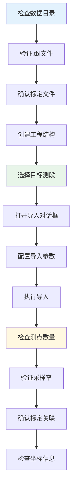
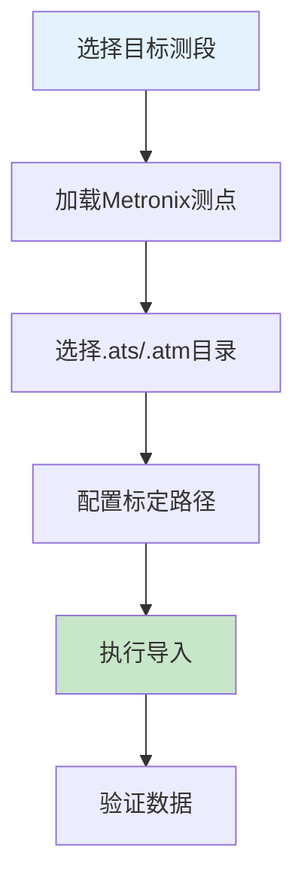
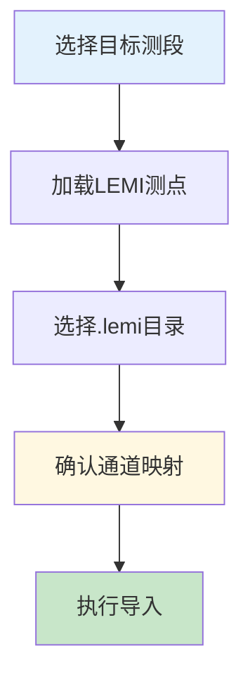
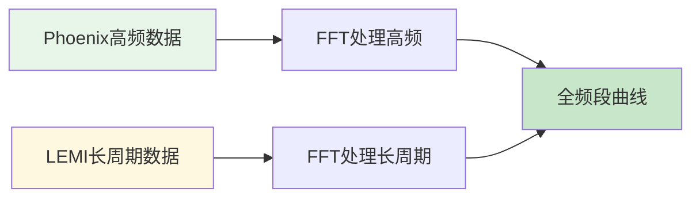
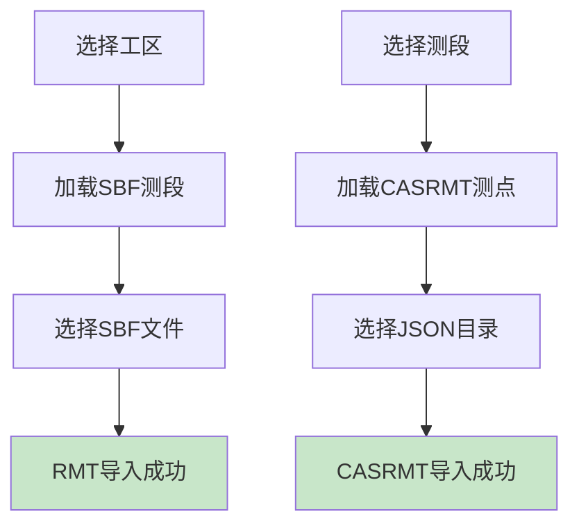
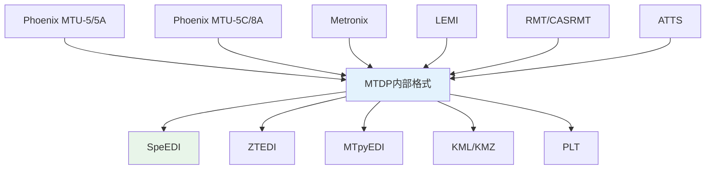

# 🔌 第4章 仪器数据支持

本章介绍MTDP支持的各类MT仪器数据格式及其导入处理流程。

---

## 4.1 📻 Phoenix MTU-5/5A (TBL格式)

### 3.1.1 支持的仪器型号

- **MTU-5**：经典款MT采集系统
- **MTU-5A**：升级版本，支持更高采样率

### 3.1.2 数据文件

| 文件 | 说明 |
|-----|------|
| .tbl | 头文件，记录采集参数 |
| .ts | 时间序列数据 |
| .mt | 连续时间序列数据 |

### 3.1.3 Phoenix MTU-5/5A 数据导入（详细步骤）



#### 3.1.3.1 准备工作

**步骤1：检查数据文件**
- [ ] 确认数据目录存在
- [ ] 检查.tbl头文件完整性
- [ ] 验证标定文件（CLB/CLC）是否齐全
- [ ] 确认.ts时间序列文件完整

**步骤2：在MTDP中准备工程结构**
- [ ] 创建或选择目标工区
- [ ] 在工区下创建测段
- [ ] 确认工程路径设置正确

#### 3.1.3.2 导入流程

**步骤3：打开导入对话框**
1. 在工程树中选择目标测段
2. 右键选择 `加载测点 → 从目录加载Phoenix测点`
3. 系统打开Phoenix测点导入对话框

**步骤4：配置导入参数**

在导入对话框中：
| 参数 | 说明 | 默认值 |
|-----|------|-------|
| 数据目录 | 选择Phoenix数据所在文件夹 | 系统记住上次位置 |
| 递归搜索 | 勾选是否搜索子目录 | 勾选 |
| 文件格式 | 自动识别 | 自动 |
| 测点命名规则 | 从文件名提取 | 从文件名提取 |
| 标定文件路径 | 自动搜索 | 系统搜索路径 |

**步骤5：执行导入**

点击"确定"后，系统将：
1. 扫描目录中的.tbl文件
2. 解析每个.tbl头文件获取测点信息
3. 提取时间序列文件路径
4. 创建测点结构并添加到工程树
5. 显示导入进度

#### 3.1.3.3 导入后验证

**检查项目：**
| 检查项 | 验证方法 |
|---------|---------|
| 测点数量 | 与源文件数量对比 | 工程树统计 |
| 采样率匹配 | 查看TS2/TS3/TS4/TS5分配 | 测点设置 |
| 标定文件关联 | 打开测点设置查看标定文件 | 测点设置窗口 |
| 坐标信息 | 确认经纬度正确 | 工程树查看 |

#### 3.1.3.4 常见问题与解决

**问题1：提示"文件格式不识别"**
- 原因：不是标准的Phoenix格式
- 解决：
  1. 检查.tbl文件是否为空或损坏
  2. 确认.tbl头文件中必需字段（BoxID、采样率等）完整
  3. 尝试使用Phoenix官方工具重新导出数据

**问题2：导入后时间序列显示异常**
- 原因：采样率设置不匹配或文件损坏
- 解决：
  1. 检查.ts文件大小是否合理
  2. 验证采样率与.tbl头文件一致
  3. 尝试使用`工具 → 时间序列查看器`单独查看数据

**问题3：标定文件未找到**
- 原因：标定文件不在标准搜索路径
- 解决：
  1. 检查采集盒序列号与标定文件名匹配
  2. 将标定文件复制到工程目录
  3. 使用`设置 → 管理标定路径`添加标定文件目录

**问题4：导入速度缓慢**
- 原因：数据量大或磁盘IO性能问题
- 解决：
  1. 关闭其他程序减少系统负载
  2. 分批导入而非一次性导入全部测点
  3. 使用SSD存储工程文件

#### 3.1.3.5 最佳实践

**文件组织建议：**
- 将同一测区的所有Phoenix数据放在同一文件夹
- 使用有意义的文件夹命名（如工区名称_测线）
- 备份原始数据文件到单独目录
- 定期清理不再使用的临时文件

**导入工作流建议：**
1. 先导入少量测试数据验证流程
2. 确认导入结果后再批量导入剩余数据
3. 导入后立即检查测点数量和质量
4. 保存工程备份以便回溯

### 3.1.4 标定文件

| 文件 | 用途 |
|-----|------|
| CLB | 电场盒标定 |
| CLC | 磁传感器标定 |

> 💡 **提示**：确保标定文件与采集盒序列号匹配。

### 3.1.5 专用工具

Phoenix仪器提供多种专用处理工具：

#### 🔧 Phoenix数据处理 (PhoenixDataProcessForm)

**功能：**
- TBL文件管理和编辑
- 标定文件关联（CLB/CLC）
- 图表查看和分析

**操作步骤：**
1. 选择菜单 `工具 → Phoenix工具 → 数据处理`
2. 加载TBL文件
3. 配置标定文件路径
4. 查看时间序列和频谱

#### 📊 SSMT2000处理 (PhoenixNormalDataProcessForm)

**支持格式：**
| 格式 | 说明 |
|-----|------|
| CLB | 电场盒标定文件 |
| CLC | 磁传感器标定文件 |
| PFT | 功率谱文件 |
| PRM | 参数文件 |
| FC | 傅里叶系数文件 |
| MT | MT响应文件 |
| EDI | EDI格式文件 |

#### 🔄 数据合并 (PhoenixDataMergeForm)

**功能：**
- MTU-5A数据合并
- 多文件自动合并
- 时间对齐


**操作步骤：**
1. 选择菜单 `工具 → Phoenix TS合并`
2. 选择要合并的文件
3. 设置合并参数
4. 执行合并
#### ✂️ 时间序列分割 (PhoenixTSSplit)

**功能：**
- 分割长时间连续数据
- 按时间段分割
- 段管理

#### 🔧 通道重排 (PhoenixChannelReArrengeForm)

**通道控制：**
| 通道 | 功能 |
|-----|------|
| Ex | X方向电场 |
| Ey | Y方向电场 |
| Hx | X方向磁场 |
| Hy | Y方向磁场 |
| Hz | Z方向磁场 |

**操作：**拖动通道滑块调整顺序

#### ⏰ 时间序列对齐修复 (PhoenixTSMisalignmentRepairForm)

**功能：**修复时钟同步问题导致的时间序列错位

#### 📋 TBL参数替换 (TBLParameterReplaceForm)

**功能：**批量替换TBL文件中的参数值

#### TS→FC转换 (PhoenixTsToFtMenu)

**功能：**将时间序列转换为傅里叶系数文件

---

## 3.2 Phoenix MTU-5C/8A (JSON格式)

### 3.2.1 支持的仪器型号

- **MTU-5C**：新一代宽带MT采集系统
- **MTU-8A**：多通道MT采集系统

### 3.2.2 数据导入

1. 选择目标测段
2. 右键选择 `加载测点 → 从目录加载MTU测点`
3. 选择JSON数据目录
4. 确认导入

### 3.2.3 降采样处理

高采样率数据可降采样处理：

1. 选择菜单 `工具 → MTU工具 → 降采样`
2. 设置目标采样率
3. 执行降采样

---

## 3.3 📻 Metronix仪器

### 3.3.1 支持的仪器型号

- ADU-06
- ADU-07
- MMS系列

### 3.3.2 数据文件

| 文件 | 说明 |
|-----|------|
| .ats | 时间序列数据 |
| .atm | ATM格式数据 |
| .cal | 标定文件 |

### 3.3.3 数据导入



1. 选择目标测段
2. 右键选择 `加载测点 → 加载Metronix测点`
3. 选择数据目录
4. 配置标定文件路径
5. 执行导入

### 3.3.4 WEM数据处理器

1. 选择菜单 `工具 → Metronix工具 → WEM处理器`
2. 加载WEM格式数据
3. 执行处理

### 3.3.5 Metronix专用工具

#### 📊 WEM处理器 (WEMProcessorForm)

**功能：**处理Western Electromagnetic数据

**操作步骤：**
1. 选择菜单 `工具 → Metronix工具 → WEM处理器`
2. 加载WEM格式数据
3. 执行处理
4. 导出结果

#### 🔄 ATS→DAT转换

**功能：**将ATS格式转换为DAT格式

**操作：**选择菜单 `工具 → Metronix工具 → ATS→DAT`

---

## 3.4 LEMI长周期仪器

### 3.4.1 数据特点

LEMI仪器适合长周期MT观测，记录周期可达数万秒。

### 3.4.2 数据导入



1. 选择目标测段
2. 右键选择 `加载测点 → 加载LEMI测点`
3. 选择数据目录
4. 确认通道映射
5. 执行导入
### 3.4.3 与高频数据联合处理


```

1. 分别导入高频和长周期数据
2. 分别处理两个频段
3. 导出全频段结果
### 3.4.4 LEMI专用工具

#### 🔄 测点合并 (LEMISiteMergeForm)

**功能：**合并多个LEMI测点数据

**操作步骤：**
1. 选择菜单 `工具 → LEMI测点合并`
2. 选择要合并的文件
3. 执行合并

#### ⏰ H自动恢复 (LEMISiteHAutoRestoreMenu)

**功能：**自动恢复LEMI磁场数据

---
---

## 3.5 📡 RMT/CASRMT格式

### 3.5.1 数据导入



**📶 RMT格式：**
1. 选择工区级别
2. 右键选择 `加载SBF测段`
3. 选择SBF文件

**CASRMT格式：**
1. 选择目标测段
2. 右键选择 `加载测点 → 加载CASRMT测点`
3. 选择数据目录
### 3.5.2 RMT/CASRMT专用工具

#### 📋 RMT站点管理 (RMTSiteForm)

**功能：**管理RMT格式测点配置

**设置项：**

| 字段 | 说明 |
|-----|------|
| 站点名称 | 测点标识 |
| 坐标信息 | 经纬度高程 |
| 采集参数 | 采样率等 |

---

## 3.6 Aether仪器 (ATTS格式)

### 3.6.1 数据导入

1. 选择目标测段
2. 右键选择 `加载测点 → 加载ATTS测点`
3. 选择数据目录

### 3.6.2 降采样处理

1. 选择菜单 `时间序列处理 → ATTS降采样`
2. 设置目标采样率
3. 执行降采样

---

## 3.7 📄 通用EDI格式

### 3.7.1 导入已有EDI数据

1. 选择目标测段
2. 右键选择 `加载测点 → 从EDI文件加载`
3. 选择EDI文件

### 3.7.2 数据编辑

导入EDI后可进行：
- 修改测点元数据
- 删除异常频点
- 数据修复

---

## 3.8 🎲 合成数据 (Synthetic)

### 3.8.1 数据格式

合成数据用于正演模拟测试，支持以下格式：

| 扩展名 | 说明 |
|-------|------|
| .timeseries | 合成时间序列数据 |
| .timeseriesb | 二进制格式合成数据 |

### 3.8.2 数据导入

1. 选择目标测段
2. 右键选择 `加载测点 → 加载合成数据`
3. 选择 .timeseries 文件

---

## 3.9 📊 AGEXXL格式

### 3.9.1 数据导入

1. 选择目标测段
2. 右键选择 `加载测点 → 加载AGEXXL测点`
3. 选择 .dat 数据文件

---

## 3.10 📋 数据格式汇总



| 仪器/格式 | 数据文件 | 标定文件 | 自动识别扩展名 |
|----------|---------|---------|--------------|
| Phoenix MTU-5/5A | .ts, .mt | .clb, .clc | .tbl |
| Phoenix MTU-5C/8A | .ts | .json | recmeta.json |
| Metronix | .ats, .atm | .cal | .mxsite |
| LEMI | 二进制 | .txt | .lemi, .lemijson |
| SBF | .sbf | 内置 | .sbf |
| RMT | .tr1/.tr2/.tr3 | 内置 | .tr1, .tr2, .tr3 |
| CASRMT | .json | .csv | .rmtjson, .json |
| ATTS | 二进制 | .csv | .atts, .atinfo |
| AGEXXL | .dat | .csv | .dat |
| Synthetic | .timeseries | - | .timeseries, .timeseriesb |
| EDI | .edi | - | .edi |

---

## 3.11 标定文件查找机制

MTDP采用多级路径搜索标定文件，确保标定文件能够被自动找到：

### 3.11.1 搜索顺序

| 优先级 | 搜索位置 | 说明 |
|-------|---------|------|
| 1 | 数据文件所在目录 | TBL/数据文件同目录 |
| 2 | 用户指定路径 | 设置中配置的额外路径 |
| 3 | 全局配置路径 | 默认标定目录 |
| 4 | 默认路径 | CalibrationFiles/Text 或 CalibrationFiles/CSV |

### 3.11.2 标定文件格式

| 格式 | 扩展名 | 内容 |
|-----|-------|------|
| 幅值相位格式 | .txt | 频率、幅度、相位 |
| CSV格式 | _CLB.csv, _CLC.csv | 频率、复数响应 |
| 实部虚部格式 | .txt | 频率、实部、虚部 |

### 3.11.3 配置标定路径

1. 选择 `设置 → 管理标定路径`
2. 添加或删除标定文件搜索路径
3. 系统自动在配置的路径中查找标定文件

---

## 3.12 多文件加载方式

### 3.12.1 单文件加载

标准方式，从单个数据文件创建测点。

### 3.12.2 双源文件加载（X/Y源）

用于可控源MT数据，分别加载X方向和Y方向源数据：
1. 右键测段 → `加载测点 → 双源文件`
2. 选择X方向数据文件
3. 选择Y方向数据文件

### 3.12.3 多文件合并加载

将多个数据文件合并为一个测点：
1. 右键测段 → `加载测点 → 多文件合并`
2. 选择多个数据文件
3. 系统自动合并

---

## 3.13 仪器类型自动识别

MTDP根据文件扩展名自动识别仪器类型：

| 文件特征 | 识别为 |
|---------|-------|
| .tbl | Phoenix |
| recmeta.json | MTU |
| .mxsite | Metronix |
| .lemi, .lemijson | LEMI |
| .sbf | SBF |
| .tr1, .tr2, .tr3 | RMT |
| .rmtjson, .json (非recmeta) | CASRMT |
| .atts, .atinfo | ATTS |
| .dat | AGEXXL |
| .timeseries, .timeseriesb | Synthetic |
| .edi | EDI |

---

## 3.14 数据导入建议

### 3.9.1 导入前检查

- 确认数据文件完整
- 检查标定文件匹配
- 验证通道配置

### 3.9.2 数据组织

- 同一仪器数据放在同一目录
- 保持文件命名规范
- 备份原始数据

---

## 3.15 批量添加频点

在MTDP中处理数据时，可能需要批量添加或修改频点。MTDP提供了强大的频点管理功能。

### 3.15.1 批量添加频点表单 (BatchAddFreqForm)

**位置**: `处理 → 批量添加频点`

**功能**: 一次性生成多个频点，支持三种分布方式

### 3.15.2 频率生成方式

MTDP支持三种频率生成方式：

| 方式 | 索引 | 说明 | 适用场景 |
|:----:|:----:|:-----|:---------|
| **等比分布（对数）** | 0 | 按对数等间隔生成 | 宽频带探测，覆盖全频段 |
| **等差分布（线性）** | 1 | 按线性等间隔生成 | 固定频率间隔研究 |
| **自定义间距** | 2 | 按自定义倍数递增 | 非均匀采样研究 |

### 3.15.3 参数说明

| 参数 | 控件名称 | 说明 | 单位 |
|:----:|:--------:|:-----|:----:|
| 起始频率 | NumberBoxStartFreq | 频带低端频率 | Hz |
| 终止频率 | NumberBoxEndFreq | 频带高端频率 | Hz |
| 频点数量 | NumberBoxFreqCount | 要生成的频点总数 | - |
| 频率间距 | NumberBoxSpacing | 线性间隔值或对数倍数 | Hz或比例 |

### 3.15.4 生成算法

#### 等比分布（对数间隔）

频点按对数等间隔分布，公式为：

```
Freq[i] = StartFreq × (EndFreq / StartFreq)^(i / (Count - 1))
```

**特点**:
- 频点在对数尺度上均匀分布
- 低频端频点密集，高频端稀疏
- 适合宽频带MT探测

**示例**:
```
起始频率: 0.001 Hz
终止频率: 1000 Hz
频点数量: 32

结果: 0.001, 0.002, 0.004, 0.008, ... (对数等比)
```

#### 等差分布（线性间隔）

频点按固定频率间距均匀分布，公式为：

```
Freq[0] = StartFreq
Freq[i+1] = Freq[i] + Spacing
直到 Freq[i] > EndFreq
```

**特点**:
- 频点在线性尺度上均匀分布
- 每个频段间隔相同
- 适合固定频率研究

**示例**:
```
起始频率: 10 Hz
终止频率: 100 Hz
频率间距: 5 Hz

结果: 10, 15, 20, 25, 30, ... 95, 100
```

#### 自定义间距（乘法递增）

频点按倍数因子递增，公式为：

```
Freq[0] = StartFreq
Freq[i+1] = Freq[i] × Spacing
直到 Freq[i] > EndFreq
```

**特点**:
- 频点间隔按倍数增长
- 频率间隔逐渐增大
- 适合对数尺度研究

**示例**:
```
起始频率: 1 Hz
终止频率: 1000 Hz
间距因子: 1.5

结果: 1, 1.5, 2.25, 3.375, ... (倍增)
```

### 3.15.5 频段编辑功能 (EditBandForm)

**位置**: `处理 → 编辑频段`

**功能**: 添加新频段或编辑已有频段

#### 界面参数

| 参数 | 控件 | 说明 |
|:----:|:-----:|:-----|
| 频段名称 | Edit | 频段标识名称 |
| 采样率 | Edit | 采样率设置 |

#### 采样率输入格式

支持多种分隔符格式：

| 格式 | 示例输入 | 解析结果 |
|:----:|:---------|:---------|
| 单值 | `2400` | 2400 Hz |
| 逗号分隔 | `2400, 150, 15` | 2400, 150, 15 Hz |
| 空格分隔 | `2400 150 15` | 2400, 150, 15 Hz |
| 分号分隔 | `2400;150;15` | 2400, 150, 15 Hz |
| 换行分隔 | `2400` + `150` + `15` | 2400, 150, 15 Hz |

#### 验证规则

- 频段名称不能为空
- 采样率必须大于0
- 至少输入一个采样率

---

## 3.16 分组类型设置 (GroupTypeForm)

在MTDP中处理数据时，需要设置XPR（交叉功率比）分组方式。

**位置**: `处理 → 分组类型`

### 分组类型说明

| 类型 | 值 | 说明 |
|:----:|:---:|:-----|
| 平均 | 0 | 所有数据平均分组 |
| 排序 | 1 | 按相干度排序后分组 |
| 随机 | 2 | 随机方式分组 |

### MaxXPR参数

MaxXPR（最大交叉功率比）用于设置分组阈值：
- 值越大：接受更多数据，但可能包含噪声
- 值越小：剔除更多噪声，但可能丢失有效数据

**建议值**:
- 保守设置: 1.0
- 标准设置: 1.5
- 激进设置: 2.0
