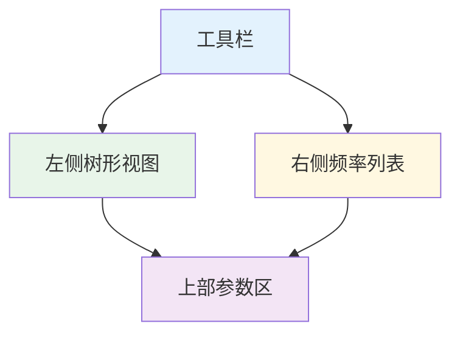
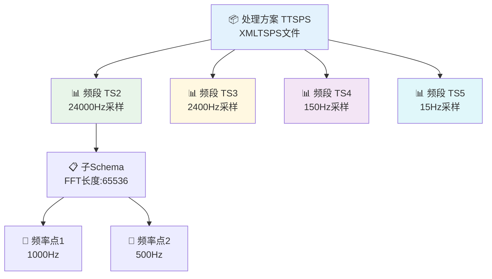
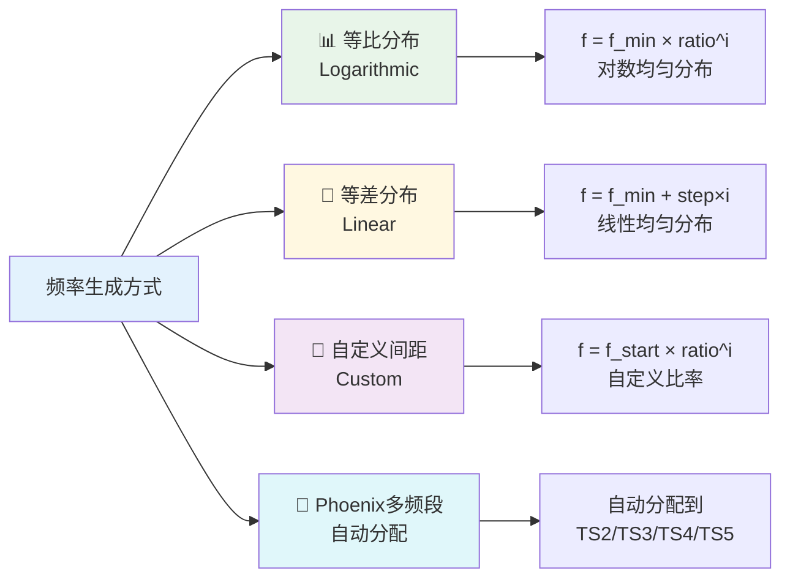
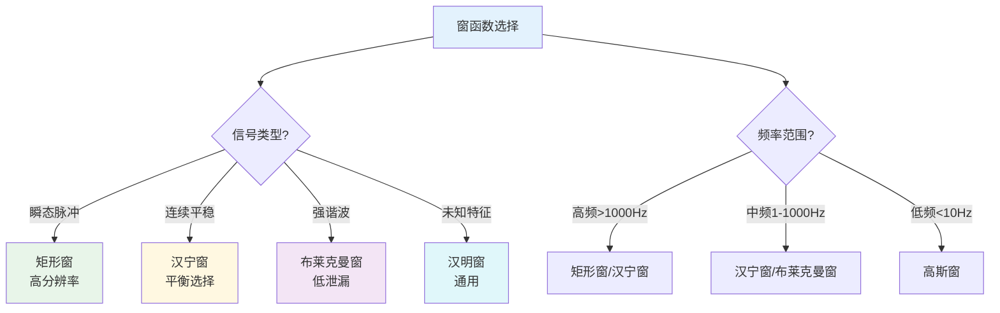
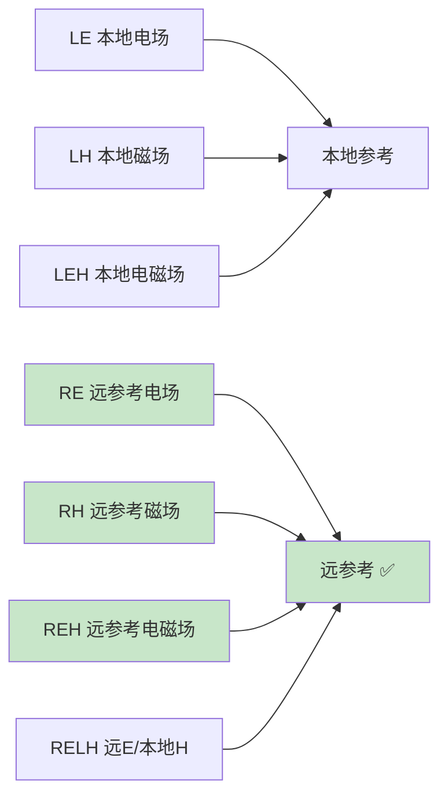
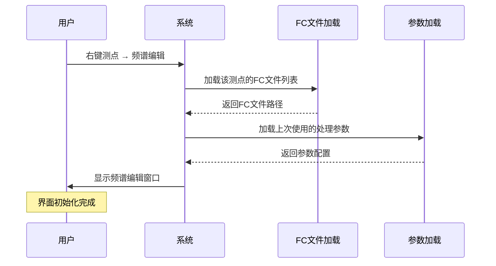
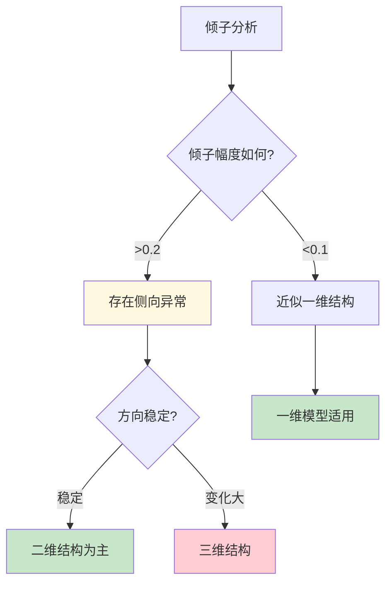
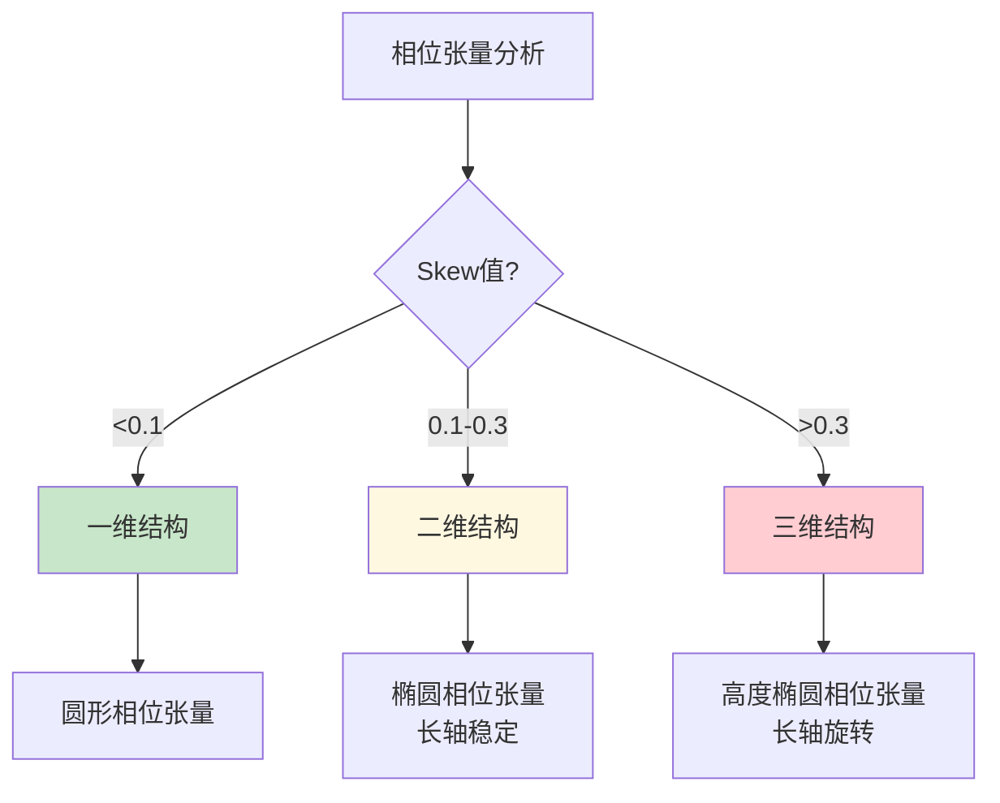
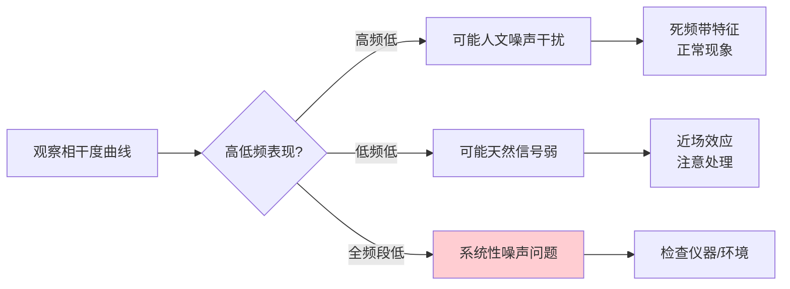

# 时间序列处理

本章介绍时间序列数据的处理方法，包括FFT参数设置、频段管理、标定应用和滤波处理。

---

## ⚙️ FFT参数设置概述

FFT参数设置对话框用于配置时间序列处理的各项参数。可通过以下方式打开：

1️⃣ 右键测段 → `FFT参数设置`
2️⃣ 菜单 `处理 → FFT参数设置`

### 参数设置对话框结构

对话框分为以下几个主要区域：



| 区域 | 内容 |
|-----|------|
| 🌳 左侧树形视图 | 频段和子Schema管理 |
| 📋 右侧频率列表 | 显示当前选中项的频率 |
| 📊 上部参数区 | FFT/估计/自动筛选参数 |
| 🔘 下部按钮区 | 打开/保存/确认/取消 |

---

## 📂 频段管理（MainSchema）

### 频段结构

MTDP采用三级层次结构组织FFT参数：



```
📦 处理方案 (TTSPS)
└── 📊 频段 (TTSMainSchema)
    └── 📋 子Schema (TTSSubSchema)
        └── 📍 频率点
```

### 频段属性

| 属性 | 类型 | 说明 |
|-----|------|------|
| Name | String | 频段名称（如TS2、TS3、TS4、TS5） |
| SampleRate | Double1D | 采样率数组（支持多个采样率） |
| SubSchema | List | 子Schema列表 |

### 频段操作

| 操作 | 方法 |
|-----|------|
| 添加频段 | 点击"添加频段"按钮或右键菜单 |
| 编辑频段 | 双击频段节点或点击"编辑频段" |
| 删除频段 | 选中频段后点击"删除频段" |
| 复制频段 | 右键菜单 → 复制频段 |

### 预设频段配置

系统提供预设频段配置，位于 `Configurations\` 目录：

| 配置文件 | 说明 |
|---------|------|
| MT2Octave.XMLTSPS | MT标准二倍频配置 |
| 其他.XMLTSPS | 用户自定义配置 |

---

## 子Schema管理（SubSchema）

### 子Schema属性

| 属性 | 类型 | 默认值 | 说明 |
|-----|------|-------|------|
| SampleLength | Double | 4096 | FFT长度（样本数） |
| Overlap | Double | 0.5 | 重叠率（0-0.75） |
| Frequency | Double1D | - | 频率数组 |
| MaxXPR | Integer | 100 | 最大XPR值 |
| GroupingType | Integer | 0 | 分组类型 |

### FFT长度设置

FFT长度影响频率分辨率和计算时间：

| 采样率 | 推荐FFT长度 | 频率分辨率 |
|-------|------------|-----------|
| 24000 Hz | 65536 | 0.37 Hz |
| 2400 Hz | 8192 | 0.29 Hz |
| 150 Hz | 4096 | 0.04 Hz |
| 15 Hz | 4096 | 0.004 Hz |

### 重叠率设置

| 重叠率 | 适用场景 |
|-------|---------|
| 50% | 最常用，平衡效率和精度 |
| 75% | 更高数据利用率，更多FFT窗口 |
| 0% | 计算最快，但窗口数最少 |

### 子Schema操作

| 操作 | 方法 |
|-----|------|
| 添加子Schema | 右键频段 → 添加子Schema |
| 删除子Schema | 选中子Schema → 右键删除 |

---

## 频率管理

### 频率列表操作

| 操作 | 说明 |
|-----|------|
| 添加频率 | 手动输入单个频率值 |
| 批量添加 | 打开批量添加对话框，生成多个频率 |
| 编辑频率 | 修改选中频率的值 |
| 删除频率 | 删除选中的频率 |
| 清空频率 | 清空当前子Schema的所有频率 |
| 升序排序 | 按频率升序排列 |
| 降序排序 | 按频率降序排列 |

### 批量生成频率

批量添加频点对话框支持三种频率生成方式：



#### 📊 方式1：等比分布（Logarithmic）

按对数等间隔生成频率，频率比为常数。

**参数：**
- 最低频率（Hz）
- 最高频率（Hz）
- 频点数量

**计算公式：**
```
ratio = (f_max / f_min) ^ (1 / (n-1))
f[i] = f_min * ratio^i
```

**适用场景：**
- MT数据处理的标准方式
- 符合电磁测深的频率分布规律
- 低频段和高频段都有合理的覆盖

#### 📏 方式2：等差分布（Linear）

按线性等间隔生成频率，频率差为常数。

**参数：**
- 最低频率（Hz）
- 最高频率（Hz）
- 频点数量

**计算公式：**
```
step = (f_max - f_min) / (n-1)
f[i] = f_min + step * i
```

**适用场景：**
- 特定频段的精细分析
- 需要均匀频率分辨率
- CSAMT等人工源数据处理

#### 🔧 方式3：自定义间距（Custom）

按用户指定的频率比值生成频率。

**参数：**
- 起始频率（Hz）
- 频率比值（ratio）
- 频点数量

**计算公式：**
```
f[i] = f_start * ratio^i
```

**适用场景：**
- 特殊频率分布需求
- 针对特定频段的优化
- 与其他软件频率点匹配

#### 📌 Phoenix多频段模式

专门为Phoenix仪器设计的自动分配模式：
- 自动将频率分配到TS2/TS3/TS4/TS5频段
- 根据采样率自动选择合适的频段
- 支持多采样率混合处理

**附加参数（所有方式通用）：**
- FFT长度：影响频率分辨率
- 重叠率：0%-75%
- MaxXPR：最大XPR值限制

### 频率显示格式

系统根据频率大小自动调整显示精度：

| 频率范围 | 小数位数 |
|---------|---------|
| >= 100 kHz | 0位 |
| >= 10 kHz | 1位 |
| >= 1 kHz | 2位 |
| >= 100 Hz | 3位 |
| >= 10 Hz | 4位 |
| >= 1 Hz | 5位 |
| < 1 Hz | 6位 |

---

## 全局FFT参数

### 窗函数

FFT窗函数影响频谱分析的频率分辨率和泄漏特性。MTDP支持多种窗函数：

| 值 | 窗函数 | 特性 | 适用场景 | 频率泄漏 | 主瓣宽 |
|---|--------|------|---------|---------|--------|
| 0 | 矩形窗 | 矩形截断 | 瞬态信号分析 | 严重 | 4π/N |
| 1 | 汉明窗 | 起始和结束逐渐衰减 | 一般信号 | 中等 | 8π/N |
| 2 | 汉宁窗 | 主瓣宽较窄 | 较平稳信号 | 较小 | 8π/N |
| 3 | 布莱克曼窗 | 主瓣宽度最小 | 短暂态信号 | 极小 | 12π/N |
| 4 | 平顶窗 | 旁瓣抑制 | 稳态/谐波 | 极小 | 12π/N |
| 5 | 高斯窗 | 指数级衰减 | 瞬态/平滑 | 小 | 8π/N |
| 6 | 巴特利特窗 | 三角窗，两端为零值，与汉宁窗的加权方式不同 | 调制信号 | 较小 | 8π/N |

### 窗函数选择指南



**选择原则：**

1. **根据信号特征选择**
   - 瞬态脉冲 → 矩形窗
   - 连续平稳信号 → 汉宁窗
   - 强谐波分量 → 布莱克曼窗
   - 未知信号特征 → 汉明窗

2. **根据频率范围选择**
   - 高频段（>1000Hz）→ 矩形窗、汉宁窗
   - 中频段（1-1000Hz）→ 汉宁窗、布莱克曼窗
   - 低频段（<10Hz）→ 高斯窗

3. **泄漏考虑**
   - 频率分辨率要求高 → 矩形窗、高斯窗
   - 需要良好幅度响应 → 布莱克曼窗
   - 调制频谱分析 → 汉明窗、布莱克曼窗

### 实用设置建议

**典型场景配置：**

| 应用场景 | 推荐窗函数 | FFT长度 | 重叠率 | 说明 |
|----------|------------|---------|--------|------|
| Phoenix高频（TS2） | 矩形窗 | 24000-48000 | 50% | 高频瞬态分析 |
| Phoenix中频（TS3/TS4） | 汉宁窗 | 12000-24000 | 50% | 平衡时频分辨率 |
| Phoenix低频（TS5） | 布莱克曼窗 | 4800-24000 | 75% | 低频宽频响应 |
| MTU-5A宽频 | 高斯窗 | 24000-48000 | 50% | 瞬态信号平滑 |
| 远参考分析 | 汉宁窗 | 9600-19200 | 75% | 相干性分析优化 |

### 窗函数对比示例

**示例：对比矩形窗和汉宁窗**
```
信号：1Hz余弦波，采样率2400Hz

矩形窗（截断）：
- 频谱：出现明显旁瓣（虚假频率）
- 主瓣分辨率：4π/N
- 适用：快速变化信号分析

汉宁窗（渐变）：
- 频谱：无旁瓣，更干净
- 主瓣分辨率：8π/N（较宽）
- 适用：一般MT数据分析
```

### 单频计算方式

| 值 | 方式 | 说明 |
|---|------|------|
| 0 | 指定频率 | 使用指定的中心频率 |
| 1 | 频带平均 | 在指定频带内平均 |
| 2 | 峰值搜索 | 搜索频带内峰值 |

**单频计算范围：** 设置频带宽度（对数单位）

### 多锥谱分析（Multi-Taper）

| 参数 | 说明 |
|-----|------|
| MultiTaper | 锥数量，0表示禁用 |
| MultiTaperMethod | 多锥方法选择：正弦加权（MultiTaperSine）或Slepian序列（MultiTaperSlepian） |

多锥谱分析使用多个正交窗函数（锥）进行谱估计，可有效减少频谱泄漏，提高估计精度。
- **多锥形正弦窗**：使用正弦加权序列，适用于一般频谱分析
- **多锥形Slepian窗**：使用Slepian最优序列，提供最佳谱估计性能

### 零填充（Zero Padding）

| 参数 | 说明 |
|-----|------|
| ZeroPadding | 零填充因子 |

零填充可提高频率分辨率显示，但不会增加实际信息。

### 搜索带宽（Search Band）

| 参数 | 说明 |
|-----|------|
| SearchBand | 频率搜索带宽 |
---

## 🎯 估计方法设置

### 参考道估计方法



| 值 | 代码 | 方法 | 说明 |
|---|------|------|------|
| 0 | LE | Local E | 本地电场参考 |
| 1 | LH | Local H | 本地磁场参考 |
| 2 | LEH | Local E/H | 本地电磁场参考 |
| 3 | RE | Remote E | 远参考电场 |
| 4 | RH | Remote H | 远参考磁场 |
| 5 | REH | Remote E/H | 远参考电磁场 |
| 6 | RELH | Remote E/Local H | 远参考E/本地H |

> 💡 **提示**：使用远参考道可有效消除本地噪声影响，提高数据质量。

### 稳健估计方法

```mermaid
graph TB
    A[LS 最小二乘法] --> H[噪声少的数据]
    B[ME M估计回归 ⭐] --> I[一般MT数据]
    C[RM 重复中位数] --> J[强噪声环境]
    G[AI 稳健+AI] --> K[复杂噪声]
    D[BI 有界影响]
    E[HPW Huber预加权]
    F[TPW Thomson预加权]
    
    style B fill:#c8e6c9
    style C fill:#fff9c4
    style G fill:#bbdefb

| 值 | 代码 | 方法 | 说明 |
|---|------|------|------|
| 0 | LS | LeastSquares | 标准最小二乘法 |
| 1 | ME | Regression-M | M估计回归法（推荐） |
| 2 | RM | Repeated Median | 重复中位数法（高抗噪性） |
| 3 | BI | Bounded Influence | 有界影响估计 |
| 4 | HPW | Huber Pre-Weighted | Huber预加权估计 |
| 5 | TPW | Thomson Pre-Weighted | Thomson预加权估计 |
| 6 | AI | Robust+AI | 稳健估计结合AI预测 |
### 传递函数类型

| 值 | 类型 | 说明 |
|---|------|------|
| 0 | MT Tensor | 大地电磁张量阻抗 |
| 1 | CS Scalar | 可控源标量传递函数 |

---

## 🤖 自动筛选方案

### 可选方案

```mermaid
graph LR
    A[None 不使用]
    B[TransferFunction 传递函数]
    C[Coherency 相干度]
    D[Tipper 倾子]
    E[Spectrum 频谱]
    F[CSRMT 方案1]
    G[CSRMT2 方案2]
    
    style B fill:#c8e6c9
    style C fill:#c8e6c9

| 值 | 方案 | 说明 |
|---|------|------|
| 0 | None | 不使用自动筛选 |
| 1 | TransferFunction | 基于传递函数筛选 |
| 2 | Coherency | 基于相干度筛选 |
| 3 | CSRMT | CSRMT专用筛选 |
| 4 | CSRMT2 | CSRMT筛选方案2 |
| 5 | Tipper | 基于倾子筛选 |
| 6 | Spectrum | 基于频谱筛选 |

### 配置文件

自动筛选方案配置文件位于 `Configurations\` 目录：

- TransferFunction.AutoSchema
- Coherency.AutoSchema
- CSRMT.AutoSchema
- 等等

---

## 相干度通道选择

可选择用于计算的相干度通道，代码支持多种相干度类型：

### 常相干度（Simple Coherence）

| 通道 | 说明 |
|-----|------|
| CohEx | Ex与磁场的相干度 |
| CohEy | Ey与磁场的相干度 |
| CohHx | Hx与电场的相干度 |
| CohHy | Hy与电场的相干度 |
| CohHz | Hz与电场的相干度 |

### 偏相干度（Partial Coherence）

移除其他通道影响后的相干度，更准确反映两个通道间的相关性：

| 通道 | 说明 |
|-----|------|
| PCohExHx | Ex相对于Hx的偏相干度（移除其他通道影响） |
| PCohEyHy | Ey相对于Hy的偏相干度 |
| PCohExHy | Ex相对于Hy的偏相干度 |
| PCohEyHx | Ey相对于Hx的偏相干度 |

### 重相干度（Bi-Coherence）

考虑远参考道修正的相干度，用于远参考处理场景：

| 通道 | 说明 |
|-----|------|
| BiCohEx | Ex的双相干度（考虑远参考） |
| BiCohEy | Ey的双相干度（考虑远参考） |
| BiCohRx | Rx（远参考Ex）的双相干度 |
| BiCohRy | Ry（远参考Ey）的双相干度 |

### 远参考相干度（Remote Reference Coherence）

使用远参考道计算的相干度：

| 通道 | 说明 |
|-----|------|
| CohExRx | Ex与远参考Rx的相干度 |
| CohEyRy | Ey与远参考Ry的相干度 |
| CohExRy | Ex与远参考Ry的相干度 |
| CohEyRx | Ey与远参考Rx的相干度 |

勾选相应通道后，系统将在FFT处理中计算该通道的相干度。

---

## MD参数设置

点击"MD参数"按钮可设置马氏距离筛选使用的参数。

选择用于马氏距离计算的MT参数类型，系统将根据选中的参数计算马氏距离并筛选异常数据点。

---

## 配置文件管理

### 保存配置

1. 配置完参数后点击"保存"按钮
2. 选择保存位置和文件名
3. 配置保存为 .XMLTSPS 文件

### 加载配置

1. 点击"打开"按钮
2. 选择 .XMLTSPS 配置文件
3. 配置加载到当前对话框

### 配置文件格式

| 格式 | 扩展名 | 说明 |
|-----|-------|------|
| XML | .XMLTSPS | XML格式，可读性好 |
| 二进制 | .TSPS | 二进制格式，文件较小 |
| JSON | .JSON | JSON格式，便于程序处理 |

---

## 标定与系统响应

### 标定文件

```mermaid
graph LR
    A[CLB 电场盒标定]
    B[CLC 磁传感器标定]
    C[原始信号] --> D[应用标定] --> E[校正后信号]
    
    style A fill:#e8f5e9
    style B fill:#e3f2fd
    style E fill:#c8e6c9

| 类型 | 用途 |
|-----|------|
| CLB | 电场盒标定 |
| CLC | 磁传感器标定 |

### 应用标定

1. 导入数据后，在测段设置中配置标定文件
2. 系统自动匹配标定
3. FFT处理后自动应用标定

> 💡 **提示**：确保标定文件与仪器序列号匹配。

---

## 🔊 滤波处理

### 工频陷波滤波

消除50/60Hz工频干扰：

```mermaid
graph TB
    A[原始信号 含50Hz] --> B[陷波滤波器] --> C[滤波后信号]
    D[基频 50Hz] --> E[谐波 100/150Hz] --> F[最多9个谐波]
    
    style A fill:#ffcdd2
    style C fill:#c8e6c9

1. 选择菜单 `处理 → 滤波器 → 陷波滤波`
2. 设置基频（50Hz或60Hz）
3. 设置谐波数量（1-9）
4. 应用滤波

### 其他滤波器

| 滤波器 | 用途 |
|-------|------|
| 🔽 高通滤波 | 去除低频漂移 |
| 🔼 低通滤波 | 去除高频噪声 |

---

## 降采样处理

### 功能说明

将高采样率数据降采样到目标采样率，支持2倍到4800倍降采样。

```mermaid
graph LR
    A[高采样率 24000Hz] --> B[低通滤波] --> C[抽取采样] --> D[降采样 2400Hz]
    
    style A fill:#e3f2fd
    style D fill:#c8e6c9

### 使用方法

1. 选择菜单 `时间序列处理 → 降采样`
2. 选择源数据
3. 设置目标采样率
4. 执行降采样

---
---

## 批量处理

```mermaid
graph TB
    A[选择多个测段] --> B[批量FFT处理]
    B --> C[设置参数]
    C --> D[并行处理]
    D --> E[进度监控]
    
    style A fill:#e3f2fd
    style D fill:#fff8e1
    style E fill:#c8e6c9

### 批量FFT

1. 选择多个测段或测点
2. 右键选择 `批量FFT处理`
3. 设置处理参数
4. 开始处理

### 进度监控

在 `线程` 选项卡中查看：
- 处理进度
- 当前任务
- 线程状态

---

## 🚀 标准处理流程

```mermaid
graph TB
    A[📥 导入原始数据<br/>.tbl/.ats/.lemi] --> B[🔍 检查数据质量<br/>时间序列完整性]
    B --> C[⚙️ 设置FFT参数<br/>窗函数/FFT长度/重叠率]
    C --> D[▶️ 执行FFT计算<br/>生成傅里叶系数]
    D --> E[📐 应用标定<br/>CLB/CLC校正]
    E --> F[🎯 筛选数据<br/>相干度/信噪比过滤]
    F --> G[📤 导出结果<br/>EDI/PLT/KML]
    
    style A fill:#e3f2fd
    style B fill:#e8f5e9
    style C fill:#fff8e1
    style D fill:#f3e5f5
    style E fill:#e0f7fa
    style F fill:#fce4ec
    style G fill:#fff3e0
```

**简化流程：** 1. **📥 导入数据** → 2. **🔍 检查数据质量** → 3. **⚙️ 设置FFT参数** → 4. **▶️ 执行FFT** → 5. **📐 应用标定**
### 数据检查要点

- 查看时间序列是否完整
- 检查是否有明显噪声
- 确认采样率正确

### 强干扰环境建议

- 启用工频陷波滤波
- 使用远参考道（RE/RH/REH）
- 采用稳健估计方法（Regression-M或Repeated Median）
- 启用自动筛选


---

## 🔬 测点精细处理界面（频谱编辑窗口）

> **📖 核心参考文献**
>
> 王培杰, 陈小斌, 韩鹏, 张赟昀. 基于稳健估计、数据筛选和Rhoplus约束的大地电磁数据处理方法. 地球物理学报, 2024, 67(11): 4325-4342.
>
> *Strong interference magnetotelluric data processing method based on robust estimation, data screening and Rhoplus constraint. Chinese Journal of Geophysics, 2024.*

测点精细处理界面是MTDP中进行单点数据精细处理的核心工具，也称为**频谱编辑窗口**。通过右键测点 → `频谱编辑` 打开。该界面完整实现了**RMSMR方法**——即**稳健估计(Robust) + 多参数筛选(Multi-parameter Screening) + 多角度Rhoplus约束(Multi-angle Rhoplus)**，专门用于处理强干扰环境下的MT数据。

---

### 界面概述与功能定位

#### 为什么需要精细处理界面？

MT数据处理面临的核心挑战：天然电磁场信号极其微弱（μV/km级别），极易受到人文噪声干扰。FFT处理后得到的大量频谱数据中，并非所有数据都"生而平等"——有些数据质量高、噪声小，有些则被噪声严重污染。

精细处理界面的核心价值：**帮助用户从海量频谱数据中识别、筛选、保留高质量数据，剔除受污染数据，最终获得可靠的阻抗估计结果。**

```mermaid
graph LR
    subgraph 精细处理的价值
        A[FFT输出<br/>成千上万数据点] --> B[哪些是"好数据"?]
        B --> C[精细处理界面]
        C --> D[识别高质量数据]
        C --> E[剔除受污染数据]
        C --> F[稳健估计]
        D --> G[可靠的阻抗]
        E --> G
        F --> G
    end
    
    style A fill:#ffcdd2
    style G fill:#c8e6c9
```

#### 界面设计理念

MTDP的精细处理界面采用**左面板+右选项卡**的经典布局。关于界面布局的演变，详见下方"工具栏与导航"章节的说明。

---

### 如何打开精细处理界面

#### 打开方式

1. **右键菜单**：在工程树中右键点击测点 → `频谱编辑`
2. **快捷键**：选中测点后按 `F5`（如果配置了快捷键）
3. **双击**：双击测点（如果配置了默认打开方式）

#### 界面初始化过程

打开精细处理界面时，系统会执行以下操作：



#### 前置条件

精细处理界面要求测点已经完成FFT处理。如果测点没有FC文件，右键菜单中的"频谱编辑"选项将是灰色的（不可用）。

---

### 工具栏与导航

> ⚠️ **重要说明**：TFrameNormalFCGroupEdit 框架**本身没有传统工具栏**。文档早期版本描述的工具栏（保存/导出/导入/刷新/设置/统计/缩放/框选/剔除/恢复按钮）**不存在于当前实现中**。

#### 实际界面布局

精细处理界面采用**左面板+右选项卡**的经典布局，左侧面板主要用于参数选择：

```
┌─────────────────────────────────────────────────────────────────┐
│  (无工具栏)                                                       │
├──────────────────┬──────────────────────────────────────────────┤
│                  │                                            │
│  左侧面板        │              右侧选项卡区域                    │
│  ┌────────────┐  │  ┌────────────────────────────────────────┐  │
│  │ 参数选择器  │  │  │ NormalEditor │ 2Parameter │ AutoSel │  │
│  │ (80+参数) │  │  ├────────────────────────────────────────┤  │
│  │            │  │  │                                        │  │
│  │ Zxx, Zxy   │  │  │         图表显示区域                   │  │
│  │ Zyx, Zyy   │  │  │    (曲线图、数据点、误差棒)            │  │
│  │ Tzx, Tzy   │  │  │                                        │  │
│  │ Rhoxy, Rhoyx │  │  ├────────────────────────────────────────┤  │
│  │ Phixy, Phiyx │  │  │         频率/数据信息栏                │  │
│  │ Coh, ...   │  │  └────────────────────────────────────────┘  │
│  └────────────┘  │                                            │
│                  │                                            │
├──────────────────┴──────────────────────────────────────────────┤
│  底部状态栏：当前频率 | 处理进度 | RMS统计 | 内存使用               │
└─────────────────────────────────────────────────────────────────┘
```

#### 操作方式

由于没有传统工具栏，界面操作主要通过：

1. **右键菜单**：在图表区域右键点击访问上下文操作
2. **参数选择面板**：左侧参数选择器用于控制显示哪些MT参数
3. **选项卡切换**：通过顶部选项卡切换不同的编辑模式

---

### 左侧面板详解（参数选择器）

> ⚠️ **重要更正**：TFrameNormalFCGroupEdit 的左侧面板**不是FC文件列表**，而是**MT参数选择面板**，包含80+个可选参数用于控制显示和编辑。

#### 参数选择器功能

左侧参数选择面板用于选择要在右侧图表中显示和编辑的MT参数类型：

| 参数类别 | 包含参数 | 说明 |
|----------|----------|------|
| 阻抗张量 | Zxx, Zxy, Zyx, Zyy | 阻抗张量四个元素 |
| 视电阻率 | Rhoxy, Rhoyx | 主阻抗计算得到的视电阻率 |
| 相位 | Phixy, Phiyx | 主阻抗的相位 |
| 倾子 | Tzx, Tzy | 感应矢量分量 |
| 相干度 | CohExHx, CohEyHy, etc. | 多通道相干度 |
| 偏相干度 | PCohExHx, PCohEyHy, etc. | 移除其他通道影响的相干度 |
| 重相干度 | BiCohEx, BiCohEy, etc. | 双相干度 |
| CCZ参数 | CCZxx, CCZxy, etc. | CCZ阻抗参数 |
| 极化参数 | PolEx, PolEy, etc. | 电磁场极化参数 |

#### FC文件列表位置

> ⚠️ **重要说明**：原始FC列表和编辑FC列表**不在 TFrameNormalFCGroupEdit 框架内**，而是在**父窗体 FormSiteFreEdit** 的布局中。

父窗体中的FC相关组件：
- **ListBoxEditFCs**：编辑FC版本列表
- **ListBoxRemoteSite**：远参考站列表

这些FC列表组件位于父窗体，而非当前编辑框架内部。

#### 频段标识说明

| 标识 | 颜色 | 频段 | 采样率 | 典型应用 |
|------|------|------|--------|----------|
| TS2 | 🔵蓝 | 高频段 | 24000 Hz | AMT/死频带分析 |
| TS3 | 🟢绿 | 中频段 | 2400 Hz | 标准MT处理 |
| TS4 | 🟡黄 | 低频段 | 150 Hz | 深部探测 |
| TS5 | 🔴红 | 超低频段 | 15 Hz | 深部/长周期MT |

#### 参数选择操作

| 操作 | 功能 |
|------|------|
| 勾选参数 | 在图表中显示该参数曲线 |
| 取消勾选 | 隐藏该参数曲线 |
| 全选 | 勾选所有可用参数 |
| 全不选 | 取消所有参数选择 |

#### 编辑FC版本管理

编辑FC版本的管理（包括复制、重命名、删除、合并等操作）通过父窗体 FormSiteFreEdit 中的 ListBoxEditFCs 组件进行。具体操作方法请参阅父窗体的相关文档。

#### 远参考站选择

远参考站的选择和配置通过父窗体 FormSiteFreEdit 中的 ListBoxRemoteSite 组件进行。

---

### 右侧选项卡详解（嵌套选项卡结构）

> ⚠️ **重要更正**：右侧区域**不是9个平级选项卡**，而是**嵌套的多层选项卡结构**。TabControlEditor 包含 **3个主选项卡**，每个主选项卡内部可能包含多个子选项卡。

#### 主选项卡结构

```
TabControlEditor
├── NormalEditor（常规编辑器）
│   ├── RhoPhs（视电阻率/相位）
│   ├── Tipper（倾子）
│   ├── Z Tensor（阻抗张量）
│   ├── Phase Tensor（相位张量）
│   ├── Coherence（相干度）
│   ├── CCZ（CCZ阻抗）
│   ├── Polarization（极化）
│   └── （其他子选项卡）
│
├── 2ParameterEditor（双参数编辑器）
│   ├── （参数选择和对比视图）
│   └── （嵌套子选项卡）
│
└── AutoSelectParameter（自动筛选参数）
    ├── （自动筛选配置）
    ├── Transmit（传输方案 - 作为子选项卡）
    └── （嵌套子选项卡）
```

#### 子选项卡说明

##### 视电阻率/相位（RhoPhs）

**这是最重要的子选项卡**，显示MT的核心数据：视电阻率(ρ)和相位(φ)。

**显示内容：**

```
┌─────────────────────────────────────────────────────────────────┐
│  ρxy ─────────●───────────────  (蓝色实线)                      │
│  ρyx ─────────○───────────────  (红色虚线)                      │
│                                                                  │
│  φxy ─────────●───────────────  (蓝色实线)                      │
│  φyx ─────────○───────────────  (红色虚线)                      │
│                                                                  │
│  误差棒：表示该频点数据的标准差/不确定性                           │
└─────────────────────────────────────────────────────────────────┘
```

**图表解读：**

| 现象 | 可能原因 | 处理建议 |
|------|----------|----------|
| 曲线光滑连续 | 数据质量良好 | 可直接使用 |
| 曲线脱节 | 死频带/强噪声 | 使用Rhoplus处理 |
| 相位>90°或<0° | 近场效应/数据错误 | 检查数据质量 |
| 误差棒过大 | 叠加次数不足 | 增加数据或合并FC |
| ρxy与ρyx不重合 | 二维/三维结构 | 正常现象，继续处理 |

**交互操作：**

| 操作 | 鼠标动作 | 功能 |
|------|----------|------|
| 选择单个数据点 | 左键单击 | 高亮显示该点 |
| 选择多个数据点 | 左键框选 | 批量选择 |
| 剔除选中数据 | 右键点击选择区域 | 标记为坏点 |
| 恢复已剔除数据 | 右键点击已剔除区域 | 取消坏点标记 |
| 查看数据详情 | 鼠标悬停 | 显示该点数值 |
| 缩放图表 | 滚轮 | 放大/缩小 |
| 平移图表 | 拖拽空白区域 | 移动视图 |

**关键信息显示：**

当选择某个数据点时，底部信息栏会显示：

```
频率: 10.00 Hz | ρxy: 125.3 Ω·m | φxy: 63.2° | ρyx: 118.7 Ω·m | φyx: -116.8°
误差: σρxy=±8.2 Ω·m (6.5%) | σφxy=±2.3°
相干度: Coh²(Ex-Hx)=0.923 | Coh²(Ey-Hx)=0.887
残差: Ex=0.00123 | Ey=0.00234 | Hz=0.00089
剔除状态: 未剔除
```

##### 倾子（Tipper）

倾子表示感应矢量的信息，用于判断地下电性结构的维性。

**显示内容：**

| 分量 | 说明 | 物理意义 |
|------|------|----------|
| Tzx实部 | 倾子实部(北向) | 感应矢量北向分量 |
| Tzy实部 | 倾子实部(东向) | 感应矢量东向分量 |
| Tzx虚部 | 倾子虚部(北向) | 感应矢量相位 |
| Tzy虚部 | 倾子虚部(东向) | 感应矢量相位 |

**倾子图解读：**



**倾子质量指标：**

| 指标 | 含义 | 正常范围 |
|------|------|----------|
| \|Tzx\|, \|Tzy\| | 倾子幅度 | 0-1 |
| 倾子相位 | Tzx/Tzy的相位差 | 取决于构造 |
| Skew(倾子) | 维性判断 | <0.3 一维, >0.5 三维 |

##### 阻抗张量（Z）

阻抗张量是MT的核心物理量，这里显示完整的四个张量元素。

**显示内容：**

| 元素 | 名称 | 说明 |
|------|------|------|
| Zxx | 阻抗张量xx | 对角元素，反映2D/3D特征 |
| Zxy | 阻抗张量xy | 主阻抗，核心分量 |
| Zyx | 阻抗张量yx | 主阻抗，核心分量 |
| Zyy | 阻抗张量yy | 对角元素，反映2D/3D特征 |

**显示模式：**
- 实部/虚部分别显示
- 可以切换显示模(|Z|)
- 可以显示相位(arg(Z))

**数据解读：**

| 条件 | 物理意义 |
|------|----------|
| Zxx ≈ Zyy ≈ 0 | 理想二维/一维结构 |
| Zxy >> Zxx, Zyy | 主要二维响应 |
| Zxx, Zyy明显非零 | 三维结构影响 |
| 阻抗相位≈±90° | 感性主导 |
| 阻抗相位≈0°或180° | 容性主导 |

##### 相位张量（Phase Tensor）

相位张量分析是判断维性的强有力工具，不受地电模型影响。

**显示内容：**

| 参数 | 符号 | 说明 | 正常范围 |
|------|------|------|----------|
| α | 主方向角 | 阻抗主轴方位 | 0-180° |
| β | 二维偏离度 | 偏离一维的程度 | <5° 一维 |
| λ | 椭圆率 | 张量椭圆形状 | <0.3 |
| Φmax | 最大主值 | 相位张量最大特征值 | 0-90° |
| Φmin | 最小主值 | 相位张量最小特征值 | 0-90° |
| Skew | 偏斜度 | 三维偏离度 | <0.3 一维 |

**相位张量图（Φmax-Φmin图）：**



**关键判据：**
- **β > 5°**：存在明显的三维结构影响
- **Skew > 0.3**：至少二维结构
- **λ接近Φmax/Φmin比值**：表示电性异向性

##### 相干度（Coherence）

相干度是衡量数据质量的重要指标，表示两个信号之间的相关性。

**显示内容：**

| 相干度类型 | 计算公式 | 物理意义 |
|------------|----------|----------|
| 常相干度(Coh²) | γ² = |Pxy|²/(Pxx·Pyy) | 简单功率谱比值 |
| 重相干度(Cohₘ²) | 考虑参考道修正 | 更准确的估计 |
| 偏相干度(Cohₚ²) | 偏相干分析 | 移除其他通道影响 |

**相干度质量标准：**

| Coh²值 | 质量等级 | 处理建议 |
|---------|----------|----------|
| > 0.95 | 优秀 | 数据非常好，可直接使用 |
| 0.85-0.95 | 良好 | 推荐使用 |
| 0.70-0.85 | 一般 | 可用，但需注意 |
| 0.50-0.70 | 较差 | 建议筛选处理 |
| < 0.50 | 很差 | 需要剔除或重测 |

**相干度图解读技巧：**



##### CCZ阻抗

CCZ阻抗是一种一致性约束阻抗估计方法。

**显示内容：**
- CCZ阻抗张量的四个元素
- CCZ相关参数（θ、Skew等）

**CCZ方法优势：**
- 对噪声更鲁棒
- 适合处理不完整的张量数据
- 在死频带表现更好

##### 极化（Polarization）

极化分析显示电磁场的极化特征。

**显示内容：**

| 类型 | 说明 | 用途 |
|------|------|------|
| 电场极化 | Ex/Ey的极化方向 | 判断场源特性 |
| 磁场极化 | Hx/Hy的极化方向 | 辅助判断 |
| 极化椭圆 | 极化椭圆参数 | 可视化分析 |

**极化分析应用：**

| 极化特征 | 可能解释 |
|----------|----------|
| 线性极化 | 平面波场，理想MT |
| 椭圆极化 | 存在非平面波成分 |
| 近场特征 | 低频端常见，近场效应 |

##### 自动筛选参数（AutoSelect）

这是**RMSMR方法的核心选项卡**，配置自动筛选算法的各种参数。

**参数配置区：**

> ⚠️ **重要更正**：自动筛选界面的实际UI控件与早期文档描述不符。以下为经验证的实际情况：
> - 筛选算法使用**下拉框**（ComboBoxScreeningType）选择，不是单选按钮组
> - 参数输入使用**数字输入框**（TNumberBox），不是滑块
> - 参数选择使用**列表框+下拉框**，不是复选框
> - 只有**一个**开关按钮（ButtonStartScreening）控制开始/停止，没有独立的"停止"和"重置参数"按钮
> - 旋转角度默认值只有**0°和45°**，不是文档描述的多个角度

```
┌─────────────────────────────────────────────────────────────┐
│  筛选算法: [▼ RhoPlus MOGA        ]  (下拉选择)            │
│                                                             │
│  保留比例: 最大 [30]%  最小 [10]%    (数字输入框)          │
│  退出误差: [0.01]            最大迭代: [1000]              │
│                                                             │
│  筛选参数选择:                                              │
│  参数列表: [ρxy, ρyx, φxy, φyx, Coh...]  [+添加] [-删除]  │
│  权重: [1.0]                                              │
│                                                             │
│  旋转角度列表: [0°] [45°]           [+添加角度] [-删除角度] │
│                                                             │
│  [▶ 开始筛选]  (点击后变为 "■ 工作中(点击停止)")           │
└─────────────────────────────────────────────────────────────┘
```

**参数详解：**

| 参数 | 说明 | 推荐值/范围 | 调整建议 |
|------|------|-------------|----------|
| 筛选算法 | 下拉选择使用的算法 | RhoPlus MOGA | 强噪声选MOGA |
| 最大保留比例 | 最终保留数据的最大百分比 | 20%-50% | 噪声强则降低 |
| 最小保留比例 | 最终保留数据的最小百分比 | 10%-30% | 与最大比例配合 |
| 退出误差 | 迭代收敛阈值 | 0.01-0.05 | 越小越严格 |
| 最大迭代 | 算法最大运行次数 | 500-2000 | 复杂度相关 |

**筛选算法类型：**

| 算法 | 类型说明 | 适用场景 |
|------|----------|----------|
| RhoPlus SA | 单频率Rhoplus角度筛选 | 轻噪声，数据质量较好 |
| RhoPlus GA | 单频率Rhoplus遗传算法筛选 | 中等噪声 |
| RhoPlus MOGA | 单频率Rhoplus多目标遗传算法筛选 | 强噪声，多参数约束 |
| Full Z MOGA | 单频率Full Z多目标遗传算法筛选 | 强噪声，需Full Z约束 |
| Full Z MOGA1 | 单频率Full Z多目标遗传算法筛选(变体1) | 特殊场景 |
| RhoPlus MOGA1 | 单频率Rhoplus多目标遗传算法筛选(变体1) | 特殊场景 |

**筛选参数选择与权重：**

参数选择通过左侧列表框（ListBoxAutoParameters）进行，右键菜单可添加/删除参数。选中参数后可在权重编辑框（EditAutoWeight）中设置权重值。

| 参数类别 | 可选参数 | 默认权重 | 调整建议 |
|----------|----------|----------|----------|
| 视电阻率 | ρxy, ρyx | 1.0 | 主要分量，可提高 |
| 相位 | φxy, φyx | 0.8 | 相位信息重要 |
| 相干度 | CohExHy, CohEyHx等 | 1.2 | 重要质量指标 |
| 倾子 | Tzx, Tzy | 0.5 | 辅助参考 |

**操作方式：**
- 从ComboBoxAutoParameters下拉框选择参数类型，点击"添加"或直接双击
- 选中列表中的参数，修改权重编辑框中的数值
- 右键菜单可删除选中参数

##### 传输方案（Transmit）

> ⚠️ **重要说明**：Transmit（传输方案）**不是独立的选项卡**，而是 **AutoSelectParameter 主选项卡下的一个子选项卡**。

传输方案用于管理频谱数据的传输和剔除规则。

**传输方案概念：**
- 传输方案定义了哪些数据可以"通过"筛选
- 可以设置多套方案应对不同场景
- 支持导入/导出方案配置

**主要功能：**
- 创建新的传输方案
- 编辑现有方案规则
- 导入/导出方案文件
- 应用方案到数据

---

### 核心操作详解

#### 操作1：手动剔除/恢复数据点

**目的：** 手动标记低质量数据点为"剔除"，使其不参与阻抗计算。

**操作步骤：**

精细处理界面的数据剔除/恢复操作通过**图表右键PopupMenu**进行，无传统工具栏按钮：

```
1. 在"视电阻率/相位"选项卡的图表区域，右键点击，弹出快捷菜单
2. 选择"框选"工具（也可直接框选数据点）
3. 左键框选要剔除的数据点，选中后从右键菜单选择"剔除"将其标记为坏点
4. 选中的数据点会变成半透明红色（表示已剔除）
5. 如需恢复，右键点击已剔除区域，从菜单选择"恢复"或"取消全选"
```

**剔除标记可视化：**

| 状态 | 视觉表现 | 含义 |
|------|----------|------|
| 正常 | 实心圆点 | 参与计算 |
| 选中 | 高亮边框 | 待操作 |
| 已剔除 | 半透明红色 | 不参与计算 |
| 临时剔除 | 半透明橙色 | 算法临时标记 |


> ⚠️ **部分功能暂不可用**：以下功能按钮当前显示"该功能暂不可用"，请使用"自动筛选参数"选项卡中的统一筛选界面：
> - 单独的Rhoplus角度/GA/MOGA/Full Z MOGA快捷按钮
> - 全频段批量筛选功能
> 如需使用单个频率的自动筛选，请在"自动筛选参数"选项卡中选择对应算法并点击"开始筛选"。

#### 操作2：执行自动筛选

**目的：** 使用算法自动识别和剔除低质量数据。

**标准操作流程（RhoPlus MOGA为例）：**

```
1. 切换到"自动筛选参数"选项卡
2. 选择筛选算法：点击"RhoPlus MOGA"单选按钮
3. 设置保留比例：拖动滑块至30%（噪声强时20%）
4. 确认筛选参数：勾选ρxy、ρyx、相位、相干度
5. 点击"开始筛选"按钮
6. 等待进度条完成（通常10秒-5分钟）
7. 切换回"视电阻率/相位"查看效果
```

**筛选过程监控：**

```
进度: ████████████░░░░░░░ 67%
当前: 第45代/100代 | 当前RMS: 0.234
最佳: 0.198 | 保留率: 32.4%
预计剩余: 约23秒
```

**如何判断筛选效果：**

| 改善指标 | 说明 |
|----------|------|
| 曲线更光滑 | 噪声被有效剔除 |
| 脱节减少 | RhoPlus约束生效 |
| 误差棒变小 | 数据一致性提高 |
| 残留RMS下降 | 整体质量提升 |

#### 操作3：远参考处理

**目的：** 使用远参考站数据消除本地噪声。

**前置条件：**
- 测段内有其他测点可作为远参考
- 远参考站与本地测点时间序列有重叠
- 远参考站位于远场区域（噪声不相关）

**操作流程：**

```
1. 打开精细处理界面
2. 在左侧"远参考站列表"中查看可用参考站
3. 根据距离和质量勾选合适的参考站（可多选）
4. 在"反向参考站"下拉框选择方案（推荐REH）
5. 在Robust参数区选择估计方法
6. 点击"添加多参考站处理"按钮
7. 系统生成新的编辑FC版本
8. 切换到"视电阻率/相位"查看效果
```

**Robust估计方法选项：**

| 方法 | 缩写 | 全称 | 适用场景 |
|------|------|------|----------|
| LS | 最小二乘 | LeastSquares | 基础参考 |
| ME | 回归M | Regression-M | 常用推荐 |
| RM | 重复中位数 | Repeated Median | 强噪声鲁棒 |
| BI | 有界影响 | Bounded Influence | 异常点处理 |
| HPW | Huber预加权 | Huber Pre-Weighted | 中等噪声 |
| TPW | Thomson预加权 | Thomson Pre-Weighted | 低信噪比 |
| AI | Robust+AI | Robust+AI | 特殊场景 |

**远参考效果对比：**

| 对比项 | 无远参考 | 有远参考 |
|--------|----------|----------|
| 相干度 | 0.65 | 0.89 |
| 相位稳定性 | 波动大 | 更稳定 |
| 近场畸变 | 明显 | 减轻 |
| 误差棒 | 较大 | 减小 |

#### 操作4：多版本对比

**目的：** 对比不同处理方法的效果，选择最佳结果。

**操作方法：**

```
1. 在"编辑FC列表"中创建多个处理版本
   - 原始版本 → 马氏距离筛选版本 → MOGA筛选版本
   
2. 单独查看：
   - 点击"编辑FC列表"中的某个版本，查看该版本的曲线
   
3. 叠加对比：
   - 切换到"对比"选项卡
   - 系统自动显示所有版本的叠加曲线
   - 通过站点列表的复选框勾选来显示/隐藏各版本
   
4. 量化对比：
   - 切换到"统计"选项卡（位于父窗体TabControl，不是框架内部）
   - 点击"统计全部结果"按钮
   - 查看各版本的RMS、残差等指标
```

> ⚠️ **重要更正**：
> - 叠加对比**不是**通过Ctrl+点击实现，而是切换到"对比"选项卡后自动显示所有版本
> - 版本显示/隐藏通过站点列表的**复选框**控制，不是多选
> - "统计"选项卡位于父窗体SiteFreEditForm的TabControl中，不在TFrameNormalFCGroupEdit框架内部

**对比视图说明：**

```
版本对比视图:
┌─────────────────────────────────────────────────────────────┐
│  ρxy_v1(原始)  ─────────  蓝色实线                          │
│  ρxy_v2(马氏)  ─────────  绿色虚线                          │
│  ρxy_v3(MOGA)  ─────────  红色点线                          │
│                                                              │
│  图例: [✓]原始 [✓]马氏距离 [✓]MOGA                           │
│  RMS对比: 原始=0.45 | 马氏=0.32 | MOGA=0.21                 │
└─────────────────────────────────────────────────────────────┘
```

#### 操作5：应用处理结果到测点

**目的：** 将精细处理的结果（某个编辑FC版本）设为测点的最终数据。

**操作步骤：**

```
1. 在"编辑FC列表"中选择最终版本
2. 右键点击 → "设为测点FC"
3. 系统弹出确认对话框
4. 点击"确认"
5. 该版本成为测点的默认FC
6. 后续处理（如EDI导出）将使用该版本
```

**重要提示：**
- "设为测点FC"是**不可逆**操作
- 建议先创建备份版本再执行
- 可以在"工程设置"中回退到之前的版本

---

### 数据导出功能详解

#### 导出为EDI格式

EDI是MT数据的标准交换格式，可被其他MT软件读取。

> ⚠️ **重要更正**：EDI导出功能通过**右键菜单**实现，没有独立的配置对话框。导出时直接使用站点已有的坐标和参数设置，不提供WGS84坐标转换或自定义坐标选项。

**导出方式：**

在"编辑FC列表"中右键点击，选择：
- **阻抗EDI** (`MenuSiteEDIImpedance`) — 导出阻抗数据
- **频谱EDI** (`MenuSiteEDISpectrum`) — 导出频谱数据

**EDI导出内容标志位（代码中的EDIFileSections）：**

| 标志 | 说明 | 导出内容 |
|------|------|----------|
| EDI_Impedance | 阻抗数据 | Zxx, Zxy, Zyx, Zyy及误差 |
| EDI_Spectra | 频谱数据 | 功率谱、互功率谱 |
| EDI_Tipper | 倾子数据 | Tzx, Tzy及误差 |
| EDI_TipperExp | 倾子扩展 | 倾子扩展参数 |
| EDI_RhoPhase | 视电阻率/相位 | ρxy, ρyx, φxy, φyx |

**默认导出内容**：`[EDI_Impedance, EDI_Tipper]`

**关于坐标**：EDI文件导出时使用站点原有的坐标数据，不进行坐标转换。

#### 导出为JSON格式

JSON格式便于程序处理和数据交换。

**JSON文件结构：**

```json
{
  "site_name": "Site001",
  "frequency": [1000, 500, 100, 50, 10, 1, 0.1],
  "impedance": {
    "zxy": [{"r": 125.3, "i": -89.2, "err": 8.2}, ...],
    "zyx": [{"r": -89.2, "i": 125.3, "err": 7.8}, ...]
  },
  "apparent_resistivity": {
    "rhoxy": [125.3, 234.5, 456.7, ...],
    "rhoyx": [118.7, 220.3, 445.2, ...]
  },
  "phase": {
    "phixy": [63.2, 58.7, 52.3, ...],
    "phiyx": [-116.8, -121.3, -127.7, ...]
  },
  "coherence": {
    "ex_hx": [0.923, 0.895, 0.867, ...],
    "ey_hy": [0.887, 0.854, 0.812, ...]
  }
}
```

#### 导出处理报告

**报告内容：**

| 章节 | 内容 |
|------|------|
| 基本信息 | 测点名称、坐标、处理日期 |
| 数据质量 | 相干度统计、误差分布 |
| 处理记录 | 使用的参数、算法、版本 |
| 结果对比 | 处理前后曲线对比图 |
| 统计指标 | RMS、残差、数据保留率 |

---

### 实用工作流程

#### 流程A：快速质量检查（2分钟）

**适用场景：** 拿到新数据后快速评估是否需要精细处理。

```
步骤1: 右键测点 → 频谱编辑（10秒）
  ↓
步骤2: 查看"视电阻率/相位"曲线（30秒）
  观察：曲线是否光滑？脱节是否严重？
  ↓
步骤3: 查看"相干度"曲线（30秒）
  观察：相干度是否>0.7？
  ↓
步骤4: 查看底部统计信息（20秒）
  观察：RMS值、数据点数量
  ↓
判断:
├─ 曲线光滑 + 相干度>0.8 → 数据良好，直接导出EDI
└─ 曲线脱节 + 相干度<0.7 → 需要精细处理
```

**快速判断标准：**

| 指标 | 良好 | 需要处理 |
|------|------|----------|
| ρ曲线 | 光滑连续 | 明显脱节/跳动 |
| φ曲线 | 稳定过渡 | 突变/180°跳 |
| 相干度 | >0.8 | <0.6 |
| RMS | <0.3 | >0.5 |

#### 流程B：标准RMSMR处理（15-30分钟）

**适用场景：** 强干扰环境或高精度项目。

```mermaid
graph TB
    subgraph 第1步：预处理
        A1[打开精细处理界面] --> A2[查看相干度选项卡]
        A2 --> A3[手动剔除相干度<0.5的明显坏点]
        A3 --> A4[保存预处理版本: "原始_预筛选"]
    end
    
    subgraph 第2步：自动筛选
        A4 --> B1[切换到自动筛选选项卡]
        B1 --> B2[选择马氏距离筛选]
        B2 --> B3[设置阈值2.5, 点击"全部MD筛选"]
        B3 --> B4[等待完成, 保存版本: "马氏距离_v1"]
    end
    
    subgraph 第3步：Rhoplus精细筛选
        B4 --> C1[选择RhoPlus MOGA算法]
        C1 --> C2[设置保留比例40%]
        C2 --> C3[勾选视电阻率+相位+相干度]
        C3 --> C4[点击"开始筛选"]
        C4 --> C5[等待完成, 保存版本: "MOGA_40pct"]
    end
    
    subgraph 第4步：结果验证
        C5 --> D1[切换到视电阻率/相位查看效果]
        D1 --> D2{曲线改善?}
        D2 -->|是| D3[保存为最终版本]
        D2 -->|否| E1[降低保留比例到30%, 重新筛选]
        E1 --> C4
    end
    
    subgraph 第5步：确认应用
        D3 --> E1[右键版本 → 设为测点FC]
        E1 --> E2[导出EDI文件]
    end
    
    style D3 fill:#c8e6c9
    style E2 fill:#c8e6c9
```

#### 流程C：远参考增强处理（10分钟）

**适用场景：** 有可用远参考站时。

```
前提条件：测段内有其他测点可作为远参考站

步骤1: 打开精细处理界面（10秒）
  ↓
步骤2: 在远参考站列表中查看可用参考站（20秒）
  评估：距离、质量指标、时间重叠
  ↓
步骤3: 勾选最佳远参考站（可多选）（10秒）
  建议：选择距离>1km且质量>60的参考站
  ↓
步骤4: 选择远参考方案（5秒）
  推荐：REH（远参考电磁场）
  ↓
步骤5: 选择Robust估计方法（5秒）
  推荐：ME（M估计）
  ↓
步骤6: 点击"添加多参考站处理"（10秒）
  系统创建新的编辑FC版本
  ↓
步骤7: 查看处理效果（30秒）
  对比：视电阻率曲线、相干度改善
  ↓
步骤8: 满意则保存，不满意则换参考站重试
```

---

### 快捷键与高效操作

#### 完整快捷键列表

| 快捷键 | 功能 | 说明 |
|--------|------|------|
| ← | 上一个频率 | 切换到相邻频率 |
| → | 下一个频率 | 切换到相邻频率 |

#### 高效操作技巧

**技巧1：快速定位问题频段**

```
问题：发现某频段曲线异常，想精确定位
操作：
1. 观察曲线大概位置（高频/中频/低频）
2. 在频率列表输入大概频率值
3. 使用← →键微调定位
4. 或直接拖动频率滑块快速扫描
```

**技巧2：批量处理多个测点**

```
问题：需要处理多个测点，效率低
操作：
1. 先对一个测点完成精细处理
2. 导出处理方案（参数模板）
3. 对其他测点应用相同方案
4. 微调参数适应个体差异
```

**技巧3：快速对比处理前后**

```
问题：想看处理前后的明显差异
操作：
1. 保留原始版本在编辑FC列表
2. 创建处理后的新版本
3. 切换到"对比"选项卡
4. 系统自动叠加显示所有版本
5. 通过站点列表复选框控制显示/隐藏
```

---

### 常见问题与解决方案

| 问题 | 可能原因 | 解决方案 |
|------|----------|----------|
| **曲线严重脱节** | 死频带噪声干扰 | 使用RhoPlus MOGA筛选，降低保留比例 |
| **相位超过0°~90°范围** | 近场效应或数据错误 | 使用远参考处理，或检查数据 |
| **误差棒异常大** | 叠加次数不足 | 合并更多FC或延长数据时长 |
| **全频段相干度低** | 系统性噪声问题 | 检查仪器接地、附近干扰源 |
| **自动筛选后曲线变差** | 参数设置过于严格 | 提高保留比例，选择不同算法 |
| **远参考无效果** | 参考站选择不当 | 尝试其他参考站，或检查时间同步 |
| **无法打开精细处理** | 测点无FC文件 | 先对测点执行FFT处理 |
| **保存后数据丢失** | 未正确保存 | 确保点击保存按钮，检查磁盘空间 |
| **处理速度很慢** | 数据量过大 | 减少频率点数量，或升级硬件 |

---

### 参考文献

> [1] 王培杰, 陈小斌, 韩鹏, 张赟昀. 基于稳健估计、数据筛选和Rhoplus约束的大地电磁数据处理方法. 地球物理学报, 2024, 67(11): 4325-4342.
>
> [2] Zhou, C., et al. Application of the Rhoplus method to audio magnetotelluric dead band distortion data. Chinese J. Geophys., 2015.
>
> [3] Platz, A., & Weckmann, U. An automated new pre-selection tool for noisy MT data using the Mahalanobis distance. GJI, 2019.

> 💡 **提示**：处理完成后，记得使用"设为测点FC"将结果应用到测点，然后导出EDI文件。