# 📊 第5章 时间序列处理

本章介绍时间序列数据的处理方法，包括FFT参数设置、频段管理、标定应用和滤波处理。

---

## ⚙️ FFT参数设置概述

FFT参数设置对话框用于配置时间序列处理的各项参数。可通过以下方式打开：

1️⃣ 右键测段 → `FFT参数设置`
2️⃣ 菜单 `处理 → FFT参数设置`

### 参数设置对话框结构

对话框分为以下几个主要区域：

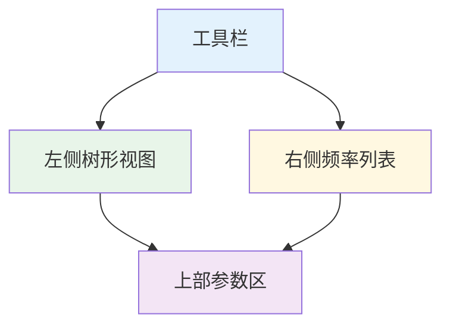

| 区域 | 内容 |
|-----|------|
| 🌳 左侧树形视图 | 频段和子Schema管理 |
| 📋 右侧频率列表 | 显示当前选中项的频率 |
| 📊 上部参数区 | FFT/估计/自动筛选参数 |
| 🔘 下部按钮区 | 打开/保存/确认/取消 |

---

## 📂 频段管理（MainSchema）

### 频段结构

MTDP采用三级层次结构组织FFT参数：

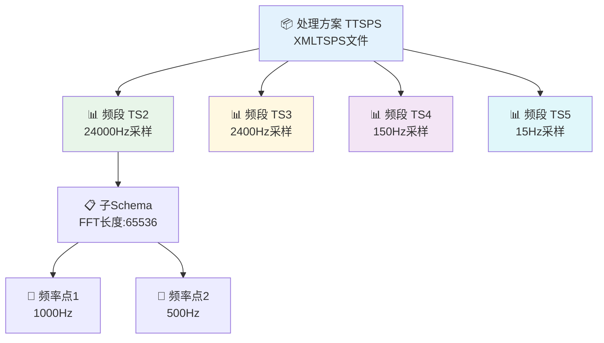

```
📦 处理方案 (TTSPS)
└── 📊 频段 (TTSMainSchema)
    └── 📋 子Schema (TTSSubSchema)
        └── 📍 频率点
```

### 频段属性

| 属性 | 类型 | 说明 |
|-----|------|------|
| Name | String | 频段名称（如TS2、TS3、TS4、TS5） |
| SampleRate | Double1D | 采样率数组（支持多个采样率） |
| SubSchema | List | 子Schema列表 |

### 频段操作

| 操作 | 方法 |
|-----|------|
| 添加频段 | 点击"添加频段"按钮或右键菜单 |
| 编辑频段 | 双击频段节点或点击"编辑频段" |
| 删除频段 | 选中频段后点击"删除频段" |
| 复制频段 | 右键菜单 → 复制频段 |

### 预设频段配置

系统提供预设频段配置，位于 `Configurations\` 目录：

| 配置文件 | 说明 |
|---------|------|
| MT2Octave.XMLTSPS | MT标准二倍频配置 |
| 其他.XMLTSPS | 用户自定义配置 |

---

## 子Schema管理（SubSchema）

### 子Schema属性

| 属性 | 类型 | 默认值 | 说明 |
|-----|------|-------|------|
| SampleLength | Double | 4096 | FFT长度（样本数） |
| Overlap | Double | 0.5 | 重叠率（0-0.75） |
| Frequency | Double1D | - | 频率数组 |
| MaxXPR | Integer | 100 | 最大XPR值 |
| GroupingType | Integer | 0 | 分组类型 |

### FFT长度设置

FFT长度影响频率分辨率和计算时间：

| 采样率 | 推荐FFT长度 | 频率分辨率 |
|-------|------------|-----------|
| 24000 Hz | 65536 | 0.37 Hz |
| 2400 Hz | 8192 | 0.29 Hz |
| 150 Hz | 4096 | 0.04 Hz |
| 15 Hz | 4096 | 0.004 Hz |

### 重叠率设置

| 重叠率 | 适用场景 |
|-------|---------|
| 50% | 最常用，平衡效率和精度 |
| 75% | 更高数据利用率，更多FFT窗口 |
| 0% | 计算最快，但窗口数最少 |

### 子Schema操作

| 操作 | 方法 |
|-----|------|
| 添加子Schema | 右键频段 → 添加子Schema |
| 删除子Schema | 选中子Schema → 右键删除 |

---

## 频率管理

### 频率列表操作

| 操作 | 说明 |
|-----|------|
| 添加频率 | 手动输入单个频率值 |
| 批量添加 | 打开批量添加对话框，生成多个频率 |
| 编辑频率 | 修改选中频率的值 |
| 删除频率 | 删除选中的频率 |
| 清空频率 | 清空当前子Schema的所有频率 |
| 升序排序 | 按频率升序排列 |
| 降序排序 | 按频率降序排列 |

### 批量生成频率

批量添加频点对话框支持三种频率生成方式：

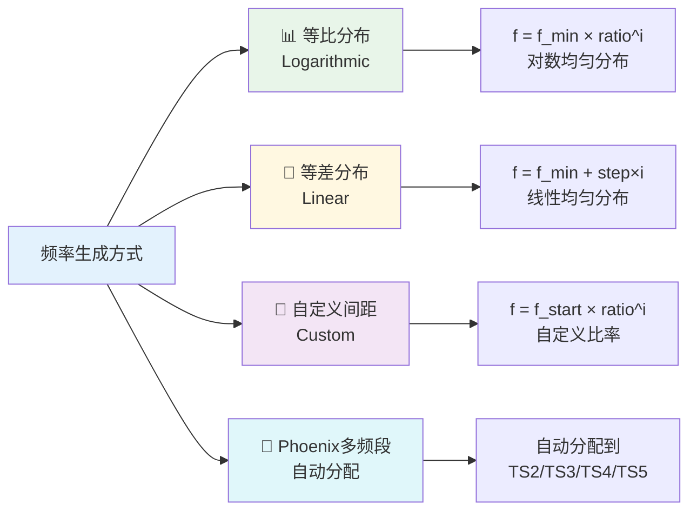

#### 📊 方式1：等比分布（Logarithmic）

按对数等间隔生成频率，频率比为常数。

**参数：**
- 最低频率（Hz）
- 最高频率（Hz）
- 频点数量

**计算公式：**
```
ratio = (f_max / f_min) ^ (1 / (n-1))
f[i] = f_min * ratio^i
```

**适用场景：**
- MT数据处理的标准方式
- 符合电磁测深的频率分布规律
- 低频段和高频段都有合理的覆盖

#### 📏 方式2：等差分布（Linear）

按线性等间隔生成频率，频率差为常数。

**参数：**
- 最低频率（Hz）
- 最高频率（Hz）
- 频点数量

**计算公式：**
```
step = (f_max - f_min) / (n-1)
f[i] = f_min + step * i
```

**适用场景：**
- 特定频段的精细分析
- 需要均匀频率分辨率
- CSAMT等人工源数据处理

#### 🔧 方式3：自定义间距（Custom）

按用户指定的频率比值生成频率。

**参数：**
- 起始频率（Hz）
- 频率比值（ratio）
- 频点数量

**计算公式：**
```
f[i] = f_start * ratio^i
```

**适用场景：**
- 特殊频率分布需求
- 针对特定频段的优化
- 与其他软件频率点匹配

#### 📌 Phoenix多频段模式

专门为Phoenix仪器设计的自动分配模式：
- 自动将频率分配到TS2/TS3/TS4/TS5频段
- 根据采样率自动选择合适的频段
- 支持多采样率混合处理

**附加参数（所有方式通用）：**
- FFT长度：影响频率分辨率
- 重叠率：0%-75%
- MaxXPR：最大XPR值限制

### 频率显示格式

系统根据频率大小自动调整显示精度：

| 频率范围 | 小数位数 |
|---------|---------|
| >= 100 kHz | 0位 |
| >= 10 kHz | 1位 |
| >= 1 kHz | 2位 |
| >= 100 Hz | 3位 |
| >= 10 Hz | 4位 |
| >= 1 Hz | 5位 |
| < 1 Hz | 6位 |

---

## 全局FFT参数

### 窗函数

FFT窗函数影响频谱分析的频率分辨率和泄漏特性。MTDP支持多种窗函数：

| 值 | 窗函数 | 特性 | 适用场景 | 频率泄漏 | 主瓣宽 |
|---|--------|------|---------|---------|--------|
| 0 | 矩形窗 | 矩形截断 | 瞬态信号分析 | 严重 | 4π/N |
| 1 | 汉明窗 | 起始和结束逐渐衰减 | 一般信号 | 中等 | 8π/N |
| 2 | 汉宁窗 | 主瓣宽较窄 | 较平稳信号 | 较小 | 8π/N |
| 3 | 布莱克曼窗 | 主瓣宽度最小 | 短暂态信号 | 极小 | 12π/N |
| 4 | 巴特利特窗 | 多个主瓣叠加 | 调制信号 | 较小 | 8π/N |
| 5 | 平顶窗 | 旁瓣抑制 | 稳态/谐波 | 极小 | 12π/N |
| 6 | 高斯窗 | 指数级衰减 | 瞬态/平滑 | 小 | 8π/N |

### 窗函数选择指南

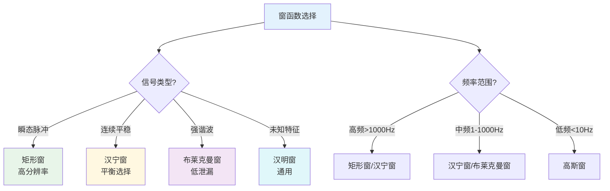

**选择原则：**

1. **根据信号特征选择**
   - 瞬态脉冲 → 矩形窗
   - 连续平稳信号 → 汉宁窗
   - 强谐波分量 → 布莱克曼窗
   - 未知信号特征 → 汉明窗

2. **根据频率范围选择**
   - 高频段（>1000Hz）→ 矩形窗、汉宁窗
   - 中频段（1-1000Hz）→ 汉宁窗、布莱克曼窗
   - 低频段（<10Hz）→ 高斯窗

3. **泄漏考虑**
   - 频率分辨率要求高 → 矩形窗、高斯窗
   - 需要良好幅度响应 → 布莱克曼窗
   - 调制频谱分析 → 汉明窗、布莱克曼窗

### 实用设置建议

**典型场景配置：**

| 应用场景 | 推荐窗函数 | FFT长度 | 重叠率 | 说明 |
|----------|------------|---------|--------|------|
| Phoenix高频（TS2） | 矩形窗 | 24000-48000 | 50% | 高频瞬态分析 |
| Phoenix中频（TS3/TS4） | 汉宁窗 | 12000-24000 | 50% | 平衡时频分辨率 |
| Phoenix低频（TS5） | 布莱克曼窗 | 4800-24000 | 75% | 低频宽频响应 |
| MTU-5A宽频 | 高斯窗 | 24000-48000 | 50% | 瞬态信号平滑 |
| 远参考分析 | 汉宁窗 | 9600-19200 | 75% | 相干性分析优化 |

### 窗函数对比示例

**示例：对比矩形窗和汉宁窗**
```
信号：1Hz余弦波，采样率2400Hz

矩形窗（截断）：
- 频谱：出现明显旁瓣（虚假频率）
- 主瓣分辨率：4π/N
- 适用：快速变化信号分析

汉宁窗（渐变）：
- 频谱：无旁瓣，更干净
- 主瓣分辨率：8π/N（较宽）
- 适用：一般MT数据分析
```

### 单频计算方式

| 值 | 方式 | 说明 |
|---|------|------|
| 0 | 指定频率 | 使用指定的中心频率 |
| 1 | 频带平均 | 在指定频带内平均 |
| 2 | 峰值搜索 | 搜索频带内峰值 |

**单频计算范围：** 设置频带宽度（对数单位）

### 多锥谱分析（Multi-Taper）

| 参数 | 说明 |
|-----|------|
| MultiTaper | 锥数量，0表示禁用 |

多锥谱分析可减少频谱泄漏，提高估计精度。

### 零填充（Zero Padding）

| 参数 | 说明 |
|-----|------|
| ZeroPadding | 零填充因子 |

零填充可提高频率分辨率显示，但不会增加实际信息。

### 搜索带宽（Search Band）

| 参数 | 说明 |
|-----|------|
| SearchBand | 频率搜索带宽 |
---

## 🎯 估计方法设置

### 参考道估计方法

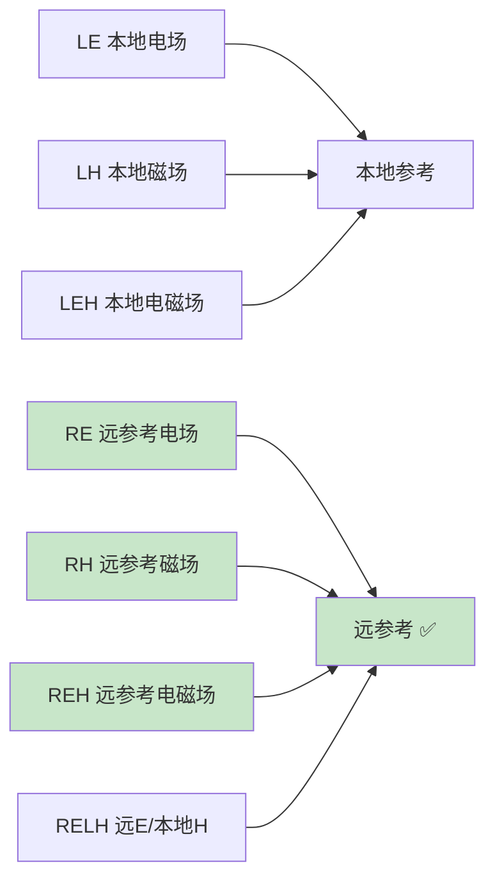

| 值 | 代码 | 方法 | 说明 |
|---|------|------|------|
| 0 | LE | Local E | 本地电场参考 |
| 1 | LH | Local H | 本地磁场参考 |
| 2 | LEH | Local E/H | 本地电磁场参考 |
| 3 | RE | Remote E | 远参考电场 |
| 4 | RH | Remote H | 远参考磁场 |
| 5 | REH | Remote E/H | 远参考电磁场 |
| 6 | RELH | Remote E/Local H | 远参考E/本地H |

> 💡 **提示**：使用远参考道可有效消除本地噪声影响，提高数据质量。

### 稳健估计方法

```mermaid
graph TB
    A[LS 最小二乘法] --> H[噪声少的数据]
    B[ME M估计回归 ⭐] --> I[一般MT数据]
    C[RM 重复中位数] --> J[强噪声环境]
    G[AI 稳健+AI] --> K[复杂噪声]
    D[BI 有界影响]
    E[HPW Huber预加权]
    F[TPW Thomson预加权]
    
    style B fill:#c8e6c9
    style C fill:#fff9c4
    style G fill:#bbdefb

| 值 | 代码 | 方法 | 说明 |
|---|------|------|------|
| 0 | LS | LeastSquares | 标准最小二乘法 |
| 1 | ME | Regression-M | M估计回归法（推荐） |
| 2 | RM | Repeated Median | 重复中位数法（高抗噪性） |
| 3 | BI | Bounded Influence | 有界影响估计 |
| 4 | HPW | Huber Pre-Weighted | Huber预加权估计 |
| 5 | TPW | Thomson Pre-Weighted | Thomson预加权估计 |
| 6 | AI | Robust+AI | 稳健估计结合AI预测 |
### 传递函数类型

| 值 | 类型 | 说明 |
|---|------|------|
| 0 | MT Tensor | 大地电磁张量阻抗 |
| 1 | CS Scalar | 可控源标量传递函数 |

---

## 🤖 自动筛选方案

### 可选方案

```mermaid
graph LR
    A[None 不使用]
    B[TransferFunction 传递函数]
    C[Coherency 相干度]
    D[Tipper 倾子]
    E[Spectrum 频谱]
    F[CSRMT 方案1]
    G[CSRMT2 方案2]
    
    style B fill:#c8e6c9
    style C fill:#c8e6c9

| 值 | 方案 | 说明 |
|---|------|------|
| 0 | None | 不使用自动筛选 |
| 1 | TransferFunction | 基于传递函数筛选 |
| 2 | Coherency | 基于相干度筛选 |
| 3 | CSRMT | CSRMT专用筛选 |
| 4 | CSRMT2 | CSRMT筛选方案2 |
| 5 | Tipper | 基于倾子筛选 |
| 6 | Spectrum | 基于频谱筛选 |

### 配置文件

自动筛选方案配置文件位于 `Configurations\` 目录：

- TransferFunction.AutoSchema
- Coherency.AutoSchema
- CSRMT.AutoSchema
- 等等

---

## 相干度通道选择

可选择用于计算的相干度通道：

| 通道 | 说明 |
|-----|------|
| Ex | X方向电场相干度 |
| Ey | Y方向电场相干度 |
| Hx | X方向磁场相干度 |
| Hy | Y方向磁场相干度 |
| Hz | Z方向磁场相干度 |

勾选相应通道后，系统将在FFT处理中计算该通道的相干度。

---

## MD参数设置

点击"MD参数"按钮可设置马氏距离筛选使用的参数。

选择用于马氏距离计算的MT参数类型，系统将根据选中的参数计算马氏距离并筛选异常数据点。

---

## 配置文件管理

### 保存配置

1. 配置完参数后点击"保存"按钮
2. 选择保存位置和文件名
3. 配置保存为 .XMLTSPS 文件

### 加载配置

1. 点击"打开"按钮
2. 选择 .XMLTSPS 配置文件
3. 配置加载到当前对话框

### 配置文件格式

| 格式 | 扩展名 | 说明 |
|-----|-------|------|
| XML | .XMLTSPS | XML格式，可读性好 |
| 二进制 | .TSPS | 二进制格式，文件较小 |
| JSON | .JSON | JSON格式，便于程序处理 |

---

## 标定与系统响应

### 标定文件

```mermaid
graph LR
    A[CLB 电场盒标定]
    B[CLC 磁传感器标定]
    C[原始信号] --> D[应用标定] --> E[校正后信号]
    
    style A fill:#e8f5e9
    style B fill:#e3f2fd
    style E fill:#c8e6c9

| 类型 | 用途 |
|-----|------|
| CLB | 电场盒标定 |
| CLC | 磁传感器标定 |

### 应用标定

1. 导入数据后，在测段设置中配置标定文件
2. 系统自动匹配标定
3. FFT处理后自动应用标定

> 💡 **提示**：确保标定文件与仪器序列号匹配。

---

## 🔊 滤波处理

### 工频陷波滤波

消除50/60Hz工频干扰：

```mermaid
graph TB
    A[原始信号 含50Hz] --> B[陷波滤波器] --> C[滤波后信号]
    D[基频 50Hz] --> E[谐波 100/150Hz] --> F[最多9个谐波]
    
    style A fill:#ffcdd2
    style C fill:#c8e6c9

1. 选择菜单 `处理 → 滤波器 → 陷波滤波`
2. 设置基频（50Hz或60Hz）
3. 设置谐波数量（1-9）
4. 应用滤波

### 其他滤波器

| 滤波器 | 用途 |
|-------|------|
| 🔽 高通滤波 | 去除低频漂移 |
| 🔼 低通滤波 | 去除高频噪声 |

---

## 降采样处理

### 功能说明

将高采样率数据降采样到目标采样率，支持2倍到4800倍降采样。

```mermaid
graph LR
    A[高采样率 24000Hz] --> B[低通滤波] --> C[抽取采样] --> D[降采样 2400Hz]
    
    style A fill:#e3f2fd
    style D fill:#c8e6c9

### 使用方法

1. 选择菜单 `时间序列处理 → 降采样`
2. 选择源数据
3. 设置目标采样率
4. 执行降采样

---
---

## 批量处理

```mermaid
graph TB
    A[选择多个测段] --> B[批量FFT处理]
    B --> C[设置参数]
    C --> D[并行处理]
    D --> E[进度监控]
    
    style A fill:#e3f2fd
    style D fill:#fff8e1
    style E fill:#c8e6c9

### 批量FFT

1. 选择多个测段或测点
2. 右键选择 `批量FFT处理`
3. 设置处理参数
4. 开始处理

### 进度监控

在 `线程` 选项卡中查看：
- 处理进度
- 当前任务
- 线程状态

---

## 🚀 标准处理流程

```mermaid
graph TB
    A[📥 导入原始数据<br/>.tbl/.ats/.lemi] --> B[🔍 检查数据质量<br/>时间序列完整性]
    B --> C[⚙️ 设置FFT参数<br/>窗函数/FFT长度/重叠率]
    C --> D[▶️ 执行FFT计算<br/>生成傅里叶系数]
    D --> E[📐 应用标定<br/>CLB/CLC校正]
    E --> F[🎯 筛选数据<br/>相干度/信噪比过滤]
    F --> G[📤 导出结果<br/>EDI/PLT/KML]
    
    style A fill:#e3f2fd
    style B fill:#e8f5e9
    style C fill:#fff8e1
    style D fill:#f3e5f5
    style E fill:#e0f7fa
    style F fill:#fce4ec
    style G fill:#fff3e0
```

**简化流程：** 1. **📥 导入数据** → 2. **🔍 检查数据质量** → 3. **⚙️ 设置FFT参数** → 4. **▶️ 执行FFT** → 5. **📐 应用标定**
### 数据检查要点

- 查看时间序列是否完整
- 检查是否有明显噪声
- 确认采样率正确

### 强干扰环境建议

- 启用工频陷波滤波
- 使用远参考道（RE/RH/REH）
- 采用稳健估计方法（Regression-M或Repeated Median）
- 启用自动筛选


---

## 🔬 测点精细处理界面（频谱编辑窗口）

> **📖 核心参考文献**
> 
> 王培杰, 陈小斌, 韩鹏, 张赟昀. 基于稳健估计、数据筛选和Rhoplus约束的大地电磁数据处理方法. 地球物理学报, 2024, 67(11): 4325-4342.
> 
> *Strong interference magnetotelluric data processing method based on robust estimation, data screening and Rhoplus constraint. Chinese Journal of Geophysics, 2024.*

测点精细处理界面是MTDP中进行单点数据精细处理的核心工具，通过右键测点 → `频谱编辑` 打开。该界面完整实现了**RMSMR方法**——即**稳健估计(Robust) + 多参数筛选(Multi-parameter Screening) + 多角度Rhoplus约束(Multi-angle Rhoplus)**，专门用于处理强干扰环境下的MT数据。

---

### RMSMR理论基础（为什么需要精细处理？）

#### 为什么MT数据需要精细处理？

天然电磁场信号非常微弱，容易受到各种干扰：

| 干扰类型 | 表现特征 | 影响频段 |
|----------|----------|----------|
| **人文噪声** | 工频干扰、电气化铁路 | 50Hz及其谐波 |
| **死频带问题** | 信号天然较弱 | 1-5 kHz (AMT死频带) |
| **相干噪声** | 多频率同时受影响 | 宽频带 |
| **近场效应** | 阻抗失真、相位异常 | 低频 |

#### RMSMR方法的三重保障

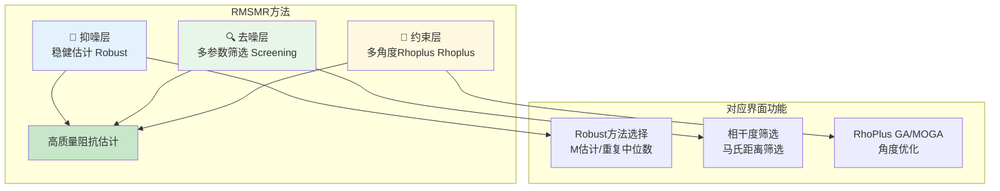

**三层保护的物理意义：**

| 层次 | 方法 | 解决的问题 | 界面位置 |
|------|------|------------|----------|
| **抑噪层** | 稳健估计(Robust) | 降低异常数据权重，不让少数坏点扭曲结果 | Robust方案下拉框 |
| **去噪层** | 多参数筛选(Screening) | 识别并剔除受污染的数据段 | 自动筛选选项卡 |
| **约束层** | 多角度Rhoplus(Rhoplus) | 用高质量频段约束低质量频段 | RhoPlus GA/MOGA按钮 |

#### 从理论到实践的映射

| RMSMR理论步骤 | 界面操作 | 参数建议 |
|---------------|----------|----------|
| 1. 初步筛选 | 查看相干度选项卡，框选剔除低相干度数据 | 相干度阈值 > 0.7 |
| 2. 稳健估计 | 选择Robust方法为"M估计" | 推荐Regression-M |
| 3. 残差分析 | 设置残差剔除参数 | 残差阈值 1.5-2.5 |
| 4. 多参数筛选 | 使用马氏距离自动筛选 | 阈值 2.0-3.0 |
| 5. Rhoplus约束 | 执行RhoPlus MOGA筛选 | 保留比例 30%-50% |
| 6. 迭代优化 | 重复2-5直到结果稳定 | 迭代3-10次 |

---

### 界面布局概述

测点精细处理界面是MTDP中进行单点数据精细处理的核心工具，通过右键测点 → `频谱编辑` 打开。该界面提供完整的频谱数据查看、筛选、阻抗估计和数据导出功能。

---

### 界面布局概述

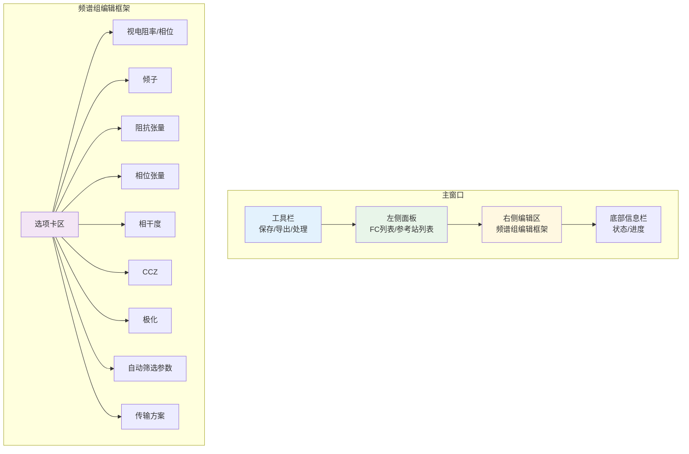

**主要区域说明：**

| 区域 | 内容 | 功能 |
|------|------|------|
| **工具栏** | 保存、导出、处理按钮 | 快捷操作入口 |
| **FC列表** | 傅里叶系数文件列表 | 管理和选择FC文件 |
| **编辑FC列表** | 已编辑的FC版本列表 | 管理多个处理版本 |
| **远参考站列表** | 可用的远参考站 | 选择参考站进行远参考处理 |
| **反向参考站列表** | 反向参考站 | 用于反向参考估计 |
| **频谱组编辑框架** | 多选项卡编辑区 | 数据查看和筛选 |

---

### FC文件管理

#### 傅里叶系数（FC）文件说明

FC文件存储FFT处理后得到的频谱数据，是后续所有处理的基础。


| 文件类型 | 扩展名 | 说明 |
|----------|--------|------|
| **原始FC** | .STFC | FFT处理后的原始频谱数据 |
| **编辑FC** | .STFCG | 经过筛选和处理的FC数据 |

#### FC列表操作

右键FC列表项可执行以下操作：

| 操作 | 功能 | 说明 |
|------|------|------|
| **设为当前** | 激活选中的FC | 将选中的FC设为当前处理对象 |
| **删除** | 删除FC文件 | 永久删除FC文件（不可恢复） |
| **合并** | 合并多个FC | 将多个FC合并为一个 |
| **导出JSON** | 导出为JSON格式 | 便于程序处理和数据交换 |
| **导出振幅谱** | 导出振幅谱数据 | 导出各通道振幅谱 |

#### 编辑FC版本管理

编辑FC列表支持创建多个处理版本，便于对比不同处理方法的效果。

**操作菜单：**

| 操作 | 功能 | 使用场景 |
|------|------|----------|
| **复制** | 创建FC副本 | 保留原始版本，在新版本上处理 |
| **重命名** | 修改FC名称 | 便于区分不同处理版本 |
| **删除** | 删除编辑FC | 清理不需要的版本 |
| **设为测点FC** | 应用到测点 | 将编辑结果应用到测点 |
| **合并选中** | 合并多个FC | 合并不同时段的处理结果 |
| **XY合并** | X/Y站数据合并 | 合并不同方向观测的数据 |
| **复制剔除** | 复制剔除标记 | 在FC间共享剔除信息 |
| **粘贴剔除** | 粘贴剔除标记 | 应用之前复制的剔除信息 |
| **删除剔除数据** | 创建无剔除FC | 创建不含剔除数据的新FC |

---

### 远参考站配置

#### 远参考站列表

远参考处理是提高数据质量的重要手段。在频谱编辑窗口中可以管理和选择远参考站。

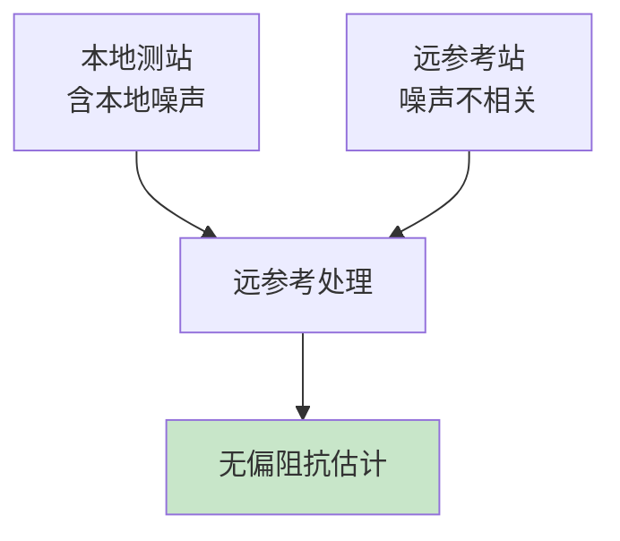

**远参考站列表操作：**

| 操作 | 功能 |
|------|------|
| **勾选** | 选择参与处理的参考站 |
| **删除选中** | 删除已勾选的参考站 |

#### 远参考方案选择

| 方案 | 代码 | 说明 |
|------|------|------|
| **Local E** | LE | 本地电场参考 |
| **Local H** | LH | 本地磁场参考 |
| **Local E/H** | LEH | 本地电磁场参考 |
| **Remote E** | RE | 远参考电场 ⭐ |
| **Remote H** | RH | 远参考磁场 ⭐ |
| **Remote E/H** | REH | 远参考电磁场 ⭐ |
| **Remote E/Local H** | RELH | 远E/本地H |

> 💡 **推荐**：使用 RE（远参考电场）或 RH（远参考磁场）可获得最佳效果。

#### 反向参考站配置

反向参考用于特殊处理场景，可将本地测站作为参考站使用。

| 方案 | 说明 |
|------|------|
| **None** | 不使用反向参考 |
| **LE/LH/LEH** | 本地参考方案 |
| **RE/RH/REH** | 远参考方案 |

#### 旋转角度设置

| 参数 | 说明 |
|------|------|
| **测站旋转角** | 本地测站的旋转角度（度） |
| **参考站旋转角** | 远参考站的旋转角度（度） |

---

### 估计方法与残差剔除

#### Robust估计方法选择

| 方法 | 代码 | 说明 | 推荐场景 |
|------|------|------|----------|
| **最小二乘** | LS | 标准最小二乘法 | 低噪声数据 |
| **M估计** | ME | 回归M估计 ⭐ | 一般MT数据 |
| **重复中位数** | RM | 重复中位数法 | 强干扰环境 |
| **有界影响** | BI | 有界影响估计 | 杠杆点处理 |
| **Huber预加权** | HPW | Huber预加权 | 稳健处理 |
| **Thomson预加权** | TPW | Thomson预加权 | 稳健处理 |
| **Robust+AI** | AI | 稳健估计+AI预测 | 复杂噪声 |

#### 残差剔除参数

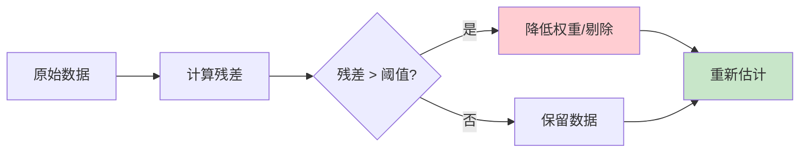

| 参数 | 说明 | 推荐值 |
|------|------|--------|
| **残差阈值** | 残差超过此值的数据被降权 | 1.5-2.5 |
| **剩余数据比例** | 保留数据的最小比例 | 0.3-0.5 |

**添加剔除功能：**

| 按钮 | 功能 |
|------|------|
| **添加剔除异常频点** | 将当前频点的异常数据加入剔除列表 |
| **根据传输方案剔除** | 按预设传输方案剔除数据 |

---

### 频谱组编辑框架（选项卡详解）

频谱组编辑框架包含多个选项卡，用于查看和处理不同类型的数据。

#### 选项卡1：视电阻率/相位（RhoPhs）

**显示内容：**
- ρxy、ρyx 视电阻率曲线
- φxy、φyx 相位曲线
- 误差棒

**交互操作：**
- 左键点击：选择频点
- 框选：选择多个数据点
- 右键：剔除/恢复选中数据

#### 选项卡2：倾子（Tipper）

**显示内容：**
- Tzx、Tzy 倾子分量（振幅和相位）
- 感应矢量指示

**倾子应用：**
- 识别侧向电性异常
- 判断二维/三维结构

#### 选项卡3：阻抗张量（Z）

**显示内容：**
- Zxx、Zxy、Zyx、Zyy 阻抗张量元素
- 实部和虚部分别显示

#### 选项卡4：相位张量（PhaseTensor）

**显示内容：**
- α（主方向角）
- β（二维偏离度）
- λ（椭圆率）
- Φmax、Φmin（相位张量主值）
- Skew1D、Skew2D（偏斜度）

#### 选项卡5：相干度（Coherence）

**显示内容：**
- 常相干度（Coh²）
- 重相干度（Cohₘ²）
- 偏相干度（Cohₚ²）
- Ex-Rx、Ex-Hy、Ey-Rx、Ey-Ry、Ey-Hx、Hx-Rx、Hx-Ry、Hy-Rx、Hy-Ry

**质量判断：**

| 相干度值 | 数据质量 | 建议 |
|----------|----------|------|
| > 0.9 | 优秀 | 可直接使用 |
| 0.7-0.9 | 良好 | 正常使用 |
| 0.5-0.7 | 一般 | 考虑筛选 |
| < 0.5 | 较差 | 建议剔除 |

#### 选项卡6：CCZ阻抗

**显示内容：**
- CCZ阻抗张量
- θ（方位角）
- Skew1D、Skew2D

#### 选项卡7：极化（Polar）

**显示内容：**
- 电场极化方向
- 磁场极化方向
- 极化椭圆参数

#### 选项卡8：自动筛选参数（AutoSelect）

**自动筛选方案配置：**

| 参数 | 说明 |
|------|------|
| **筛选方案** | 选择预设的筛选方案 |
| **旋转角度列表** | 用于多角度筛选的旋转角度 |
| **筛选参数** | 参与筛选的MT参数类型 |
| **排序方式** | 升序/降序 |
| **权重** | 各参数的权重 |
| **保留比例** | 筛选后保留的数据比例 |
| **退出误差** | 迭代退出条件 |

**可用筛选参数：**

| 参数类型 | 说明 |
|----------|------|
| 视电阻率 | ρxy、ρyx |
| 相位 | φxy、φyx |
| 相干度 | Ex-Hx、Ex-Hy等 |
| 倾子 | Tzx、Tzy |
| 相位张量 | α、β、λ等 |

#### 选项卡9：传输方案（Transmit）

传输方案用于管理频谱数据的传输和剔除规则。

---

### 自动筛选算法详解（RMSMR核心）

> **📚 理论基础**：自动筛选是RMSMR方法的核心环节。通过智能算法从大量频谱数据中识别并剔除受污染的数据段，保留高质量信号。

#### 为什么需要自动筛选？

MT数据处理面临的根本问题：**如何从大量数据中识别哪些是"好数据"？**

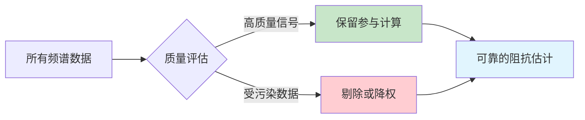

**传统方法的局限：**
- 只看单一指标（如相干度）
- 阈值选择主观
- 难以处理复杂干扰模式

**MTDP的解决方案：多算法融合**
- 多目标遗传算法(MOGA)：同时优化多个质量指标
- Rhoplus约束：用物理模型约束数据质量
- 马氏距离：统计异常检测

---

#### 筛选类型总览

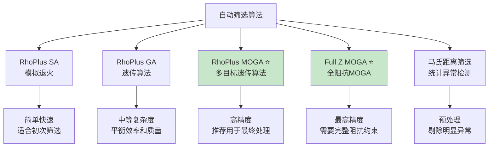

---

#### 各算法详解

##### 1. RhoPlus SA（模拟退火）

**原理：** 模拟金属退火过程，在解空间中随机搜索，逐步降低"温度"收敛到最优解。

**物理意义：**
- 在不同旋转角度下计算视电阻率
- 寻找使模型最简单的角度组合
- 用高质量频段的1D响应约束低质量频段

**适用场景：** 快速筛选，作为初次处理

| 参数 | 说明 | 推荐值 |
|------|------|--------|
| 最大迭代次数 | 搜索的最大步数 | 10000-100000 |
| 最小RMS | 低于此值不筛选 | 0.5 |

##### 2. RhoPlus GA（遗传算法）

**原理：** 模拟生物进化过程，通过选择、交叉、变异操作逐代优化。

**与SA的区别：**
- 维护一个种群而非单个解
- 更容易跳出局部最优
- 计算量更大但结果更稳定

**适用场景：** SA效果不佳时的升级选择

##### 3. RhoPlus MOGA（多目标遗传算法）⭐ 推荐

**核心创新：** 同时优化多个目标函数，而非单一目标

**多目标的物理意义：**

| 目标函数 | 物理意义 | 为什么要优化？ |
|----------|----------|---------------|
| Zxy实部RMS | 阻抗实部与预测值的偏差 | 确保振幅准确 |
| Zxy虚部RMS | 阻抗虚部与预测值的偏差 | 确保相位准确 |
| Zyx实部RMS | 正交方向阻抗实部 | 确保张量完整 |
| Zyx虚部RMS | 正交方向阻抗虚部 | 确保张量完整 |

**为什么MOGA比GA更好？**

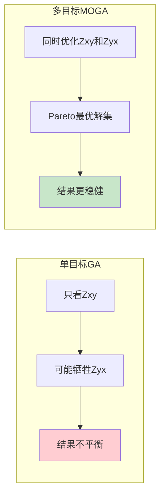

**适用场景：** 强干扰环境，作为最终处理步骤

##### 4. Full Z MOGA（全阻抗MOGA）⭐ 高精度

**与RhoPlus MOGA的区别：**

| 对比项 | RhoPlus MOGA | Full Z MOGA |
|--------|--------------|-------------|
| 约束数据 | Zxy, Zyx | Zxx, Zxy, Zyx, Zyy |
| 约束来源 | 多角度旋转 | 理论模型预测 |
| 精度 | 高 | 最高 |
| 计算量 | 中等 | 大 |

**物理意义：**
- 不仅约束主阻抗(Zxy, Zyx)
- 同时约束对角元素(Zxx, Zyy)
- 对于三维结构更准确

**适用场景：** 需要最高精度的研究项目

---

#### 马氏距离筛选（预处理步骤）

**理论基础：** 马氏距离是考虑变量间相关性的广义距离。

$$D_M = \sqrt{(\mathbf{x} - \boldsymbol{\mu})^T \mathbf{\Sigma}^{-1} (\mathbf{x} - \boldsymbol{\mu})}$$

**与欧氏距离的区别：**

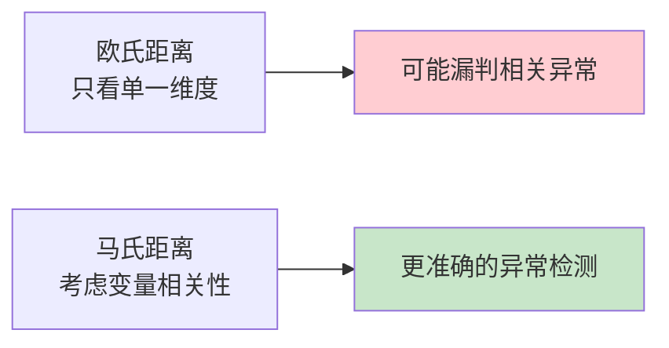

**实际应用：**

当多个参数同时出现轻微异常时，单独看每个参数都不明显，但马氏距离能识别出这种"组合异常"。

**参数设置：**

| 参数 | 说明 | 推荐值 | 物理意义 |
|------|------|--------|----------|
| 阈值 | 马氏距离阈值 | 2.0-3.0 | 对应95%-99%置信区间 |
| 最大迭代次数 | 迭代筛选次数 | 10-50 | 迭代越多越严格 |
| 参数集 | 参与计算的MT参数 | 选择主要参数 | 视电阻率+相位+相干度 |

**操作按钮：**

| 按钮 | 功能 | 使用时机 |
|------|------|----------|
| **MD自动筛选** | 对当前频率执行 | 单频点问题诊断 |
| **MD自动筛选（固定H）** | 固定H方向的筛选 | H场数据质量好时 |
| **全部MD筛选** | 对所有频率执行 | 整体质量提升 |
| **全部MD筛选（固定H）** | 对所有频率执行 | H场数据质量好时 |

---

#### 筛选算法选择指南

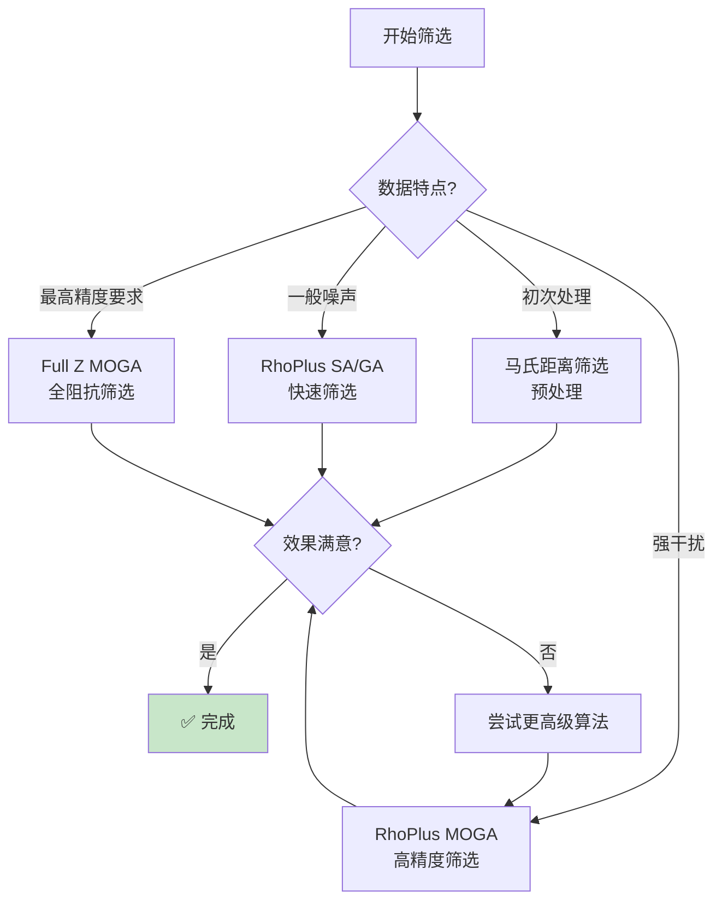

**推荐流程：**

1. **预处理**：马氏距离筛选 → 剔除明显异常
2. **主处理**：RhoPlus MOGA → 精细筛选
3. **可选**：Full Z MOGA → 最终优化（如需要）

**保留比例建议：**

| 环境类型 | 保留比例 | 说明 |
|----------|----------|------|
| 低噪声环境 | 50%-70% | 可以保留更多数据 |
| 中等噪声 | 30%-50% | 平衡数据量和质量 |
| 强干扰环境 | 20%-30% | 严格筛选，宁可少而精 |
---

### 数据导出功能

频谱编辑窗口支持多种数据导出格式。

#### 导出菜单概览

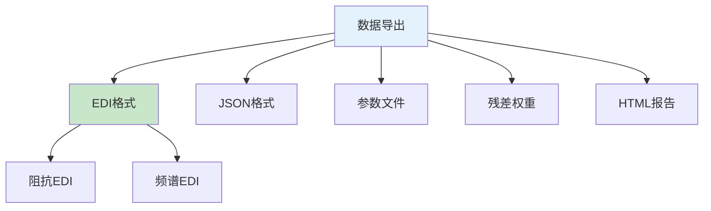

#### EDI格式导出

| 选项 | 说明 | 内容 |
|------|------|------|
| **导出阻抗EDI** | 导出阻抗张量EDI | Zxx, Zxy, Zyx, Zyy |
| **导出频谱EDI** | 导出频谱数据EDI | 功率谱、互功率谱 |

#### JSON格式导出

- 将FC数据导出为JSON格式
- 便于程序处理和数据交换
- 文件路径自动复制到剪贴板

#### 参数导出

- 导出所有MT参数到指定目录
- 包括视电阻率、相位、阻抗、倾子等
- 每个参数保存为单独文件

#### 残差权重导出

导出残差和权重数据，用于分析处理效果。

**输出格式：**
```
#Index ExRes EyRes HzRes ExHuberW EyHuberW HzHuberW ExThomsonW EyThomsonW HzThomsonW Time
000001  1.234e-03 2.345e-03 3.456e-04 1.000 0.950 1.000 0.980 0.930 0.990 2024-01-15T10:30:00.000
...
```

**字段说明：**

| 字段 | 说明 |
|------|------|
| Index | 数据点索引 |
| ExRes/EyRes/HzRes | Ex、Ey、Hz通道的残差 |
| ExHuberW/EyHuberW/HzHuberW | Huber权重 |
| ExThomsonW/EyThomsonW/HzThomsonW | Thomson权重 |
| Time | 数据时间戳（GMT格式） |

---

### 多参考站处理

MTDP支持多参考站处理，可以利用多个远参考站提高数据质量。

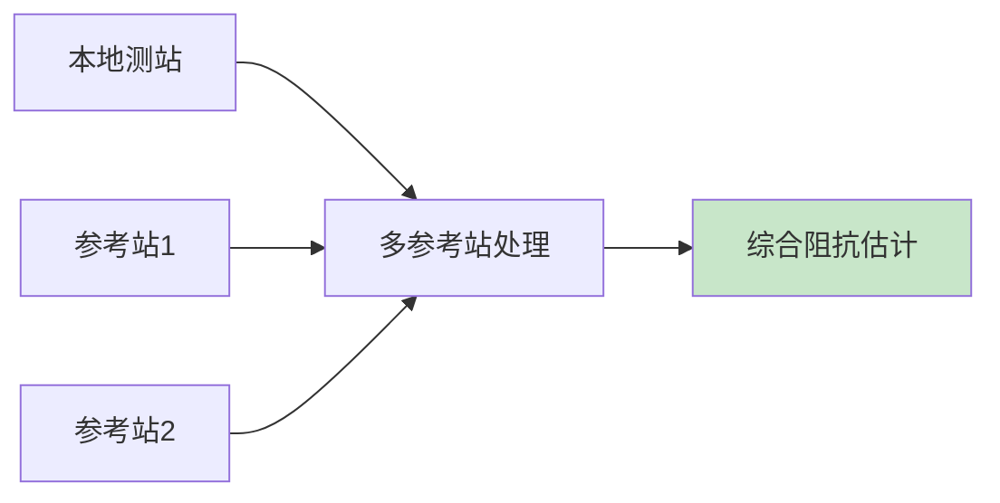

**操作步骤：**

1. 在远参考站列表中勾选要使用的参考站
2. 选择远参考方案（推荐REH）
3. 点击"添加多参考站处理"按钮
4. 系统自动创建新的编辑FC

---

### 理论模型对比

频谱编辑窗口支持加载理论模型进行对比分析。

**功能：**

| 功能 | 说明 |
|------|------|
| **加载预测值** | 从文件加载理论模型预测值 |
| **保存预测值** | 保存当前预测值到文件 |
| **理论旋转** | 旋转理论模型 |

**预测值文件格式：**
```
fre zxxr zxxi zxyr zxyi zyxr zyxi zyyr zyyi
100.0 0.1234 -0.0567 1.2345 -0.7890 -1.4567 0.8901 0.0987 -0.0432
...
```

---

### 常用操作流程（RMSMR实践）

> **💡 RMSMR方法的核心思想：** 迭代优化，逐步提升数据质量。每一轮处理后检查结果，不满意则调整参数重试。

#### 流程1：快速质量检查（1分钟）

**目的：** 快速评估数据质量，决定是否需要精细处理

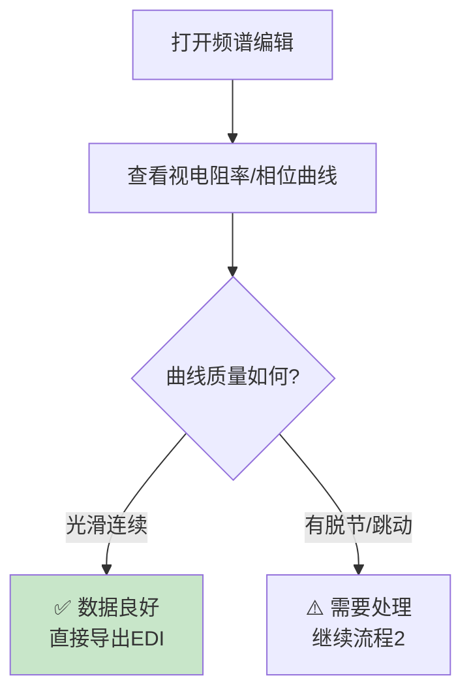

---

#### 流程2：远参考处理（5分钟）

**理论基础：** 远参考利用"噪声不相关、信号相关"的特性消除本地噪声偏差。

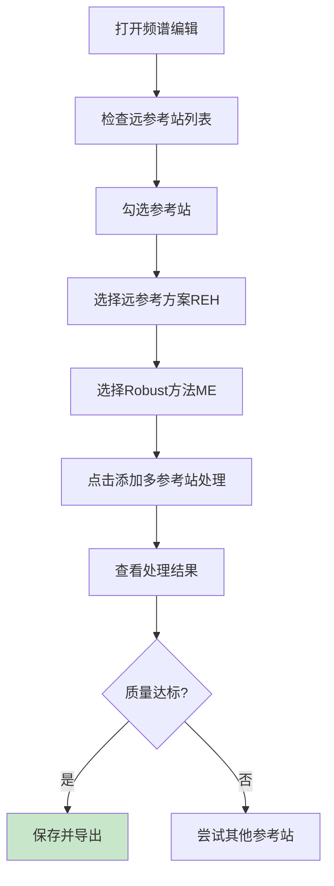

---

#### 流程3：自动筛选（10分钟）

**理论基础：** 使用多目标遗传算法(MOGA)，同时优化多个质量指标。

```mermaid
graph TB
    A[切换到自动筛选选项卡] --> B[选择筛选类型<br/>推荐RhoPlus MOGA]
    B --> C[设置保留比例30%-50%]
    C --> D[点击开始筛选]
    D --> E[等待计算完成]
    E --> F[查看筛选结果]
    F --> G{曲线改善明显?}
    G -->|是| H[保存FC]
    G -->|否| I[调整保留比例]
    I --> C
    style H fill:#c8e6c9
```

---

#### 流程4：完整RMSMR处理流程（20-30分钟）

**适用于强干扰环境或高精度要求项目**

```mermaid
graph TB
    subgraph 第一轮
        A1[马氏距离筛选] --> A2[保存预处理版本]
    end
    subgraph 第二轮
        A2 --> B1[远参考处理]
        B1 --> B2[检查结果]
    end
    subgraph 第三轮
        B2 --> C1[RhoPlus MOGA筛选]
        C1 --> C2[验证效果]
    end
    subgraph 最终
        C2 --> D1[设为测点FC]
        D1 --> D2[导出EDI]
    end
    style D2 fill:#c8e6c9
```

---

### 快捷键参考

| 快捷键 | 功能 |
|---------|------|
| ← | 切换到上一个频率 |
| → | 切换到下一个频率 |
| Ctrl+S | 保存当前FC |
| Ctrl+Shift+S | 保存所有FC |

---

### 常见问题与解决

| 问题 | 可能原因 | 解决方案 |
|------|----------|----------|
| **曲线脱节** | 死频带噪声 | 使用RhoPlus MOGA筛选 |
| **相位异常** | 近场干扰 | 手动剔除异常频点 |
| **误差棒过大** | 叠加次数不足 | 增加数据时长或合并FC |
| **相干度低** | 人文噪声 | 远参考+Robust估计 |
| **自动筛选效果差** | 参数设置不当 | 降低保留比例或换算法 |
| **远参考无效果** | 参考站质量差 | 更换参考站或检查时间同步 |

---

### 参考文献

> [1] 王培杰, 陈小斌, 韩鹏, 张赟昀. 基于稳健估计、数据筛选和Rhoplus约束的大地电磁数据处理方法. 地球物理学报, 2024, 67(11): 4325-4342.
>
> [2] Zhou, C., et al. Application of the Rhoplus method to audio magnetotelluric dead band distortion data. Chinese J. Geophys., 2015.
>
> [3] Platz, A., & Weckmann, U. An automated new pre-selection tool for noisy MT data using the Mahalanobis distance. GJI, 2019.

> 💡 **提示**：处理完成后，建议使用"设为测点FC"将结果应用到测点，然后导出EDI文件。