# 🔍 第6章 数据筛选与估计

本章详细介绍MTDP的数据筛选和阻抗估计功能。

---


## 🖥️ 数据筛选界面

### 界面布局

数据筛选界面分为多个选项卡：

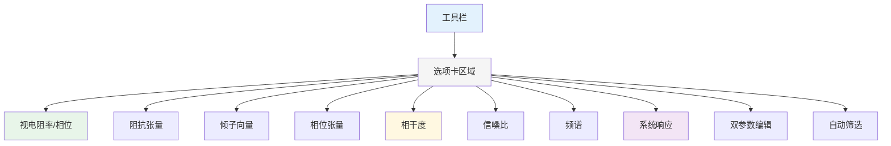

| 选项卡 | 功能 |
|-------|------|
| 视电阻率/相位 | 编辑Rho和Phase数据 |
| 阻抗 | 编辑阻抗张量 |
| 倾子 | 编辑倾子向量 |
| 相位张量 | 查看相位张量参数 |
| 相干度 | 查看相干度曲线 |
| 信噪比 | 查看信噪比曲线 |
| 频谱 | 查看功率谱密度 |
| 系统响应 | 查看标定曲线 |
| 双参数编辑 | 双参数散点图筛选 |
| 自动筛选 | 设置自动筛选参数 |
### 工具栏

| 按钮 | 功能 |
|-----|------|
| 保存FC | 保存傅里叶系数 |
| 全选 | 选中所有数据 |
| 当前频率全选 | 选中当前频率的所有数据 |
| 显示误差棒 | 显示/隐藏误差棒 |
| 旋转角度 | 设置坐标旋转角度 |

---

## 📈 图表类型

### 视电阻率/相位

| 曲线 | 说明 |
|-----|------|
| Rxx/Ryy | 对角元素视电阻率 |
| Rxy/Ryx | 非对角元素视电阻率 |
| Pxx/Pyy | 对角元素相位 |
| Pxy/Pyx | 非对角元素相位 |

### 阻抗张量

| 曲线 | 说明 |
|-----|------|
| Z振幅 | 阻抗振幅 |
| Z相位 | 阻抗相位 |
| Z实部 | 阻抗实部 |
| Z虚部 | 阻抗虚部 |

### 倾子向量

| 曲线 | 说明 |
|-----|------|
| T振幅 | 倾子振幅 |
| T相位 | 倾子相位 |
| T实部 | 倾子实部 |
| T虚部 | 倾子虚部 |

### 相位张量

| 曲线 | 说明 |
|-----|------|
| PT元素 | 相位张量四个分量 |
| α/β | 相位张量主方向角 |
| Max/Min | 相位张量最大/最小值 |
| Skew1D/2D | 相位张量偏斜度 |

> **📖 理论背景：相位张量（Phase Tensor）**
>
> 相位张量是由Caldwell等（2004）提出的一种分析MT数据的新方法，**不依赖于地下电性结构的维性假设**。
>
> **定义**：将阻抗张量分解为实部和虚部 $\mathbf{Z} = \mathbf{X} + i\mathbf{Y}$，相位张量定义为：
>
> $$\mathbf{\Phi} = \mathbf{X}^{-1}\mathbf{Y} = \begin{bmatrix} \Phi_{xx} & \Phi_{xy} \\ \Phi_{yx} & \Phi_{yy} \end{bmatrix}$$
>
> **主要参数：**
>
> | 参数 | 公式 | 物理意义 |
> |------|------|----------|
> | **主方向角 α** | $\alpha = \frac{1}{2}\arctan\left(\frac{\Phi_{xy}+\Phi_{yx}}{\Phi_{xx}-\Phi_{yy}}\right)$ | 电性结构主走向方向 |
> | **二维偏离度 β** | $\beta = \frac{1}{2}\arctan\left(\frac{\Phi_{xy}-\Phi_{yx}}{\Phi_{xx}+\Phi_{yy}}\right)$ | 偏离二维程度，$|\beta|<3°$可近似为二维 |
> | **椭圆率 λ** | $\lambda = \frac{\Phi_{max} - \Phi_{min}}{\Phi_{max} + \Phi_{min}}$ | 各向异性程度 |
> | **一维偏离度 κ** | $\kappa = \sqrt{\frac{(\Phi_{xx}-\Phi_{yy})^2 + 4\Phi_{xy}^2}{(\Phi_{xx}+\Phi_{yy})^2}}$ | 偏离一维程度 |
>
> **椭圆表示**：相位张量可用椭圆可视化，长轴=$\Phi_{max}$，短轴=$\Phi_{min}$，方向=主方向角$\alpha$。对于一维层状介质，相位张量为圆形。

### 相干度

**常相干度（Ordinary Coherency）：**

| 曲线 | 说明 |
|-----|------|
| CohEx | Ex道常相干度 |
| CohEy | Ey道常相干度 |
| CohHx | Hx道常相干度 |
| CohHy | Hy道常相干度 |
| CohHz | Hz道常相干度 |

**多道相干度（Multiple Channel Coherency）：**

| 曲线 | 说明 |
|-----|------|
| CohMEx | Ex与磁场多道相干 |
| CohMEy | Ey与磁场多道相干 |
| CohMHx | Hx与磁场多道相干 |
| CohMHy | Hy与磁场多道相干 |
| CohMHz | Hz与磁场多道相干 |

**偏相干度（Partial Coherency）：**

| 曲线 | 说明 |
|-----|------|
| PCohExHx | Ex-Hx偏相干 |
| PCohExHy | Ex-Hy偏相干 |
| PCohEyHx | Ey-Hx偏相干 |
| PCohEyHy | Ey-Hy偏相干 |

**重相干度（Bi-coherency）：**

| 曲线 | 说明 |
|-----|------|
| BiCohEx | Ex重相干度 |
| BiCohEy | Ey重相干度 |
| BiCohHx | Hx重相干度 |
| BiCohHy | Hy重相干度 |

### 其他参数

| 曲线 | 说明 |
|-----|------|
| CCZ Skew | 共轭阻抗偏斜度 |
| CCZ Theta | 共轭阻抗角度 |
| SNR | 信噪比 |
| 功率谱 | 各道功率谱密度 |
| 系统响应 | 标定曲线 |
| 极化方向 | 电/磁场极化 |

---

## 筛选操作

### 单参数筛选

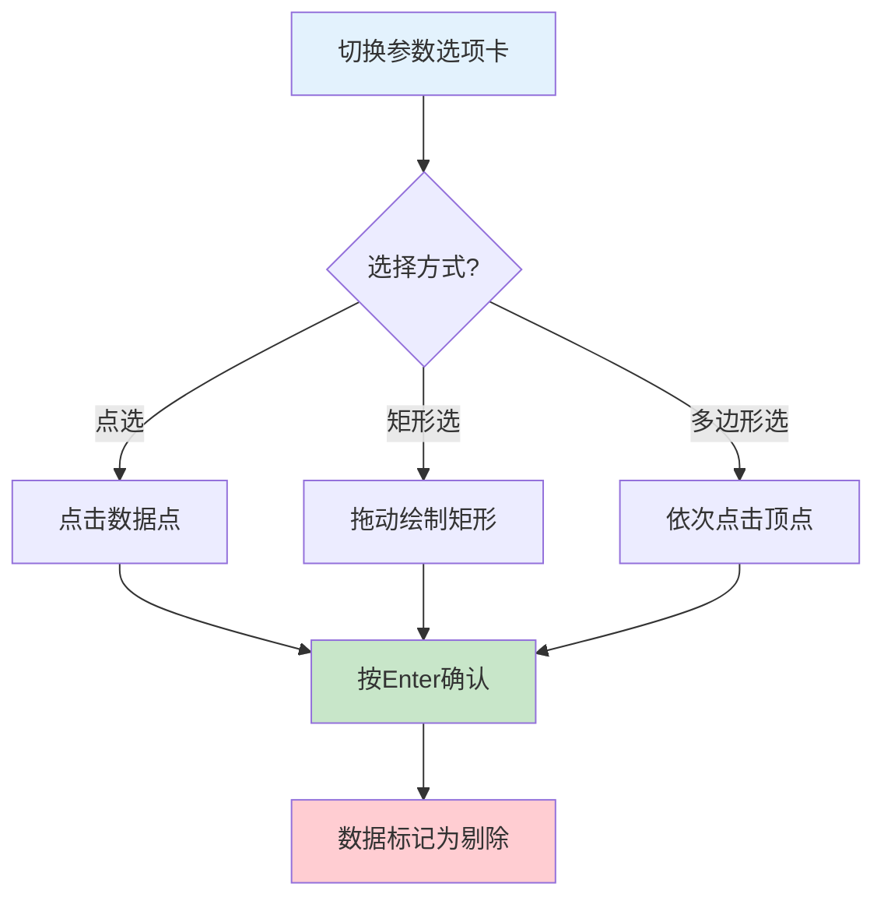

1. 切换到要编辑的参数选项卡
2. 在图表上进行筛选：
   - 点选：点击数据点
   - 矩形选：拖动绘制矩形
   - 多边形选：依次点击顶点
3. 按 Enter 确认选择
### 双参数筛选

1. 切换到"双参数编辑"选项卡
2. 选择X轴和Y轴参数
3. 点击"添加"创建新的筛选图表
4. 在散点图上筛选

### 撤销与重做

| 快捷键 | 功能 |
|-------|------|
| Ctrl + Z | 撤销 |
| Ctrl + Y | 重做 |

---

## 旋转角度

### 功能说明

设置坐标旋转角度，用于：

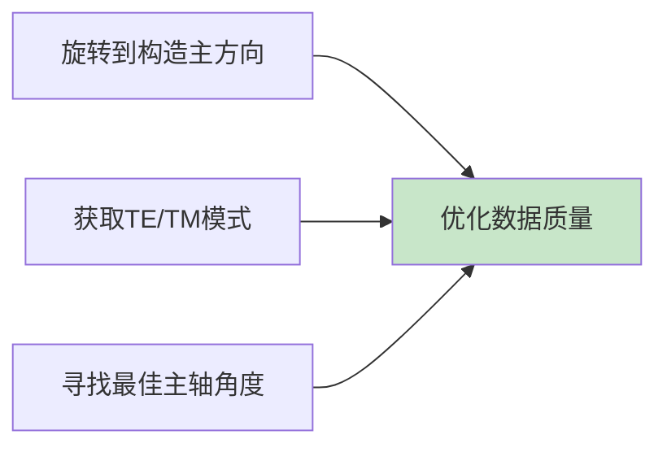

- 旋转到构造主方向
- 获取TE/TM模式
- 最佳主轴角度
### 操作方法

1. 在工具栏中设置旋转角度（度）
2. 或点击"最佳旋转角度"自动计算
3. 曲线自动更新

---

## 📏 马氏距离筛选

### 功能说明

使用马氏距离自动识别异常数据点。

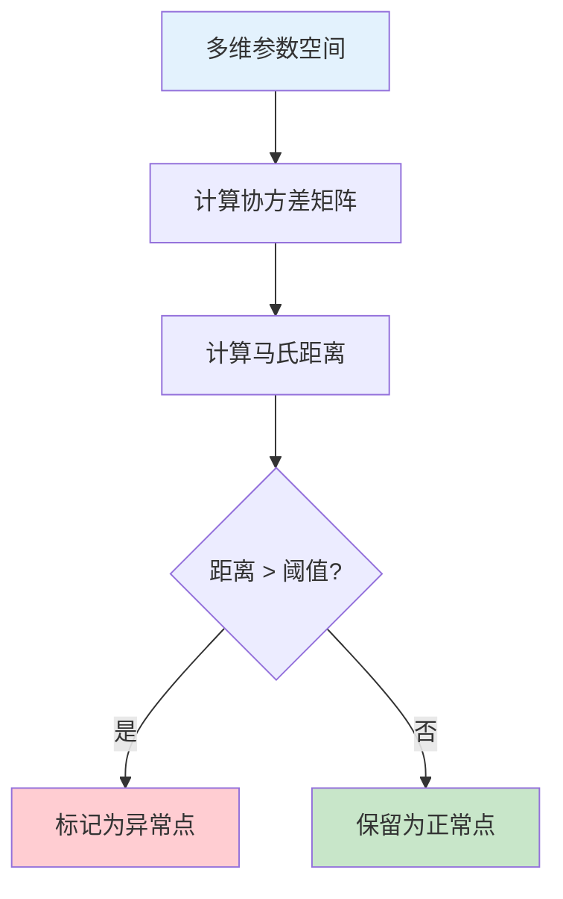

### 操作方法

1️⃣ 设置阈值（默认4.0）
2️⃣ 设置迭代次数（默认5）
3️⃣ 点击"马氏距离筛选"
4️⃣ 查看筛选结果

> **📖 理论背景：马氏距离（Mahalanobis Distance）**
>
> 马氏距离考虑了变量之间的相关性和各变量的方差，能够更准确地衡量样本的异常程度。
>
> **定义**：对于p维随机向量$\mathbf{x}$，马氏距离定义为：
>
> $$D_M(\mathbf{x}) = \sqrt{(\mathbf{x} - \boldsymbol{\mu})^T \mathbf{\Sigma}^{-1} (\mathbf{x} - \boldsymbol{\mu})}$$
>
> 式中$\boldsymbol{\mu}$为均值向量，$\mathbf{\Sigma}$为协方差矩阵。
>
> **在MT数据筛选中的应用**：将每个频点的数据视为多维向量，例如：
>
> $$\mathbf{x}_i = [\log\rho_{xy}, \log\rho_{yx}, \varphi_{xy}, \varphi_{yx}]^T$$
>
> 计算每个频点的马氏距离，距离较大的频点被认为是离群点。
>
> **阈值确定方法：**
>
> | 方法 | 说明 |
> |------|------|
> | **卡方分布法** | $D_M^2$服从自由度为p的卡方分布，取$\chi_{p,1-\alpha}^2$为阈值 |
> | **百分位数法** | 选取某个百分位数（如95%或99%）作为阈值 |
> | **迭代法** | 每次剔除最大马氏距离点，直到分布稳定 |
>
> **优点**：综合考虑多个参数的相关性，对变量尺度不敏感，比单一参数筛选更加稳健。

---

## 🤖 自动筛选

### 筛选参数

| 参数 | 说明 |
|-----|------|
| 最大保留比例 | 保留数据的最大比例 |
| 最小保留比例 | 保留数据的最小比例 |
| 退出误差 | 迭代退出的误差阈值 |
| 自动百分比 | 自动筛选的百分比 |

### 自动旋转角度

可设置多个旋转角度进行自动筛选：
1. 在"自动旋转角度"列表中添加角度
2. 系统在各角度下分别筛选
3. 选择最优结果

### 筛选类型

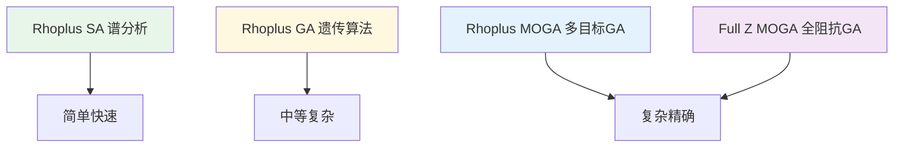

| 类型 | 说明 |
|-----|------|
| Rhoplus SA | Rhoplus谱分析筛选 |
| Rhoplus GA | Rhoplus遗传算法筛选 |
| Rhoplus MOGA | Rhoplus多目标遗传算法 |
| Full Z MOGA | 全阻抗多目标遗传算法 |
---

## 📐 Rhoplus参考曲线

### 功能说明

Rhoplus是一种基于1D层状模型的反演方法，用于：

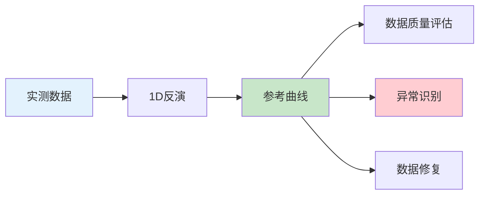

- 数据质量评估
- 生成平滑的参考曲线
- 识别异常数据点

> **📖 理论背景：Rhoplus方法**
>
> Rhoplus方法由Parker和Booker（1996）提出，核心思想是**寻找与观测数据相容的最简单地下电阻率结构**。
>
> **基本原理**：如果存在一个一维层状模型能够完全解释观测的视电阻率数据，那么该模型就是与数据相容的最简单模型。Rhoplus方法寻找的是使拟合误差最小的一维模型。
>
> **目标函数**：
>
> $$\min_{\boldsymbol{\rho}, \boldsymbol{h}} \sum_{i=1}^{N} w_i \left[\frac{\rho_a^{obs}(\omega_i) - \rho_a^{cal}(\omega_i, \boldsymbol{\rho}, \boldsymbol{h})}{\delta\rho_a(\omega_i)}\right]^2$$
>
> 式中：$\rho_a^{obs}$为观测视电阻率，$\rho_a^{cal}$为计算视电阻率，$\delta\rho_a$为观测误差，$\boldsymbol{\rho}$为各层电阻率，$\boldsymbol{h}$为各层厚度。
>
> **多角度Rhoplus**：对于二维或三维结构，不同方向的视电阻率曲线不同。通过旋转坐标系计算不同角度的Rhoplus响应：
>
> $$\rho_a(\theta, \omega) = \frac{|Z_{xy}\cos^2\theta + (Z_{yy}-Z_{xx})\sin\theta\cos\theta - Z_{yx}\sin^2\theta|^2}{\omega\mu_0}$$
>
> **主要应用：**
>
> | 应用 | 说明 |
> |------|------|
> | **数据质量评估** | 如果数据能被一维Rhoplus很好拟合，说明数据质量高 |
> | **维性分析** | 比较不同方向Rhoplus响应差异，判断维性特征 |
> | **静态位移校正** | 检测近地表不均匀体引起的静态位移效应 |
> | **初始模型构建** | Rhoplus反演结果可作为2D/3D反演的初始模型 |

### Rhoplus计算方式

| 方法 | 说明 |
|-----|------|
| CalRhoplus | XY和YX同时反演 |
| CalRhoplusXY | 仅XY模式反演 |
| CalRhoplusYX | 仅YX模式反演 |

### 操作方法

1. 勾选"自动更新Rhoplus"
2. 系统自动计算参考曲线
3. 曲线叠加显示在图表上

### 输出结果

Rhoplus输出包括：
- 平滑后的视电阻率曲线
- 平滑后的相位曲线
- 1D层状模型参数（层数、层厚、电阻率）

### 添加预测曲线

1. 点击"添加Rhoplus角度"
2. 选择预测模型
3. 预测曲线显示在图表上

---

## 🧠 AI模型预测

### 功能说明

使用深度学习模型预测完整的阻抗张量，用于：

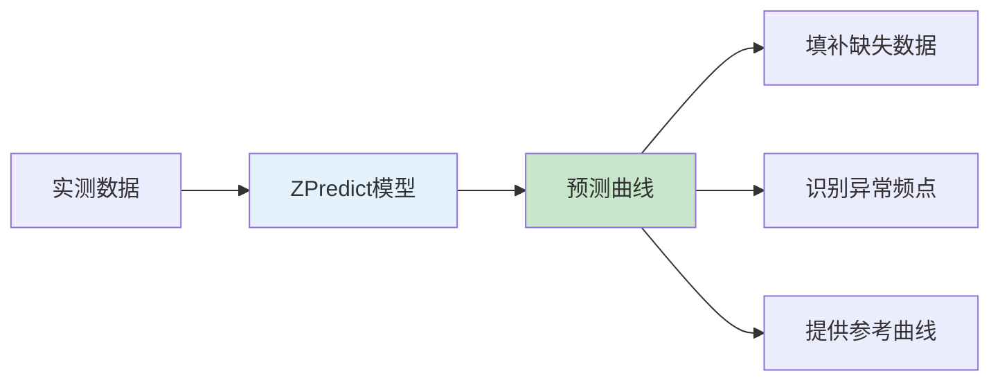

- 填补缺失数据
- 识别异常频点
- 提供参考曲线

### 预测方法

| 方法 | 算法 | 适用场景 |
|-----|------|---------|
| ModelPredict | ZPredict深度学习模型 | 一般数据 |
| ModelPredict1 | 中值滤波方法 | 简单平滑 |
| ModelPredict2 | 迭代优化方法 | 精细预测 |

### 操作方法

1. 点击"AI预测"按钮
2. 选择预测方法
3. 系统计算预测阻抗
4. 预测曲线叠加显示

### 使用建议

- 先进行基本筛选再使用AI预测
- 对比预测结果与实际数据
- 异常频点可参考预测值进行判断
---

## 理论曲线预测

### 功能说明

根据正演模型计算理论MT响应曲线。

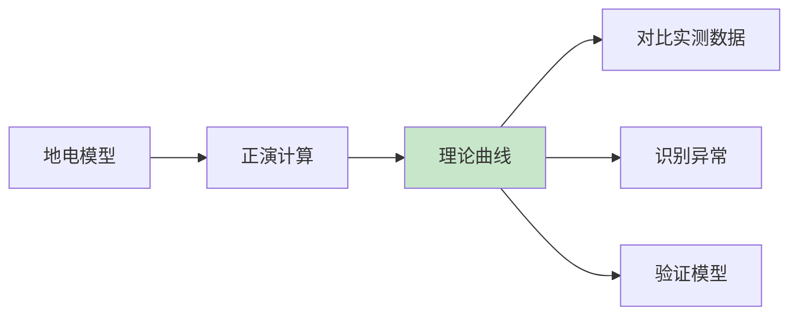

### 操作方法

1. 点击"曲线预测"按钮
2. 设置地电模型参数
3. 系统计算理论曲线
4. 理论曲线叠加显示

### 导入/导出预测

- 点击"加载预测"导入预测模型
- 点击"保存预测"保存当前预测

---

## 🎯 Robust稳健估计

### 可用方法

| 方法 | 适用场景 |
|-----|---------|
| 最小二乘法 | 高质量数据 |
| Regression-M | 一般数据（推荐） |
| 重复中位数法 | 强干扰环境 |
| Robust+AI | 复杂噪声 |

### 参数设置

1. 点击"MD参数"按钮
2. 选择估计方法
3. 调整参数（通常使用默认值）
4. 应用设置

---

## 时轴显示

### 功能说明

按采集时间显示数据，用于识别时间相关的噪声。

### 操作方法

1. 勾选"时轴"选项
2. 设置时区偏移
3. 数据按时间顺序显示

---

## 传递调度

### 功能说明

查看和管理测点的传递函数估计结果。

### 操作方法

- 选择要保留的数据
- 选择要剔除的数据

---

## 🚀 实用处理流程

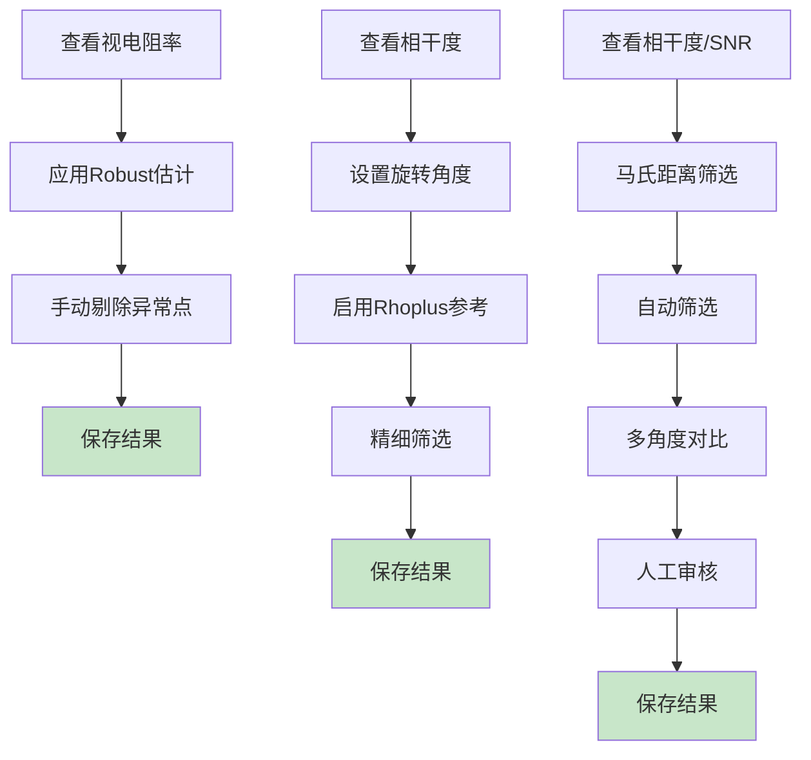

### 👶 新手推荐

1️⃣ 查看视电阻率/相位曲线
2️⃣ 应用Robust估计
3️⃣ 手动剔除明显异常点
4️⃣ 保存结果

### ⭐ 高质量数据

1️⃣ 查看相干度曲线
2️⃣ 设置旋转角度
3️⃣ 启用Rhoplus参考曲线
4️⃣ 精细筛选
5️⃣ 保存结果

### ⚠️ 强干扰环境

1️⃣ 查看相干度和SNR
2️⃣ 使用马氏距离筛选
3️⃣ 应用自动筛选
4️⃣ 多角度对比
5️⃣ 人工审核
6️⃣ 保存结果
## XPR分组设置

XPR（交叉功率比）分组用于确定FFT窗口如何组合计算传递函数。

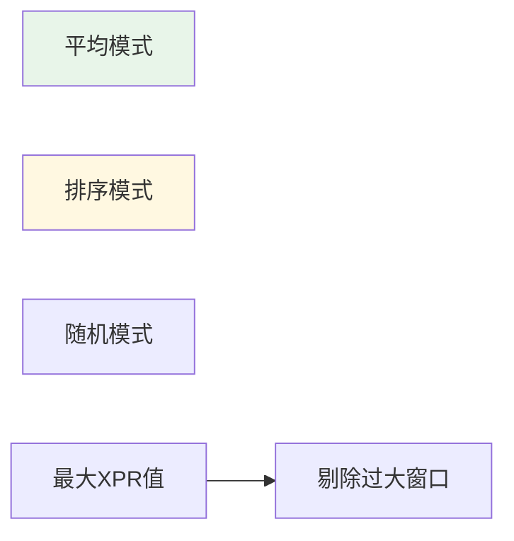

### 分组类型

| 类型 | 名称 | 说明 |
|-----|------|------|
| 0 | 平均 | 所有窗口等权平均计算 |
| 1 | 排序 | 按XPR值排序后加权计算 |
| 2 | 随机 | 随机选取窗口组合 |

### MaxXPR参数

- **说明**: 最大允许的XPR值
- **默认值**: 100
- **作用**: 限制参与计算的窗口XPR范围，剔除XPR过大的异常窗口

### 使用建议

- **平均模式**: 适用于高质量数据，计算速度快
- **排序模式**: 适用于中等质量数据，可提高估计精度
- **随机模式**: 用于统计检验和误差估计

---

## 🌐 远参考站管理

### 功能说明

远参考（Remote Reference）是一种提高MT数据质量的技术，通过使用远离测点的参考站数据来降低噪声影响。

### 适用条件

| 条件 | 要求 |
|-----|------|
| 参考站距离 | 通常 > 10km |
| 时间同步 | 与本地站同时采集 |
| 电磁环境 | 参考站环境安静 |
| 相干性 | 与本地站相干性 > 0.7 |

### 远参考数据编辑 (RemoteReferenceEditForm)

**功能说明：**

编辑和配置远参考站的傅里叶系数数据。

**编辑内容：**

| 项目 | 说明 |
|-----|------|
| 参考站名称 | 远参考站标识 |
| 时间范围 | 数据采集时间 |
| 频率范围 | 可用频率范围 |
| 相干性 | 与本地站的相干性 |

**操作步骤：**

1. 右键测点 → `远参考设置`
2. 在对话框中配置远参考站
3. 查看相干性曲线
4. 保存设置

### 远参考处理建议

**高质量远参考条件：**

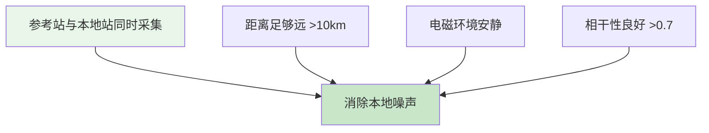

**常见问题：**

| 问题 | 解决方案 |
|-----|---------|
| 相干性低 | 检查时间同步 |
| 数据缺失 | 确认参考站数据完整 |
| 噪声干扰 | 选择更安静的参考站 |
---

## 🔄 通道旋转恢复

### 功能说明

通道旋转恢复功能用于校正传感器方向偏差,通过旋转电磁场分量实现坐标系变换。

### 旋转角度设置

| 通道 | 范围 | 说明 |
|-----|------|------|
| Ex | -360° ~ +360° | X方向电场旋转角 |
| Ey | -360° ~ +360° | Y方向电场旋转角 |
| Hx | -360° ~ +360° | X方向磁场旋转角 |
| Hy | -360° ~ +360° | Y方向磁场旋转角 |

### 使用场景


- 传感器安装方向与地理北不一致
- 需要将数据转换到统一坐标系
- 远参考数据处理时的坐标对齐
- 多测点数据对比时的坐标标准化

### 操作步骤

1. 在工程树中选择测点
2. 右键选择 `编辑 → 通道旋转恢复`
3. 设置各通道的旋转角度
4. 点击确定应用旋转
5. 系统自动更新傅里叶系数数据

### 注意事项

- 旋转操作会修改原始傅里叶系数
- 建议在旋转前备份数据
- 旋转角度以逆时针为正方向
- Hz通道不受旋转影响

---

## 🧬 智能筛选算法

### 遗传算法概述

MTDP使用遗传算法进行MT数据智能筛选，自动优化数据质量。遗传算法模拟自然进化过程，通过选择、交叉和变异操作，逐步优化数据筛选方案。

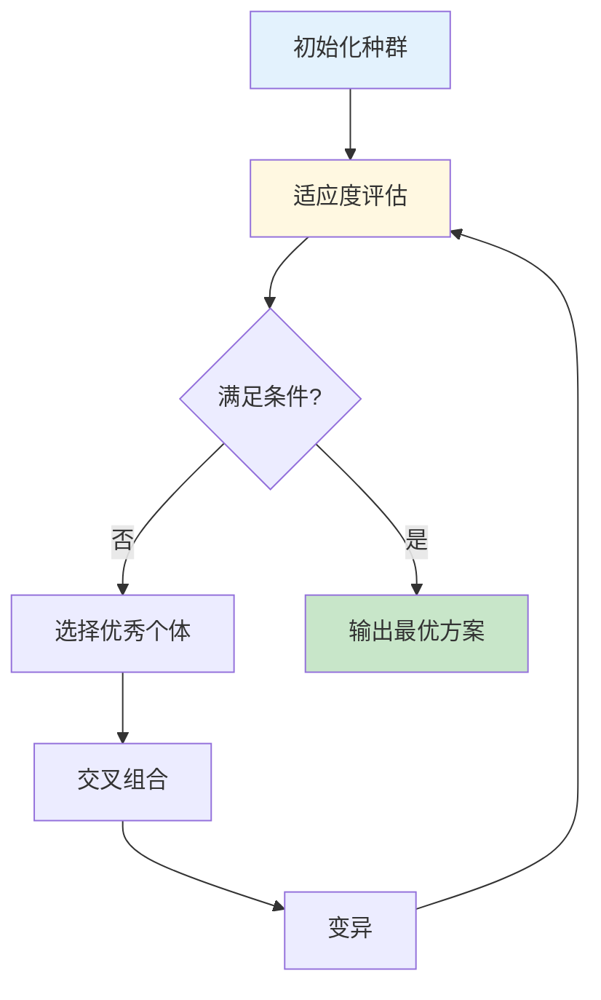

### 算法参数

| 参数 | 说明 | 典型值 |
|-----|------|--------|
| 种群大小 | 每代个体数量 | 50-200 |
| 迭代次数 | 进化代数 | 100-500 |
| 交叉率 | 个体交叉概率 | 0.7-0.9 |
| 变异率 | 基因变异概率 | 0.01-0.1 |
| 精英保留 | 保留最优个体数 | 1-5 |

### 优化目标

- **RMS最小化**：最小化数据与模型的残差
- **相干性最大化**：最大化通道间相干性
- **数据利用率**：最大化有效数据点数
### 多目标优化

支持NSGA-II多目标优化算法：
- Pareto最优解集
- 拥挤距离排序
- 外部档案管理

### 统计质量控制

**马氏距离过滤：**
- 协方差矩阵分析
- Huber加权稳健统计
- 迭代阈值优化
- 异常值自动检测

### 使用建议

1. 首先使用默认参数进行初步筛选
2. 根据结果调整参数进行精细优化
3. 对比多次运行结果确保稳定性
4. 结合人工筛选进行最终确认

### MT参数完整列表

MTDP支持75+种MT参数用于数据分析和筛选。以下按类别详细介绍各参数的定义、理论解释和计算公式。

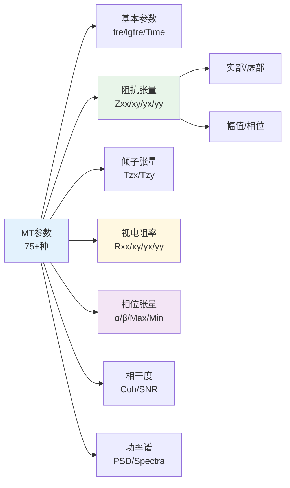

MTDP支持75+种MT参数用于数据分析和筛选。以下按类别详细介绍各参数的定义、理论解释和计算公式。

#### 基本参数

| 参数名 | 内部名称 | 说明 | 单位 |
|--------|----------|------|------|
| fre | MT_fre | 频率 | Hz |
| lgfre | MT_lgfre | 对数频率（log10） | log(Hz) |
| Time | MT_Time | 时间 | s |

#### 阻抗张量实部与虚部（单位：Ω）

阻抗张量Z描述电场与磁场之间的关系：

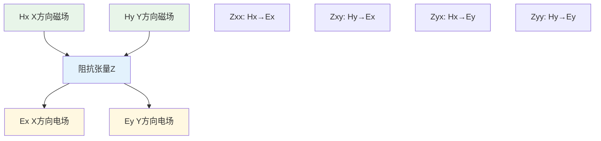

**理论公式：**
```
[Ex]   [Zxx  Zxy] [Hx]
[Ey] = [Zyx  Zyy] [Hy]
```

| 参数名 | 内部名称 | 说明 | 计算公式 |
|--------|----------|------|----------|
| zxxr | MT_zxxr | Zxx实部 | Re(Zxx) |
| zxxi | MT_zxxi | Zxx虚部 | Im(Zxx) |
| zxyr | MT_zxyr | Zxy实部 | Re(Zxy) |
| zxyi | MT_zxyi | Zxy虚部 | Im(Zxy) |
| zyxr | MT_zyxr | Zyx实部 | Re(Zyx) |
| zyxi | MT_zyxi | Zyx虚部 | Im(Zyx) |
| zyyr | MT_zyyr | Zyy实部 | Re(Zyy) |
| zyyi | MT_zyyi | Zyy虚部 | Im(Zyy) |

**Gamble估计公式：**
```
Z = <EH*> / <HH*>
其中：E为电场，H为磁场，*表示共轭，<>表示平均
```

#### 阻抗张量幅值与相位

| 参数名 | 内部名称 | 说明 | 计算公式 |
|--------|----------|------|----------|
| zxxa | MT_zxxa | Zxx幅值 | \|Zxx\| = √(zxxr² + zxxi²) |
| zxxp | MT_zxxp | Zxx相位 | atan2(zxxi, zxxr) × 180/π |
| zxya | MT_zxya | Zxy幅值 | \|Zxy\| = √(zxyr² + zxyi²) |
| zxyp | MT_zxyp | Zxy相位 | atan2(zxyi, zxyr) × 180/π |
| zyxa | MT_zyxa | Zyx幅值 | \|Zyx\| = √(zyxr² + zyxi²) |
| zyxp | MT_zyxp | Zyx相位 | atan2(zyxi, zyxr) × 180/π |
| zyya | MT_zyya | Zyy幅值 | \|Zyy\| = √(zyyr² + zyyi²) |
| zyyp | MT_zyyp | Zyy相位 | atan2(zyyi, zyyr) × 180/π |

> **注意：** zxxp1/zxyp1/zyxp1/zyyp1为第一象限相位（0-90°）

#### 倾子张量（无量纲）

倾子T描述垂直磁场与水平磁场的关系：

**理论公式：**
```
Hz = Tzx·Hx + Tzy·Hy
```

| 参数名 | 内部名称 | 说明 | 计算公式 |
|--------|----------|------|----------|
| tzxr | MT_tzxr | Tzx实部 | Re(Tzx) |
| tzxi | MT_tzxi | Tzx虚部 | Im(Tzx) |
| tzyr | MT_tzyr | Tzy实部 | Re(Tzy) |
| tzyi | MT_tzyi | Tzy虚部 | Im(Tzy) |
| tzxa | MT_tzxa | Tzx幅值 | \|Tzx\| |
| tzxp | MT_tzxp | Tzx相位 | atan2(tzxi, tzxr) × 180/π |
| tzya | MT_tzya | Tzy幅值 | \|Tzy\| |
| tzyp | MT_tzyp | Tzy相位 | atan2(tzyi, tzyr) × 180/π |

#### 视电阻率（单位：Ω·m）

**理论公式：**
```
ρij = (1/ωμ₀) × |Zij|²
其中：ω = 2πf，μ₀ = 4π×10⁻⁷ H/m
```

| 参数名 | 内部名称 | 说明 | 计算公式 |
|--------|----------|------|----------|
| rxx | MT_rxx | ρxx视电阻率 | (1/ωμ₀) × \|Zxx\|² |
| rxy | MT_rxy | ρxy视电阻率 | (1/ωμ₀) × \|Zxy\|² |
| ryx | MT_ryx | ρyx视电阻率 | (1/ωμ₀) × \|Zyx\|² |
| ryy | MT_ryy | ρyy视电阻率 | (1/ωμ₀) × \|Zyy\|² |
| lgrxx | MT_lgrxx | log₁₀(ρxx) | log₁₀(rxx) |
| lgrxy | MT_lgrxy | log₁₀(ρxy) | log₁₀(rxy) |
| lgryx | MT_lgryx | log₁₀(ρyx) | log₁₀(ryx) |
| lgryy | MT_lgryy | log₁₀(ρyy) | log₁₀(ryy) |

> **常用：** ρxy和ρyx是MT解释的主要参数

#### 阻抗方差

| 参数名 | 内部名称 | 说明 | 用途 |
|--------|----------|------|------|
| ZxxVar | MT_ZxxVar | Zxx方差 | 数据质量评估 |
| ZxyVar | MT_ZxyVar | Zxy方差 | 数据质量评估 |
| ZyxVar | MT_ZyxVar | Zyx方差 | 数据质量评估 |
| ZyyVar | MT_ZyyVar | Zyy方差 | 数据质量评估 |
| TzxVar | MT_TzxVar | Tzx方差 | 数据质量评估 |
| TzyVar | MT_TzyVar | Tzy方差 | 数据质量评估 |

#### 视电阻率与相位方差

| 参数名 | 内部名称 | 说明 | 计算公式 |
|--------|----------|------|----------|
| rxxvar | MT_rxxvar | ρxx方差 | 基于Zxx方差传播 |
| rxyvar | MT_rxyvar | ρxy方差 | 基于Zxy方差传播 |
| ryxvar | MT_ryxvar | ρyx方差 | 基于Zyx方差传播 |
| ryyvar | MT_ryyvar | ρyy方差 | 基于Zyy方差传播 |
| lgrxxvar | MT_lgrxxvar | log(ρxx)方差 | 数据筛选 |
| lgrxyvar | MT_lgrxyvar | log(ρxy)方差 | 数据筛选 |
| lgryxvar | MT_lgryxvar | log(ρyx)方差 | 数据筛选 |
| lgryyvar | MT_lgryyvar | log(ρyy)方差 | 数据筛选 |
| pxxvar | MT_pxxvar | φxx方差 | 相位误差 |
| pxyvar | MT_pxyvar | φxy方差 | 相位误差 |
| pyxvar | MT_pyxvar | φyx方差 | 相位误差 |
| pyyvar | MT_pyyvar | φyy方差 | 相位误差 |

#### 相位张量

相位张量Φ是归一化阻抗张量的实部，用于分析地下构造：

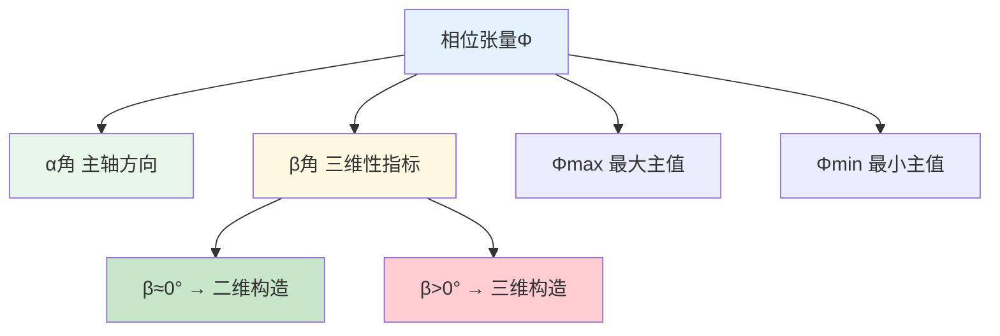

**理论公式：**
```
Φ = Re(Z) / |ωμ₀| = [Φxx Φxy]
                        [Φyx Φyy]
```

| 参数名 | 内部名称 | 说明 | 用途 |
|--------|----------|------|------|
| ptxx | MT_ptxx | Φxx | 相位张量分量 |
| ptxy | MT_ptxy | Φxy | 相位张量分量 |
| ptyx | MT_ptyx | Φyx | 相位张量分量 |
| ptyy | MT_ptyy | Φyy | 相位张量分量 |
| alpha | MT_alpha | α角 | 主轴方向角 |
| beta | MT_beta | β角 | 构造三维性指示 |
| pmax | MT_pmax | Φmax | 最大主值 |
| pmin | MT_pmin | Φmin | 最小主值 |
| ptskew1d | MT_ptskew1d | 1D偏斜度 | 一维偏离度 |
| ptskew2d | MT_ptskew2d | 2D偏斜度 | 二维偏离度 |

**解释：**
- **β ≈ 0°**：二维构造
- **β > 0°**：三维构造
- **skew较小**：近二维构造

#### 共轭阻抗变换

| 参数名 | 内部名称 | 说明 | 用途 |
|--------|----------|------|------|
| cczxxr | MT_cczxxr | 共轭Zxx实部 | 构造分析 |
| cczxxi | MT_cczxxi | 共轭Zxx虚部 | 构造分析 |
| cczxyr | MT_cczxyr | 共轭Zxy实部 | 构造分析 |
| cczxyi | MT_cczxyi | 共轭Zxy虚部 | 构造分析 |
| cczyxr | MT_cczyxr | 共轭Zyx实部 | 构造分析 |
| cczyxi | MT_cczyxi | 共轭Zyx虚部 | 构造分析 |
| cczyyr | MT_cczyyr | 共轭Zyy实部 | 构造分析 |
| cczyyi | MT_cczyyi | 共轭Zyy虚部 | 构造分析 |
| ccztheta | MT_ccztheta | 共轭旋转角 | 主轴方向 |
| cczskew1d | MT_cczskew1d | 共轭1D偏斜 | 构造维数 |
| cczskew2d | MT_cczskew2d | 共轭2D偏斜 | 构造维数 |

#### 相干度

相干度衡量两个信号之间的线性相关程度：

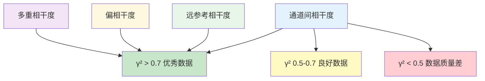

**理论公式：**
```
γ² = |<XY*>|² / (<XX*><YY*>)
范围：0 ≤ γ² ≤ 1
```

**通道间相干度：**

| 参数名 | 内部名称 | 说明 | 典型范围 |
|--------|----------|------|----------|
| CohExHy | MT_CohExHy | Ex-Hy相干度 | 0.5-0.95 |
| CohExHx | MT_CohExHx | Ex-Hx相干度 | 0.3-0.8 |
| CohEyHx | MT_CohEyHx | Ey-Hx相干度 | 0.5-0.95 |
| CohEyHy | MT_CohEyHy | Ey-Hy相干度 | 0.3-0.8 |

**远参考相干度（带Rx/Ry）：**

| 参数名 | 内部名称 | 说明 |
|--------|----------|------|
| CohExRx | MT_CohExRx | Ex-远参考X相干度 |
| CohExRy | MT_CohExRy | Ex-远参考Y相干度 |
| CohEyRx | MT_CohEyRx | Ey-远参考X相干度 |
| CohEyRy | MT_CohEyRy | Ey-远参考Y相干度 |
| CohHxRx | MT_CohHxRx | Hx-远参考X相干度 |
| CohHxRy | MT_CohHxRy | Hx-远参考Y相干度 |
| CohHyRx | MT_CohHyRx | Hy-远参考X相干度 |
| CohHyRy | MT_CohHyRy | Hy-远参考Y相干度 |

**偏相干度：**

| 参数名 | 内部名称 | 说明 | 计算公式 |
|--------|----------|------|----------|
| CohpExHx | MT_CohpExHx | Ex-Hx偏相干 | (γb - γ1)/(1-γ1) |
| CohpExHy | MT_CohpExHy | Ex-Hy偏相干 | (γb - γ1)/(1-γ1) |
| CohpEyHx | MT_CohpEyHx | Ey-Hx偏相干 | (γb - γ1)/(1-γ1) |
| CohpEyHy | MT_CohpEyHy | Ey-Hy偏相干 | (γb - γ1)/(1-γ1) |
| CohpHxEx | MT_CohpHxEx | Hx-Ex偏相干 | (γb - γ1)/(1-γ1) |
| CohpHxEy | MT_CohpHxEy | Hx-Ey偏相干 | (γb - γ1)/(1-γ1) |
| CohpHyEx | MT_CohpHyEx | Hy-Ex偏相干 | (γb - γ1)/(1-γ1) |
| CohpHyEy | MT_CohpHyEy | Hy-Ey偏相干 | (γb - γ1)/(1-γ1) |
| CohpHzHx | MT_CohpHzHx | Hz-Hx偏相干 | (γb - γ1)/(1-γ1) |
| CohpHzHy | MT_CohpHzHy | Hz-Hy偏相干 | (γb - γ1)/(1-γ1) |

**多重相干度：**

| 参数名 | 内部名称 | 说明 |
|--------|----------|------|
| CohbEx | MT_CohbEx | Ex多重相干度 |
| CohbEy | MT_CohbEy | Ey多重相干度 |
| CohbHx | MT_CohbHx | Hx多重相干度 |
| CohbHy | MT_CohbHy | Hy多重相干度 |
| CohbHz | MT_CohbHz | Hz多重相干度 |

#### 信号与噪声

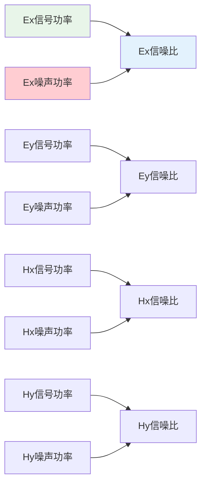

| 参数名 | 内部名称 | 说明 | 单位 |
|--------|----------|------|------|
| exsignal | MT_exsignal | Ex信号功率 | V²/m² |
| eysignal | MT_eysignal | Ey信号功率 | V²/m² |
| hxsignal | MT_hxsignal | Hx信号功率 | nT² |
| hysignal | MT_hysignal | Hy信号功率 | nT² |
| rxsignal | MT_rxsignal | Rx信号功率 | nT² |
| rysignal | MT_rysignal | Ry信号功率 | nT² |
| exnoise | MT_exnoise | Ex噪声功率 | V²/m² |
| eynoise | MT_eynoise | Ey噪声功率 | V²/m² |
| hxnoise | MT_hxnoise | Hx噪声功率 | nT² |
| hynoise | MT_hynoise | Hy噪声功率 | nT² |
| rxnoise | MT_rxnoise | Rx噪声功率 | nT² |
| rynoise | MT_rynoise | Ry噪声功率 | nT² |
**信噪比（SNR）：**

| 参数名 | 内部名称 | 说明 | 计算公式 |
|--------|----------|------|----------|
| exsnr | MT_exsnr | Ex信噪比 | signal/noise |
| eysnr | MT_eysnr | Ey信噪比 | signal/noise |
| hxsnr | MT_hxsnr | Hx信噪比 | signal/noise |
| hysnr | MT_hysnr | Hy信噪比 | signal/noise |
| rxsnr | MT_rxsnr | Rx信噪比 | signal/noise |
| rysnr | MT_rysnr | Ry信噪比 | signal/noise |

#### 功率谱密度

| 参数名 | 内部名称 | 说明 | 计算公式 |
|--------|----------|------|----------|
| ExPSD | MT_ExPSD | Ex功率谱密度 | <Ex·Ex*> |
| EyPSD | MT_EyPSD | Ey功率谱密度 | <Ey·Ey*> |
| HxPSD | MT_HxPSD | Hx功率谱密度 | <Hx·Hx*> |
| HyPSD | MT_HyPSD | Hy功率谱密度 | <Hy·Hy*> |
| HzPSD | MT_HzPSD | Hz功率谱密度 | <Hz·Hz*> |
| lgExPSD | MT_lgExPSD | log(Ex PSD) | log₁₀(ExPSD) |
| lgEyPSD | MT_lgEyPSD | log(Ey PSD) | log₁₀(EyPSD) |
| lgHxPSD | MT_lgHxPSD | log(Hx PSD) | log₁₀(HxPSD) |
| lgHyPSD | MT_lgHyPSD | log(Hy PSD) | log₁₀(HyPSD) |
| lgHzPSD | MT_lgHzPSD | log(Hz PSD) | log₁₀(HzPSD) |

#### 频谱幅值

| 参数名 | 内部名称 | 说明 | 计算公式 |
|--------|----------|------|----------|
| ExSpectra | MT_ExSpectra | Ex频谱幅值 | √(ExPSD) |
| EySpectra | MT_EySpectra | Ey频谱幅值 | √(EyPSD) |
| HxSpectra | MT_HxSpectra | Hx频谱幅值 | √(HxPSD) |
| HySpectra | MT_HySpectra | Hy频谱幅值 | √(HyPSD) |
| HzSpectra | MT_HzSpectra | Hz频谱幅值 | √(HzPSD) |
| lgExSpectra | MT_lgExSpectra | log(Ex Spectra) | log₁₀(ExSpectra) |
| lgEySpectra | MT_lgEySpectra | log(Ey Spectra) | log₁₀(EySpectra) |
| lgHxSpectra | MT_lgHxSpectra | log(Hx Spectra) | log₁₀(HxSpectra) |
| lgHySpectra | MT_lgHySpectra | log(Hy Spectra) | log₁₀(HySpectra) |
| lgHzSpectra | MT_lgHzSpectra | log(Hz Spectra) | log₁₀(HzSpectra) |

#### 极化参数

| 参数名 | 内部名称 | 说明 | 计算公式 |
|--------|----------|------|----------|
| EPolar | MT_EPolar | 电场极化角 | arctan(2×Exy/(Exx-Eyy))×180/π |
| HPolar | MT_HPolar | 磁场极化角 | arctan(2×Hxy/(Hxx-Hyy))×180/π |
| HRPolar | MT_HRPolar | 远参考极化差 | HPolar - RRPolar |

#### 阻抗行列式

| 参数名 | 内部名称 | 说明 | 计算公式 |
|--------|----------|------|----------|
| DetZr | MT_DetZr | det(Z)实部 | Re(Zxx·Zyy - Zxy·Zyx) |
| DetZi | MT_DetZi | det(Z)虚部 | Im(Zxx·Zyy - Zxy·Zyx) |
| DetZa | MT_DetZa | det(Z)幅值 | \|Zxx·Zyy - Zxy·Zyx\| |
| DetZp | MT_DetZp | det(Z)相位 | arg(Zxx·Zyy - Zxy·Zyx) |

#### 数据筛选常用参数推荐

**推荐用于数据质量筛选的参数组合：**

| 筛选类型 | 推荐参数 | 筛选标准 |
|----------|----------|----------|
| 相干度筛选 | CohExHy, CohEyHx | > 0.7 (优秀), > 0.5 (合格) |
| 信噪比筛选 | exsnr, eysnr, hxsnr, hysnr | > 3 (推荐) |
| 误差筛选 | rxyvar, ryxvar, pxyvar, pyxvar | 越小越好 |
| 三维性筛选 | beta, ptskew2d | < 3° (近2D), < 6° (可接受) |

#### 参数使用建议

1. **初学者**：优先关注 rxy、ryx（视电阻率）和 zxyp、zyxp（相位）
2. **质量控制**：使用相干度（CohExHy、CohEyHx）和信噪比（SNR）
3. **构造分析**：关注相位张量参数（alpha、beta、skew）
4. **噪声诊断**：检查功率谱密度和各通道噪声水平

#### EDI导出格式

MTDataPro支持多种EDI格式导出，方便与其他MT软件进行数据交换。

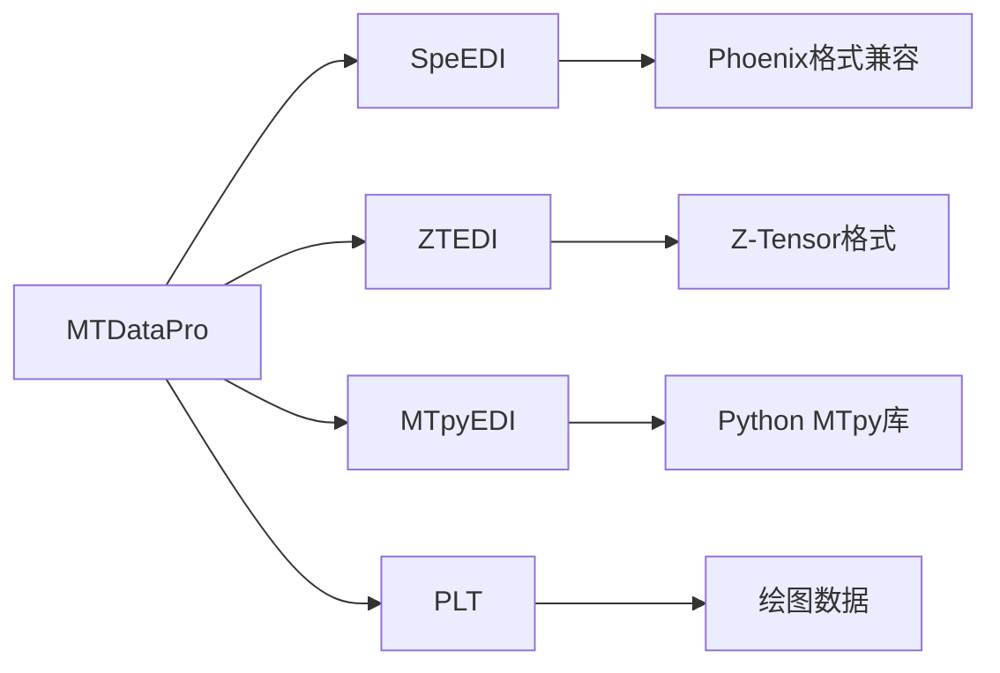

**各EDI导出格式说明：**

| 格式名称 | 菜单路径 | 说明 | 适用场景 |
|----------|----------|------|----------|
| SpeEDI | 组导出 → SpeEDI | 光谱EDI格式 | Phoenix MT系统数据兼容 |
| ZTEDI | 组导出 → ZTEDI | Z-Tensor EDI格式 | 垂直分量数据导出 |
| MTpyEDI | 组导出 → MTpyEDI | MTpy库兼容格式 | Python MTpy数据分析 |
| PLT | 组导出 → PLT | 绘图格式 | 数据可视化与绘图 |

**SpeEDI格式**
- 基于标准EDI格式的光谱版本
- 保留完整频率信息
- 适用于Phoenix系列仪器数据

**ZTEDI格式**
- 专门用于垂直电场(Z)分量
- 包含Z数据和张量信息
- 适用于大地电磁测深研究

**MTpyEDI格式**
- 兼容Python的MTpy库
- 优化了数据类型和结构
- 便于在Python环境中进行数据分析

**PLT格式**
- 用于数据绘图和可视化
- 包含绘图所需的坐标数据
- 适用于制作publication-quality图形