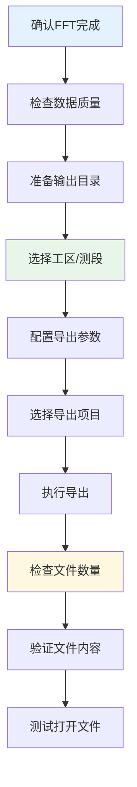
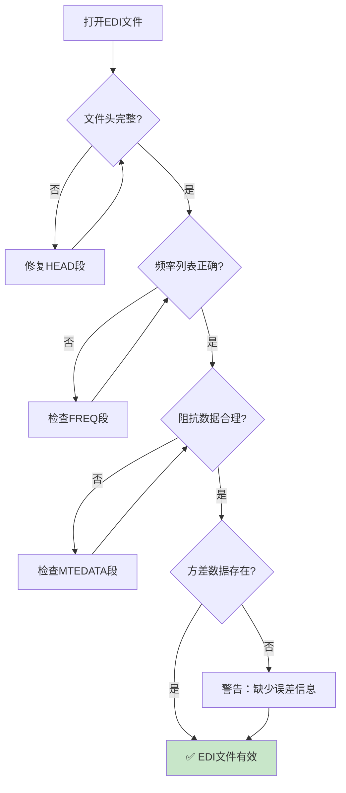
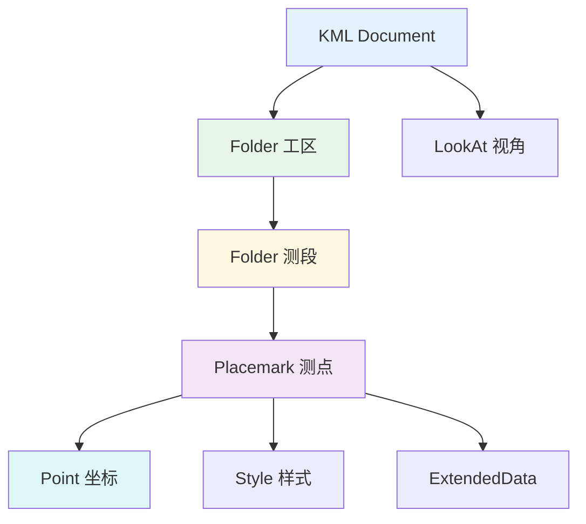
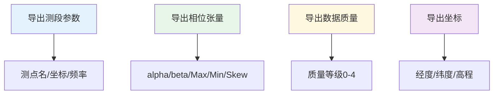
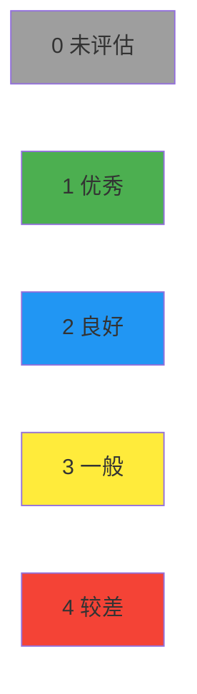
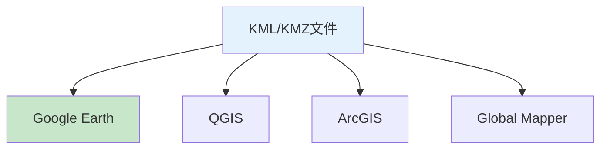

# 结果输出与可视化

本章介绍MTDP中数据处理结果的查看、导出和可视化功能。

---

## 数据图表查看

### 视电阻率/相位曲线

1. 在工程树中选择测点
2. 双击或右键选择"查看曲线"
3. 窗口显示视电阻率（ρa）和相位（φ）曲线

**曲线显示选项：**
- **XY/YX模式**：显示 ρxy/φxy 和 ρyx/φyx
- **误差棒**：显示/隐藏误差棒
- **数据点标记**：标记数据点位置
- **对数/线性坐标**：切换坐标轴类型

### 多测点对比

1. 在工程树中选择多个测点（按住Ctrl多选）
2. 右键选择"对比曲线"
3. 所有选中的测点曲线将显示在同一图表中

### 图表交互操作

| 操作 | 说明 |
|-----|------|
| 鼠标滚轮 | 缩放图表 |
| 左键拖动 | 平移图表 |
| 双击 | 恢复原始视图 |
| 右键菜单 | 导出、设置等选项 |

---

## EDI格式导出

### 批量导出（详细流程）

#### 批量导出概述

批量导出功能支持一次性导出多个测点的处理结果，大幅提高工作效率。



**支持格式：** SpeEDI | ZTEDI | MTpyEDI | PLT | KML/KMZ

#### 导入前准备

**检查清单：**
- [ ] 确认所有测点已完成FFT计算
- [ ] 检查数据质量评估（相干性、残差等）
- [ ] 确认需要导出的格式
- [ ] 准备输出目录和命名规则
- [ ] 检查磁盘空间充足

**质量评估标准：**

| 指标 | 合格范围 | 说明 |
|-----|---------|------|
| 相干性 | >0.7 | 优秀，可导出 |
| 相干性 | 0.5-0.7 | 良好，谨慎使用 |
| 相干性 | <0.5 | 数据质量差，建议重新处理 |
| 残差 | <10° | 优秀 |
| 残差 | 10°-20° | 良好 |
| 残差 | >20° | 可疑，检查数据 |

#### 批量导出操作步骤

**步骤1：启动批量导出**

1. 在工程树中选择工区或测段
2. 右键选择 `导出 → 批量导出`
3. 系统打开批量导出对话框

**步骤2：配置导出参数**

在批量导出对话框中设置：

| 参数 | 说明 | 推荐设置 |
|-----|------|---------|
| 导出格式 | 根据接收软件选择 | SpeEDI/ZTEDI/MTpyEDI |
| 文件命名规则 | {测点名}.{格式扩展名} | {测点}_EDI.edi |
| 覆盖已存在 | 不覆盖（安全） | 不覆盖 |
| 导出范围 | 全部测点/选中测点 | 全部测点 |
| 质量过滤 | 仅导出相干性>X的测点 | 不限 |
| 包含误差棒 | 是/否 | 是 |

**步骤3：选择导出项目**

可选择导出的数据项：
- [ ] 阻抗张量（Zxx, Zxy, Zyx, Zyy）
- [ ] 相位张量（Pxy, Pyx）
- [ ] 倾子张量（Tzx, Tzy）
- [ ] 视电阻率张量（Rhoxx, Rhoxy, Rhoyx, Rhoyy）
- [ ] 相干度曲线
- [ ] 数据质量信息

**步骤4：执行导出**

点击"开始导出"后：
1. 系统显示进度条
2. 逐个处理测点数据
3. 生成EDI文件并保存
4. 完成后显示导出摘要

#### 导出后验证

**检查项目：**

| 检查项 | 验证方法 |
|---------|---------|
| 文件数量 | 对比导出数量与源测点数 | 工程树统计 |
| 文件大小 | 确认EDI文件大小合理 | 文件管理器 |
| 打开测试 | 用专业软件打开验证 | EDI查看器 |
| 数据完整性 | 检查关键频点是否导出 | 随机抽样 |

#### 常见问题

**问题1：部分测点导出失败**
- 原因：数据质量不足或计算未完成
- 解决：
  1. 检查失败测点的FFT状态
  2. 查看"处理"选项卡中的计算日志
  3. 重新完成FFT计算后再导出

**问题2：导出格式不兼容**
- 原因：EDI版本不符合接收软件要求
- 解决：
  1. 确认目标软件的EDI版本要求
  2. 使用批量导出的格式选择功能
  3. 重新导出兼容版本

**问题3：文件名冲突**
- 原因：导出目录中已存在同名文件
- 解决：
  1. 使用"覆盖已存在"选项（如需要）
  2. 使用不同的命名规则
  3. 手动重命名冲突文件

**问题4：磁盘空间不足**
- 原因：批量导出数据量大
- 解决：
  1. 评估所需磁盘空间（约1MB/测点）
  2. 分批导出而非一次性全部导出
  3. 使用压缩或分盘存储

#### 批量导出最佳实践

**文件组织建议：**
- 为每个测线创建独立文件夹
- 使用统一的命名约定（如{测线}_{日期}_{测点}.edi）
- 按时间戳或质量级别分批存储
- 保留原始工程文件作为备份

**导出工作流建议：**
1. 先用少量测点测试导出流程
2. 验证导出文件可以被目标软件正确读取
3. 确认所有必需元数据都包含在导出文件中
4. 建立导出质量检查清单，确保数据完整性

### 导出操作

**单测点导出：**

1. 在工程树中选择测点
2. 右键选择相应的导出选项
3. 选择保存位置

**批量导出：**

1. 在工程树中选择测段（Group）
2. 右键选择批量导出选项
3. 选择输出目录
4. 系统自动为每个测点生成EDI文件

**工区级导出：**

1. 选择工区
2. 右键选择 `导出EDI`
3. 选择输出目录

**HEAD段详细信息：**
- DataID：数据标识
- AcquiredBy：采集者
- AcquiredDate/EndDate：采集日期
- Name：测点名称
- Latitude/Longitude/Elevation：坐标信息

### EDI格式详细规范

#### EDI文件完整结构

```text
>HEAD
    DATAID=MTSurvey2024
    PROJECT=Area1
    SURVEY=Line1
    YEAR=2024
    MONTH=01
    DAY=15
    PROJLAT=30.5
    PROJLONG=120.5
    PROJELEV=150.5
    ACQBY=MTTeam
    FILEBY=MTDP v1.9.4

>INFO
    MAXSITES=1
    UNITS=M
    ELEVUNIT=METERS
    COORDINATE=Geographic

>DEFINEMEAS
    MAXCHAN=5
    MAXFREQ=30
    UNITS=M
    REFTIM=2024-01-15 00:00:00

>SITE
    BIRPTIM=24
    LAT=30:15:30
    LONG=120:34:12
    ELEV=150.5
    ANGLE=0

>FREQ
    100.0000
    80.0000
    ...

>MTEDATA
    FREQ=100.0
    ZXXR=0.1234
    ZXXI=-0.0567
    ZXYR=1.2345
    ZXYI=-0.7890
    ZYXR=-1.4567
    ZYXI=0.8901
    ZYYR=0.0987
    ZYYI=-0.0432
    ...

>END
```

#### EDI数据段详解

| 段名 | 必需 | 内容 | 说明 |
|:----:|:----:|:-----|:-----|
| **HEAD** | 是 | 头信息 | 包含项目、日期、坐标等基本信息 |
| **INFO** | 是 | 数据说明 | 包含数据单位、坐标系统等 |
| **DEFINEMEAS** | 是 | 测量定义 | 定义通道数、频率数等 |
| **SITE** | 是 | 测点信息 | 测点坐标、角度等 |
| **FREQ** | 是 | 频率列表 | 所有频率点（Hz） |
| **MTEDATA** | 是 | MT数据 | 阻抗、倾子、误差等 |
| **END** | 是 | 结束标记 | 文件结束 |

#### MTEDATA数据字段

| 字段 | 单位 | 说明 |
|:----:|:----:|:-----|
| **FREQ** | Hz | 频率 |
| **ZXXR/ZXXI** | Ω/km | 阻抗Zxx实部/虚部 |
| **ZXYR/ZXYI** | Ω/km | 阻抗Zxy实部/虚部 |
| **ZYXR/ZYXI** | Ω/km | 阻抗Zyx实部/虚部 |
| **ZYYR/ZYYI** | Ω/km | 阻抗Zyy实部/虚部 |
| **TXR/TXI** | 无量纲 | 倾子Tx实部/虚部 |
| **TYR/TYI** | 无量纲 | 倾子Ty实部/虚部 |
| **ZXX.VAR** | - | Zxx方差 |
| **ZXY.VAR** | - | Zxy方差 |
| ... | ... | ... |

#### EDI版本兼容性

| 版本 | 特点 | 兼容软件 |
|:----:|:-----|:---------|
| **SpeEDI** | 标准格式，广泛支持 | MT-Pioneer, WinGLink |
| **ZTEDI** | 支持张量数据 | Zonge软件 |
| **MTpyEDI** | Python兼容格式 | MTpy, SimPEG |
| **SEG-EDI** | SEG标准格式 | 大多数商业软件 |

### EDI格式验证

**验证清单：**



**数据合理性检查：**

| 检查项 | 合理范围 | 异常处理 |
|:------:|:---------|:---------|
| **视电阻率** | 0.01 - 100000 Ω·m | 检查标定 |
| **相位** | 0° - 90° | 检查象限 |
| **方差** | < 50% | 增加叠加 |
| **频率间隔** | 对数均匀 | 检查FFT设置 |

### 其他导出格式

#### PLT格式

PLT格式用于绘图软件。

**内容：**
- 视电阻率曲线数据
- 相位曲线数据
- 坐标信息

**导出步骤：**
1. 右键测点 → `导出PLT`
2. 选择保存位置

**PLT文件示例：**
```text
# MTDP PLT File
# Site: SITE001
# Coordinate: 30.2567, 120.5678
# Frequency(Hz) Rhoxy(Ohm-m) Rhoyx(Ohm-m) Phasexy(deg) Phaseyx(deg)
100.0  15.23  18.45  42.5  47.3
80.0   16.78  19.23  43.2  46.8
...
```

#### CSV格式

CSV格式便于数据处理和分析。

**导出步骤：**
1. 在曲线窗口右键 → `导出数据`
2. 选择 CSV 格式
3. 设置分隔符（逗号/制表符）

**CSV文件结构：**
```text
Frequency,ExEy,HyHx,Rhoxy,Rhoyx,Phasexy,Phaseyx,Error_xy,Error_yx
100.0,0.1234,0.0567,15.23,18.45,42.5,47.3,0.05,0.06
80.0,0.1456,0.0678,16.78,19.23,43.2,46.8,0.04,0.05
...
```
---

## 地理信息导出

### KML格式导出

**导出级别：**

| 级别 | 菜单选项 |
|-----|---------|
| 工程 | `工程 → 导出KML` |
| 工区 | `工区 → 导出普通KML` |
| 测段 | `测段 → 导出普通KML` |

**导出步骤：**
1. 选择要导出的工程/工区/测段
2. 右键选择相应的KML导出选项
3. 设置保存位置
4. 用Google Earth打开查看

### KMZ格式导出

KMZ是KML的压缩格式：
1. 选择工区或测段
2. 右键选择 `导出KMZ`
3. 选择保存位置

### KML文件结构



- **Document**：文档容器
- **Folder**：文件夹组织
- **Placemark**：地标（测点）
- **Point**：点坐标
- **Style**：样式定义（IconStyle、LineStyle、BalloonStyle）
- **LookAt**：视角设置
- **ExtendedData**：扩展数据

---

## 坐标数据导出

1. 选择工区
2. 右键选择 `导出测点坐标`
3. 选择导出格式（TXT/CSV）

导出内容：
- 测点名称
- 经度
- 纬度
- 高程

---

## 批量导出功能



### 导出测段参数

将测段内所有测点的参数导出到单个文件：

1. 选择测段
2. 右键选择 `导出参数`
3. 选择导出内容

**导出文件格式：**
- 文件名：`测段名-Paint.dat`
- 内容：测点名、坐标、频率、所有MT参数

### 导出相位张量

按频率导出所有测点的相位张量参数：

1. 选择测段
2. 右键选择 `导出相位张量`
3. 系统为每个频率生成一个文件

**导出文件格式：**
- 文件名：`频率-PhaseTensor.dat`
- 内容：测点名、坐标、alpha、beta、PtMax、PtMin、Skew1D、Skew2D等

### 导出数据质量

1. 选择测段
2. 右键选择 `导出数据质量`
3. 生成质量等级文件

**导出文件格式：**
- 文件名：`测段名-DataQuality.dat`
- 内容：测点名、质量等级

### 导出测点坐标

1. 选择测段
2. 右键选择 `导出坐标`
3. 生成坐标文件

**导出文件格式：**
- 文件名：`测段名-Coor.dat`
- 内容：测点名、经度、纬度、高程

---

## 其他导出格式

### 视电阻率/相位数据导出

1. 选择测点
2. 在曲线窗口中右键选择"导出数据"
3. 选择格式（CSV、TXT）

### 图表导出

| 格式 | 说明 |
|-----|------|
| EMF/WMF | 矢量图（Windows） |
| PNG | 位图，透明背景 |
| BMP | 位图，无压缩 |
| JPG | 位图，有损压缩 |

---

## 数据质量控制

### 数据质量标记



| 等级 | 说明 |
|-----|------|
| 0 | 未评估 |
| 1 | 优秀 |
| 2 | 良好 |
| 3 | 一般 |
| 4 | 较差 |

### 批量质量导出

1. 选择测段
2. 右键选择 `导出数据质量`
3. 导出所有测点的质量信息

---

## 与GIS软件联动

MTDP导出的地理数据可与以下软件联动：



- **Google Earth**：查看测点空间分布
- **QGIS**：进行空间分析和制图
- **ArcGIS**：专业GIS处理
- **Global Mapper**：多格式数据集成

> **提示**：导出KML/KMZ前，请确保测点的经纬度坐标已正确设置。

---

## 工程文件备份

### 导出版本

- 选择 `文件 → 导出版本`
- 创建工程的完整副本

### 自动备份

- 每次保存时自动创建备份
- 保留最近10个备份版本
- 备份文件存储在工程目录下

---

## 时间序列导出

### GMT格式导出

1. 选择测点
2. 选择 `导出 → GMT时间序列`
3. 时间序列导出为GMT兼容格式

### ATGMT格式导出

1. 选择测点
2. 选择 `工具 → 时间序列 → ATGMT格式`
3. 配置导出参数

---

## HTML报告生成

1. 选择测点
2. 选择 `测点 → 导出HTML设置`
3. 生成测点配置的HTML报告
