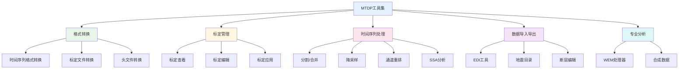
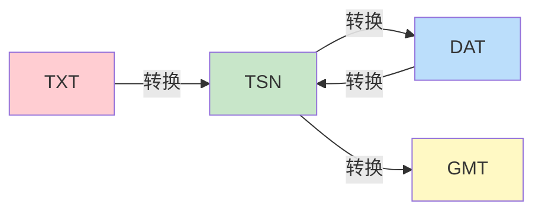
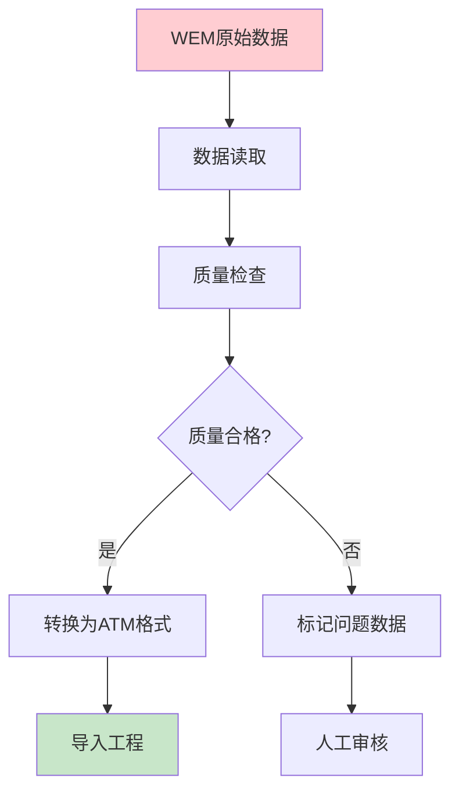

# 🔧 第9章 工具集

本章详细介绍MTDP提供的各种实用工具，包括格式转换、标定管理、时间序列处理等专业工具。

---

## 9.1 工具集概述

### 9.1.1 工具分类

MTDP的工具集按功能分为以下几类：



### 9.1.2 访问方式

| 访问方式 | 说明 |
|:--------:|:-----|
| **菜单栏** | 工具 → [子菜单] |
| **右键菜单** | 在工程树或数据窗口右键 |
| **快捷键** | 部分工具支持快捷键 |
| **命令行** | 高级用户可通过命令行调用 |

---

## 9.2 🔄 时间序列格式转换

### 9.2.1 支持的格式一览

| 格式 | 类型 | 仪器 | 说明 |
|:----:|:----:|:----:|:-----|
| **TSN** | 二进制 | Phoenix | Phoenix标准时间序列格式 |
| **DAT** | 二进制 | Phoenix | Phoenix数据格式 |
| **TXT** | 文本 | Phoenix | Phoenix文本格式 |
| **TS** | 二进制 | 通用 | 通用时间序列格式 |
| **ATM** | 二进制 | Metronix | Metronix数据格式 |
| **WEM** | 二进制 | Metronix | Metronix原始数据 |
| **GMT** | 文本 | 通用 | GMT时间序列格式 |
| **ATGMT** | 文本 | 通用 | 扩展GMT格式 |

### 9.2.2 Phoenix格式转换

#### 支持的转换路径



| 转换 | 菜单位置 | 用途 | 注意事项 |
|:----:|:--------:|:-----|:---------|
| **TXT → TSN** | 工具 → 时间序列转换 | 文本数据转二进制 | 需确保格式正确 |
| **TSN → DAT** | 工具 → 时间序列转换 | 标准格式转换 | 保留原始采样率 |
| **DAT → TSN** | 工具 → 时间序列转换 | 反向转换 | 可能丢失部分元数据 |
| **TSN → GMT** | 工具 → 时间序列转换 | 导出为通用格式 | 便于其他软件使用 |

#### 详细操作步骤

**Phoenix格式转换：**

1. 选择菜单 **工具 → 时间序列转换**
2. 在弹出的对话框中：
   - **源格式**：选择原始文件格式（如 TSN）
   - **目标格式**：选择目标格式（如 GMT）
3. 点击 **添加文件** 或 **添加目录** 选择要转换的文件
4. 设置 **输出目录**（默认为源文件目录下的 `converted` 文件夹）
5. 点击 **开始转换**
6. 查看转换日志确认结果

::: tip 💡 转换提示
- 批量转换时，建议先测试单个文件确保参数正确
- 转换后的文件会保留原始文件名，仅扩展名变化
- 转换日志保存在输出目录下的 `conversion.log` 文件中
:::

### 9.2.3 通用格式转换

#### GMT格式导出

GMT（Geophysical Magnetotelluric Time-series）是一种通用的时间序列文本格式。

**GMT格式结构：**
```
# GMT Time Series File
# Site: SITE001
# Sampling Rate: 256 Hz
# Channels: 5
# Time: 2024-01-15 10:00:00
#
# Column 1: Ex (mV/km)
# Column 2: Ey (mV/km)
# Column 3: Hx (nT)
# Column 4: Hy (nT)
# Column 5: Hz (nT)
#
1.234  -0.567  12.3  -8.9  0.5
1.235  -0.566  12.4  -8.8  0.4
...
```

**导出步骤：**
1. 选择菜单 **工具 → 时间序列转换 → 时间序列 → GMT**
2. 选择要导出的测点或时间序列文件
3. 设置导出参数：
   - 采样率（可降采样）
   - 时间范围
   - 通道选择
4. 指定输出目录
5. 点击 **导出**

#### ATGMT格式导出

ATGMT是扩展的GMT格式，包含更多元数据。

**ATGMT额外信息：**
- 标定参数
- 坐标信息
- 仪器配置

### 9.2.4 批量转换

**场景**：需要转换整个项目的数据文件

**步骤：**
1. 选择菜单 **工具 → 批量转换**
2. 选择源目录（支持递归搜索子目录）
3. 设置文件过滤条件（如 `*.tsn`）
4. 选择目标格式
5. 设置输出选项：
   - [ ] 保持原目录结构
   - [ ] 覆盖已存在文件
   - [ ] 生成转换报告
6. 点击 **开始**

**转换报告示例：**
```
=== 批量转换报告 ===
时间: 2024-01-15 14:30:00
源目录: D:\MTData\Phoenix
目标格式: GMT

成功: 45 个文件
失败: 2 个文件
  - SITE023.tsn: 文件损坏
  - SITE045.tsn: 格式不兼容

总耗时: 3分25秒
```

---

## 9.3 📡 标定文件管理

### 9.3.1 标定文件类型

| 格式 | 类型 | 仪器 | 内容 |
|:----:|:----:|:----:|:-----|
| **CLB** | 二进制 | Phoenix | 电场盒标定 |
| **CLC** | 二进制 | Phoenix | 磁传感器标定 |
| **CAL** | 文本 | Metronix | Metronix标定 |
| **JSON** | 文本 | 通用 | 通用标定格式 |

### 9.3.2 Phoenix标定转换

#### CLB/CLC ↔ JSON 转换

**为什么转换？**
- JSON格式便于查看和编辑
- 可用于批量修改标定参数
- 便于版本控制和备份

**转换步骤：**

1. 选择菜单 **工具 → 标定文件转换**
2. 选择转换方向：
   - `CLB/CLC → JSON`：转换为可编辑格式
   - `JSON → CLB/CLC`：恢复为Phoenix格式
3. 选择要转换的文件
4. 设置输出目录
5. 点击 **转换**

**JSON标定格式示例：**
```json
{
  "calibration": {
    "type": "magnetic_sensor",
    "serial_number": "ANT12345",
    "model": "MTC-50",
    "frequencies": [0.001, 0.01, 0.1, 1, 10, 100, 1000],
    "amplitude_response": [1.002, 1.001, 1.000, 0.999, 1.001, 1.003, 1.005],
    "phase_response": [0.1, 0.2, 0.3, 0.5, 1.2, 2.5, 5.0],
    "units": {
      "frequency": "Hz",
      "amplitude": "V/nT",
      "phase": "degrees"
    }
  }
}
```

### 9.3.3 标定文件查看器

**打开方式**：菜单 **工具 → 标定查看器**

**功能：**
- 📈 查看幅频响应曲线
- 📐 查看相频响应曲线
- 🔍 对比多个标定文件
- 📊 导出标定数据

**操作步骤：**
1. 打开标定查看器
2. 点击 **打开** 选择标定文件（CLB/CLC/CAL/JSON）
3. 查看响应曲线
4. 可选操作：
   - 切换显示：幅值/相位
   - 切换坐标：对数/线性
   - 导出为图片或数据

### 9.3.4 标定文件编辑

**编辑JSON标定文件：**

1. 将CLB/CLC转换为JSON格式
2. 使用文本编辑器打开JSON文件
3. 修改需要调整的参数
4. 保存JSON文件
5. 将JSON转换回CLB/CLC格式

::: warning ⚠️ 注意事项
- 编辑标定文件前务必备份原始文件
- 修改标定参数可能影响数据处理结果
- 不建议修改幅值和相位响应数据
:::

### 9.3.5 批量标定应用

**场景**：将新的标定文件应用到已处理的数据

**步骤：**
1. 选择菜单 **处理 → 重新标定**
2. 选择要重新标定的测点
3. 指定新的标定文件目录
4. 系统自动匹配标定文件（根据序列号）
5. 点击 **应用**
6. 重新执行FFT处理

---

## 9.4 📄 Phoenix头文件转换

### 9.4.1 TBL文件结构

TBL文件是Phoenix MTU-5/5A仪器的头文件，包含测点配置信息。

**TBL文件内容：**
```
SITE_NAME: SITE001
SITE_NUMBER: 001
LATITUDE: 30.1234
LONGITUDE: 120.5678
ELEVATION: 150.5
AZIMUTH: 0.0
DIPLOLE_LENGTH: 100
START_TIME: 2024-01-15 10:00:00
SAMPLE_RATE: 256
CHANNELS: 5
...
```

### 9.4.2 TBL ↔ JSON 转换

**转换步骤：**
1. 选择菜单 **工具 → Phoenix工具 → TBL转换**
2. 选择转换方向
3. 选择文件
4. 设置输出目录
5. 点击 **转换**

**JSON格式示例：**
```json
{
  "site_info": {
    "name": "SITE001",
    "number": "001",
    "coordinates": {
      "latitude": 30.1234,
      "longitude": 120.5678,
      "elevation": 150.5
    },
    "acquisition": {
      "start_time": "2024-01-15T10:00:00",
      "sample_rate": 256,
      "channels": 5,
      "dipole_length": 100,
      "azimuth": 0.0
    }
  }
}
```

### 9.4.3 批量修改TBL信息

**场景**：需要修改多个测点的坐标或配置信息

**步骤：**
1. 将所有TBL文件转换为JSON格式
2. 使用脚本或文本编辑器批量修改
3. 将修改后的JSON转换回TBL格式
4. 替换原始TBL文件

**批量修改示例（Python脚本）：**
```python
import json
import os

# 批量修改坐标偏移
offset_lat = 0.0001
offset_lon = 0.0002

for filename in os.listdir('.'):
    if filename.endswith('.json'):
        with open(filename, 'r') as f:
            data = json.load(f)
        
        # 应用坐标偏移
        data['site_info']['coordinates']['latitude'] += offset_lat
        data['site_info']['coordinates']['longitude'] += offset_lon
        
        with open(filename, 'w') as f:
            json.dump(data, f, indent=2)
```

---

## 9.5 📊 时间序列处理工具

### 9.5.1 时间序列分割

**用途**：将长时间序列分割为多个短段，便于处理或剔除噪声时段

**打开方式**：菜单 **工具 → 时间序列工具 → TS分割**

**参数设置：**

| 参数 | 说明 | 推荐值 |
|:----:|:-----|:------:|
| **分割长度** | 每段的时长（秒） | 3600（1小时） |
| **重叠长度** | 相邻段的重叠时长（秒） | 0 |
| **输出格式** | 分割后文件的格式 | 与源文件相同 |
| **命名规则** | 文件命名方式 | 原名_序号 |

**操作步骤：**
1. 打开TS分割工具
2. 选择要分割的时间序列文件
3. 设置分割参数
4. 预览分割结果
5. 点击 **执行分割**

**分割结果示例：**
```
原始文件: SITE001_24h.ts (24小时)
分割后:
  SITE001_01.ts (0:00-1:00)
  SITE001_02.ts (1:00-2:00)
  ...
  SITE001_24.ts (23:00-24:00)
```

### 9.5.2 时间序列合并

**用途**：合并多个连续的时间序列文件

**打开方式**：菜单 **工具 → 时间序列工具 → 数据合并**

**合并条件：**
- 采样率必须相同
- 时间必须连续或接近连续
- 通道配置必须一致

**操作步骤：**
1. 打开数据合并工具
2. 添加要合并的文件（按时间顺序）
3. 检查文件列表和时间连续性
4. 设置输出文件名和位置
5. 点击 **合并**

### 9.5.3 时间序列修复

**用途**：修复损坏或异常的时间序列文件

**打开方式**：菜单 **工具 → 时间序列工具 → TS修复**

**可修复的问题：**

| 问题类型 | 修复方法 |
|:--------:|:---------|
| **文件头损坏** | 从备份或类似文件恢复头部信息 |
| **数据截断** | 填充零或删除损坏部分 |
| **时间戳错误** | 重新计算时间戳 |
| **通道丢失** | 用零填充丢失通道 |

**操作步骤：**
1. 打开TS修复工具
2. 选择损坏的文件
3. 选择修复选项
4. 预览修复结果
5. 保存修复后的文件

::: warning ⚠️ 警告
修复后的数据可能不完整，建议保留原始损坏文件作为备份。
:::

### 9.5.4 通道重排

**用途**：当仪器的通道配置与MTDP默认配置不同时，重新排列通道顺序

**打开方式**：菜单 **工具 → 时间序列工具 → 通道重排**

**默认通道顺序：**
```
通道1: Ex (南北向电场)
通道2: Ey (东西向电场)
通道3: Hx (南北向磁场)
通道4: Hy (东西向磁场)
通道5: Hz (垂直向磁场)
```

**操作步骤：**
1. 打开通道重排工具
2. 选择时间序列文件
3. 查看当前通道配置
4. 设置新的通道映射关系
5. 点击 **应用**

**通道映射示例：**
```
原配置 → 新配置
通道1 (Ex) → 通道3
通道2 (Ey) → 通道4
通道3 (Hx) → 通道1
通道4 (Hy) → 通道2
通道5 (Hz) → 通道5
```

### 9.5.5 坐标修复

**用途**：修复TBL文件中的坐标信息错误

**打开方式**：菜单 **工具 → 时间序列工具 → 坐标修复**

**常见问题：**
- GPS信号丢失导致坐标为0
- 坐标格式错误（度分秒 vs 十进制度）
- 南北半球/东西半球符号错误

**操作步骤：**
1. 打开坐标修复工具
2. 选择要修复的TBL文件
3. 输入正确的坐标信息
4. 或从GPS轨迹文件导入
5. 点击 **修复**

---

## 9.6 📉 降采样工具

### 9.6.1 降采样原理

降采样是将高采样率数据转换为低采样率数据的过程，用于：
- 减少数据量
- 降低存储需求
- 加快处理速度

**注意事项：**
- 降采样会丢失高频信息
- 需要先进行抗混叠滤波
- 建议保留原始高采样率数据

### 9.6.2 ATTS降采样

**适用格式**：Aether (ATTS) 格式

**打开方式**：菜单 **时间序列处理 → ATTS降采样**

**参数设置：**

| 参数 | 说明 |
|:----:|:-----|
| **原始采样率** | 当前采样率（Hz） |
| **目标采样率** | 降采样后的采样率（Hz） |
| **抗混叠滤波** | 是否应用低通滤波 |
| **滤波器类型** | Butterworth / Chebyshev |

**操作步骤：**
1. 打开ATTS降采样工具
2. 选择要处理的时间序列文件
3. 设置目标采样率
4. 选择抗混叠滤波选项
5. 预览频谱变化
6. 点击 **执行**

### 9.6.3 MTU降采样

**适用格式**：Phoenix MTU格式

**打开方式**：菜单 **时间序列处理 → MTU降采样**

**支持的降采样路径：**


### 9.6.4 降采样质量检查

**检查项目：**

| 检查项 | 方法 | 通过标准 |
|:------:|:-----|:--------:|
| **频谱完整性** | 对比降采样前后频谱 | 低频部分一致 |
| **能量保持** | 计算能量比 | > 95% |
| **相位失真** | 对比相位曲线 | 差异 < 5° |

---

## 9.7 📈 SSA奇异谱分析

### 9.7.1 SSA原理简介

奇异谱分析（Singular Spectrum Analysis, SSA）是一种非线性时间序列分析方法，用于：
- 趋势提取
- 周期成分识别
- 噪声滤除
- 异常检测

**基本步骤：**
1. 构建轨迹矩阵
2. 奇异值分解
3. 分组
4. 重构

### 9.7.2 SSA参数设置

**打开方式**：菜单 **时间序列处理 → SSA/MSSA**

| 参数 | 说明 | 推荐值 |
|:----:|:-----|:------:|
| **窗口长度 L** | 嵌入维度 | N/4 到 N/2 |
| **成分数量** | 保留的主成分数 | 根据特征值确定 |
| **分组方式** | 趋势/周期/噪声 | 手动或自动 |

### 9.7.3 使用步骤

1. 打开SSA工具
2. 选择时间序列数据
3. 设置窗口长度（建议为周期长度的整数倍）
4. 点击 **计算** 查看特征值
5. 选择要保留的成分
6. 点击 **重构** 生成去噪后的序列
7. 对比原始和重构序列

**特征值图解读：**
- 前1-2个大特征值：趋势成分
- 成对出现的特征值：周期成分
- 小且接近的特征值：噪声

### 9.7.4 MSSA多通道分析

多通道SSA（MSSA）同时分析多个通道，可识别通道间的共同模式。

**适用场景：**
- 分析Ex和Ey的共同噪声
- 识别多个磁场通道的相关干扰

---

## 9.8 📻 WEM数据处理器

### 9.8.1 WEM格式说明

WEM是Metronix仪器的原始数据格式，包含：
- 原始采样数据
- GPS信息
- 仪器状态
- 环境数据

### 9.8.2 WEM处理流程

**打开方式**：菜单 **工具 → Metronix工具 → WEM处理器**



**处理步骤：**
1. 打开WEM处理器
2. 选择WEM数据目录
3. 系统自动扫描并列出可用数据
4. 查看数据质量预览
5. 选择要处理的数据段
6. 点击 **处理**
7. 选择输出格式和位置

### 9.8.3 常见问题处理

| 问题 | 原因 | 解决方案 |
|:----:|:----:|:---------|
| **GPS丢失** | 信号遮挡 | 使用后处理GPS或手动输入坐标 |
| **采样率异常** | 时钟漂移 | 检查并应用时钟校正 |
| **数据断点** | 电源或存储问题 | 合并前后数据或标记断点 |

---

## 9.9 📄 EDI工具

### 9.9.1 EDI格式简介

EDI（Electrical Data Interchange）是MT数据的标准交换格式，被广泛用于：
- 数据交换
- 反演软件输入
- 数据存档

### 9.9.2 EDI文件结构

```
>HEAD
    PROJECT=MTSurvey2024
    SURVEY=Area1
    ACQBY=MTTeam

>INFO
    MAXSITES=1
    UNITS=M

>DEFINEMEAS
    MAXCHAN=5
    MAXFREQ=30
    UNITS=M

>SITE
    LAT=30:15:30
    LONG=120:34:12
    ELEV=150.5

>MTEDATA
    FREQ=100.0
    ZXYR=1.234
    ZXYI=-0.567
    ZYXR=-1.456
    ZYWI=0.789
    ...
```

### 9.9.3 EDI修复工具

**常见EDI问题：**

| 问题 | 症状 | 修复方法 |
|:----:|:-----|:---------|
| **格式错误** | 无法读取 | 修复语法错误 |
| **编码问题** | 乱码 | 转换为UTF-8 |
| **数据缺失** | 空值 | 插值或标记 |
| **版本不兼容** | 字段丢失 | 升级格式版本 |

**修复步骤：**
1. 选择菜单 **工具 → EDI修复**
2. 选择要修复的EDI文件
3. 系统自动检测问题
4. 显示问题列表和建议修复
5. 选择要应用的修复
6. 点击 **修复**
7. 保存修复后的文件

### 9.9.4 相干度转换

**用途**：从处理结果中提取相干度数据

**步骤：**
1. 选择菜单 **工具 → EDI工具 → 转换相干度**
2. 选择EDI文件
3. 选择要提取的相干度类型：
   - 常相干度
   - 重相干度
   - 偏相干度
4. 选择输出格式（CSV/JSON）
5. 点击 **导出**

### 9.9.5 旧版MT格式转换

**支持的旧格式：**
- EGF（早期EG&G格式）
- J-format（日本标准格式）
- SPAM（Society of Exploration Geophysicists格式）

**转换步骤：**
1. 选择菜单 **工具 → EDI工具 → 旧版MT → EDI**
2. 选择旧格式文件
3. 系统自动识别格式
4. 预览转换结果
5. 点击 **转换**
6. 保存为EDI格式

---

## 9.10 🧪 LEMI工具

### 9.10.1 LEMI格式说明

LEMI是乌克兰生产的长周期MT仪器，具有以下特点：
- 超低频观测（< 0.001 Hz）
- 长时间连续记录
- 特定的数据格式

### 9.10.2 LEMI格式转换

**打开方式**：菜单 **工具 → LEMI工具**

| 转换 | 说明 |
|:----:|:-----|
| **LEMI → JSON** | 转换为可编辑格式 |
| **JSON → LEMI** | 恢复为LEM格式 |
| **LEMI → TSN** | 转换为Phoenix格式 |

### 9.10.3 使用步骤

1. 打开LEMI工具
2. 选择LEM数据目录
3. 设置转换参数
4. 选择输出格式
5. 点击 **转换**

---

## 9.11 工具使用常见问题

### FAQ

#### Q1: 时间序列转换后数据量变大/变小？

**A**: 可能原因：
- 格式差异：不同格式存储效率不同
- 采样率变化：检查是否意外改变了采样率
- 压缩设置：某些格式支持压缩

#### Q2: 标定文件转换失败？

**A**: 检查：
- 原文件是否完整
- 文件格式是否正确
- JSON格式是否符合规范

#### Q3: EDI文件无法在其他软件中打开？

**A**: 可能原因：
- EDI版本不兼容
- 必需字段缺失
- 数据格式错误

使用EDI修复工具检查和修复。

#### Q4: 批量转换时部分文件失败？

**A**: 查看 `conversion.log` 文件了解失败原因：
- 文件损坏：跳过或尝试修复
- 格式不匹配：检查文件格式
- 权限问题：检查文件读写权限

---

## 9.12 小结

本章介绍了MTDP提供的各种实用工具：

| 工具类别 | 主要工具 | 用途 |
|:--------:|:---------|:-----|
| **格式转换** | 时间序列转换、标定转换 | 数据格式互转 |
| **时间序列处理** | 分割、合并、降采样、SSA | 数据预处理 |
| **数据管理** | EDI工具 | 数据组织和管理 |
| **仪器专用** | WEM处理器、LEM工具 | 特定仪器数据处理 |

> 📖 **相关章节**：
> - 第4章：仪器数据支持 - 各仪器格式的详细说明
> - 第5章：时间序列处理 - FFT和频谱分析
> - 第7章：结果输出 - EDI格式导出的详细流程

---

## 9.13 标定路径管理

标定路径管理工具用于管理标定文件的搜索路径列表，方便软件自动查找和加载所需的标定文件。

### 9.13.1 功能概述

标定路径管理（CalibPathManageForm）提供以下功能：

- 添加和删除标定文件搜索路径
- 保存路径列表到加密的设置文件
- 管理采集盒标定目录
- 管理传感器标定目录
- 设置系统标定文件

### 9.13.2 路径存储机制

标定路径列表保存在加密的配置文件中：

| 配置项 | 说明 |
|:------|:----|
| **存储位置** | `./Configurations/MTDP.SETING` |
| **加密方式** | 软件专用加密算法 |
| **全局变量** | `ExtraCalFilePaths` |

### 9.13.3 访问方式

通过菜单 **工具 → 管理标定路径** 访问标定路径管理功能。

此外，相关菜单项还包括：

| 菜单项 | 功能 |
|:-------|:-----|
| **设置采集盒标定目录** | SetBoxCalDirMenu |
| **设置传感器标定目录** | SetSensorCalDirMenu |
| **管理标定路径** | ManageCalibPathMenu |
| **设置系统标定文件** | SetSysCalFileNameMenu |

### 9.13.4 使用步骤

1. 选择菜单 **工具 → 管理标定路径**
2. 在路径列表中查看当前搜索路径
3. 添加新路径：
   - 点击 **添加**
   - 选择标定文件所在目录
   - 确认添加
4. 删除路径：
   - 选中要删除的路径
   - 点击 **删除**
   - 确认操作
5. 路径修改后自动保存

### 9.13.5 标定文件搜索顺序

当软件需要加载标定文件时，按以下顺序搜索：

1. 当前工作目录
2. 用户自定义的额外搜索路径（ExtraCalFilePaths）
3. 系统默认标定目录
4. 仪器附带的标定文件

### 9.13.6 注意事项

- 添加路径时确保目录存在且包含有效的标定文件
- 删除路径时不会删除实际的标定文件
- 路径列表的修改会影响所有项目的标定文件搜索
- 修改后可能需要重启软件使部分设置生效

---

## 9.12 小结

本章介绍了MTDP提供的各种实用工具：

| 工具类别 | 主要工具 | 用途 |
|:--------:|:---------|:-----|
| **格式转换** | 时间序列转换、标定转换 | 数据格式互转 |
| **时间序列处理** | 分割、合并、降采样、SSA | 数据预处理 |
| **数据管理** | EDI工具 | 数据组织和管理 |
| **仪器专用** | WEM处理器、LEM工具 | 特定仪器数据处理 |
| **标定管理** | 标定路径管理 | 标定文件查找 |

> 📖 **相关章节**：
> - 第4章：仪器数据支持 - 各仪器格式的详细说明
> - 第5章：时间序列处理 - FFT和频谱分析
> - 第7章：结果输出 - EDI格式导出的详细流程

---

> **下一章预告**：第10章将介绍MTDP的视图功能，包括时间序列查看器、FFT实时计算和地图视图等。
