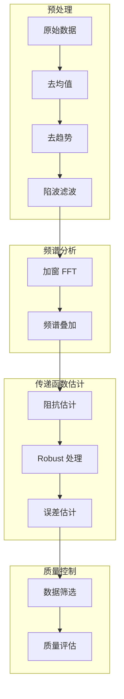

# 进阶教程

本章节包含 MTDataPro 的进阶使用教程。

## 处理流程详解

典型的 MT 数据处理流程包括以下环节：

```mermaid
graph TB
    subgraph 预处理
        A[原始数据] --> B[去均值]
        B --> C[去趋势]
        C --> D[陷波滤波]
    end
    
    subgraph 频谱分析
        D --> E[加窗 FFT]
        E --> F[频谱叠加]
    end
    
    subgraph 传递函数估计
        F --> G[阻抗估计]
        G --> H[Robust 处理]
        H --> I[误差估计]
    end
    
    subgraph 质量控制
        I --> J[数据筛选]
        J --> K[质量评估]
    end
```

## 学习路径

建议按以下顺序学习：

1. 掌握基本处理流程（快速入门）
2. 学习处理方案配置
3. 理解 Robust 估计原理
4. 实践参考道处理技术
5. 探索正演建模功能

## 专题教程

更多专题教程正在整理中。
